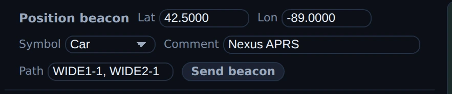
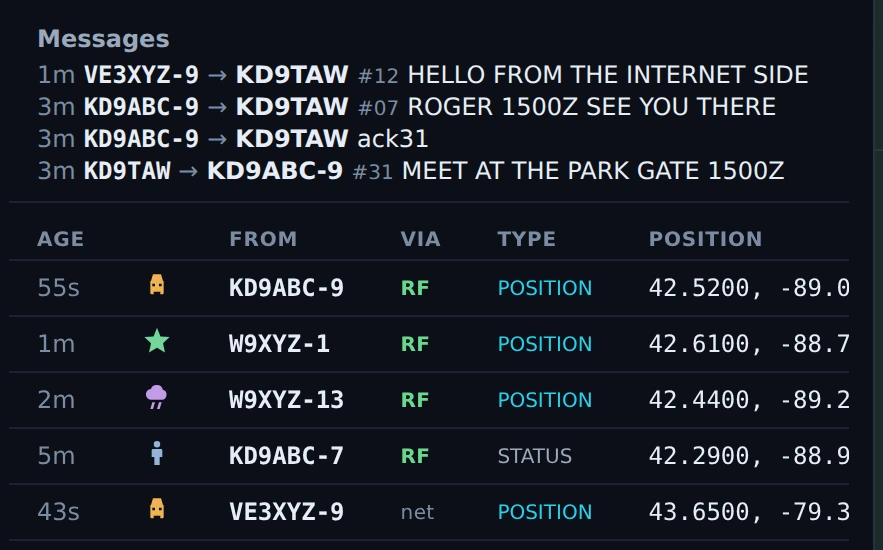
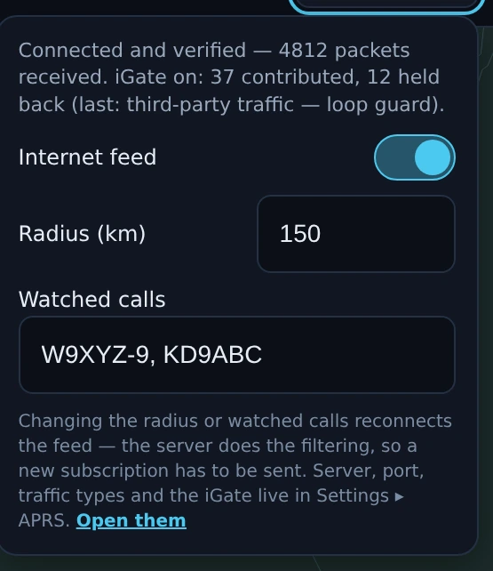

# APRS

The APRS section is a 2 m packet monitor with a map: it decodes AFSK-1200 off
your rig's receive audio, plots what it hears, and lets you send a position
beacon or a short message when you choose to. It is receive-first by design —
opening the screen only ever starts a decoder, never a transmitter — and it is
deliberately not a tracker: there is no periodic beaconing, no GPS input, and no
digipeating. The header says the scope in one line: *"AFSK-1200 packet — decode
positions/messages, send a beacon."*

APRS ships enabled — the wizard turns everything on; there is no goal or mode
picker to miss it in. If you have trimmed sections, switch APRS back on in
[Settings ▸ Appearance ▸ Features](settings-reference.md#features).

<!-- TODO: capture screenshot — the APRS cockpit at 1024×768 or wider: the left rail (beacon form, message compose, station table with mixed RF/net rows) beside the map at its default local zoom with a dozen symbols plotted, header showing "144.390 · N. America", "● Monitoring (auto)" and a green "N decoded" chip -->

## The tour

The screen is a header strip over two columns: a **rail** on the left carrying
the controls and the lists, and the **map** taking everything else. Below 768
effective px — a small window, or a large UI zoom — they stack with the map on
top, since the map is the thing worth seeing on a small screen. Either way the
rail scrolls inside itself rather than forcing the section wide or tall.

**The header.** Left to right: the station count, a `N pkts` count beside it
whenever the packet log's count differs from the station count, then the
controls.

- **Frequency** — the seven regional APRS channels, all 2 m FM, all AFSK-1200,
  which is what this decoder handles: 144.390 N. America, 144.800 Europe /
  Africa, 145.175 Australia, 144.575 New Zealand, 144.660 Japan, 144.930
  Argentina, 145.570 Brazil. Picking one **retunes immediately** — it is a
  band-picker, not a preference — and hands off to your 2 m-capable radio in FM
  simplex, because a 2 m packet signal demodulated as USB/DATA never decodes.
  The *selection* always sticks even on a radio that cannot get there, since it
  is also what the decode chip judges "wrong frequency" against; only the retune
  is gated. The channel is **derived from your grid square the first time and
  then remembered** — a European station opens APRS on 144.800 with nothing to
  configure — and a pick you make here is pinned for good, in the same setting
  [Settings ▸ Digital ▸ APRS](settings-reference.md#aprs) shows.
- **Re-tune** puts the rig back on the selected channel after you have been
  elsewhere. It is disabled, with the reason in its tooltip, when the radio
  provably cannot receive that frequency — *"This radio doesn't cover 144.390
  MHz — RF APRS needs a VHF radio."* A button whose only possible outcome is a
  refused CAT command is worse than no button.
- **The dial readout** — frequency, band and mode straight from CAT. This view
  hides the top bar's readout, so this is the one that speaks.
- **TX On / TX Off** is APRS's own transmit-enable latch, present for the same
  reason: the top bar's is hidden here. *"Transmit is OFF — enable it before a
  beacon or message can send."*
- **Monitor** arms and stops the decoder, and it has three faces, because
  "decoding" and "may transmit an ack by itself" are different things:
  **Monitor** (off), **● Monitoring (auto)** — armed by opening the view, and
  *"RECEIVE ONLY. It will never send an automatic ack"* — and **● Monitoring**,
  which is an arm you performed yourself and is the only one that permits
  automatic acks. It reads the engine, not a local copy, so the button and the
  decode chip can never disagree.
- **The decode chip** is the one that turns an empty screen into a diagnosis.
  Hover it for the full sentence; the label is the verdict. Eight of them, and
  the chip shows the topmost one that is true, in this order: **No 2 m radio**
  (the rig's Hamlib coverage table says it cannot receive this channel at all —
  above everything, because no amount of arming, tuning, squelch or audio routing
  fixes it), **Monitor off** (the decoder is not running), **Wrong frequency** /
  **Wrong mode** (CAT knows where the dial is; *"FM packet audio demodulated as
  SSB is garbled, so nothing will decode however strong the signal is"*), **No
  input** (armed, and no samples arriving at all — a real capture fault), **N
  decoded**, which latches once a checksummed frame lands so the readout cannot
  flap back to an alarm in the gap between packets, **N failed CRC** (bursts
  heard, none passing the checksum, with the burst's peak level and headroom
  advice), **Silent** (audio flowing at zero level — normally just a closed
  squelch, which is what an idle FM channel looks like) and **Listening** (a
  quiet channel). The order is the order to work in, and it is why a disarmed
  decoder reads **Monitor off** even when the dial is also in the wrong place:
  arm Monitor and read the chip again rather than trusting the frequency because
  the chip did not complain about it. The bottom four — **N decoded**, **N failed
  CRC**, **Silent**, **Listening** — carry the **live input level in dBFS** in
  their hover sentence, the peak of the most recent 0.1 s drain, so once audio is
  known to be arriving "what is the app actually hearing" is a number rather than
  an inference. **Listening** goes further and gives you the targets to compare it
  against: roughly what the hiss should read with the squelch open, and the range a
  packet burst should peak into. The four above them carry no level: each has
  already found a fault the level cannot speak to. When the verdict is a wrong dial, a **Tune to
  144.390** button appears beside the chip.
- **on \<radio name\>** appears only when more than one of your radios covers the
  band. The tap follows the active radio, and wrong-radio silence is
  indistinguishable from a dead band unless the app names the rig.
- **The internet chip** — *Internet off / connecting / quiet / N* — is a second,
  deliberately separate chip. The RF chain and the APRS-IS feed fail
  independently, and a green internet chip beside a silent RF chip is the whole
  diagnostic: it proves the fault is in the radio path. Click it and it opens the
  feed's controls in place: the on/off switch, **Radius (km)**, and **Watched
  calls** (committed on blur, not per keystroke, because each write reconnects
  the feed). Server, port, traffic types and the iGate live in
  [Settings ▸ Digital ▸ APRS](settings-reference.md#aprs), and the panel says so.
- **Internet N** / **Internet N hidden** appears once the feed has contributed
  stations your own antenna has not heard. One click hides them, leaving the
  honest picture of what this radio can actually reach. The count is in the
  button so the effect is never a surprise.

**The station table** is one row per station, newest-heard first, fading as a
station goes quiet — same thresholds the map fades on, so the two readings cannot
disagree. Columns: **Age**, the station's own **symbol**, **From**, **Via**,
**Type**, **Position**, **Dist** and **Info**.

The **Via** tag is the load-bearing one. **RF** means *"your receiver decoded
this station off the air"*; **net** means *"reported by APRS-IS — your receiver
has not heard this station"*; **RF+net** means both. An RF sighting is evidence
about your antenna; an internet one proves nothing about your range, and
collapsing them would hide the only fact that says anything about your station.
**Type** is what the packet was — `position`, `mice`, `message`, `status`,
`object` or `other`. **Position** carries lat/lon and, for a station under way,
its speed and course. **Dist** is great-circle km plus an eight-point bearing
from your grid, so it is blank until your grid is set. Clicking a row selects the
station on the map; clicking it again clears it.

With no stations to show, the table is replaced by the decode chip's full
explanation — the empty state answers the question the emptiness raises.

**The message list** appears when message packets have arrived, newest first, as
their own chronological list rather than folded into stations: a conversation of
several lines from one station has to show all of them. Each row is age, sender,
addressee, the sender's line number if any, and the text.

**The map** opens on the local picture, not the planet — zoom 25, roughly 275 km
in every direction, which keeps WIDE2-2 digipeated traffic on screen while a
local net spreads across it instead of stacking into one smear. It centres on
your grid (or, with no grid set, on the mean position of what you have heard).
Drag to pan, wheel to zoom. Relief, coastlines, state borders and the grid are
on; nothing propagation-related is, because APRS is a local terrestrial picture.

Each station draws as its **own APRS symbol** — the shape says what the station
*is* (car, weather station, digipeater, balloon, boat…), colour-coded by family,
and any overlay character rides on top unrotated. The **ring around the glyph**
says how it reached you: solid for RF, doubled for both, dashed and dimmed for
internet-only. Vehicles under way are drawn nose-up to their course with a short
course/speed vector. Below zoom 4 symbols become plain dots, because a screen of
18 px glyphs is unreadable mush and the question at that scale is "where is there
traffic". Only the selection and moving stations are labelled — labelling
everything turns a busy local net into a wall of text.

When nothing is plotted the map says why, and *"No positions heard yet — status
and message packets carry none"* is a normal state, not a fault.

**The station card** opens over the map when you select a station, from either
the list or the map — one selection, two ways in. It carries: the resolved symbol
and its name; **per-source lines with separate ages** (*"Heard on RF — your
receiver decoded this station 4 min ago"*, *"Via APRS-IS — the internet feed
reported it 20 s ago"*), never collapsed into one "last heard"; position with its
Maidenhead square; **From you** — distance, a 16-point compass point and the
bearing in degrees; motion (speed, course, and altitude if the comment carries an
`/A=` token); the comment; the **path**, read as *"direct — no digipeaters in the
path"* or *"digipeated via WIDE1-1\*, WIDE2-1\*"*; the packet count and how long
this station has been in the roster; **decoded weather** for a weather station —
temperature, wind and gust, humidity, pressure, rain in the last hour and 24 h,
with any sensor the station does not carry simply omitted rather than shown as a
zero; and a **Raw packet** disclosure holding the TNC2 monitor line verbatim.
Two links close it out: **QRZ** and **aprs.fi** — the latter just opens that
station's page in your browser, nothing is sent to it. `Esc` closes the card and
hands focus back where it came from.

## Safety — why transmit works the way it does

A radio that keys up with nobody at the desk is the failure this design refuses,
so:

**Opening APRS only ever starts a receive-only decoder.** Entering the view arms
Monitor so the section does not open on a dead screen you have to notice and fix.
That auto-arm can only upgrade from off — it never demotes an arm you performed
yourself, it never confers ack capability, and once you have explicitly stopped
the decoder it refuses for the rest of the session rather than restarting behind
you. The policy lives in the engine, not in the screen, so a remount cannot lose
it.

**Every transmission from this section is one you asked for.** Three things can
key: the **Send beacon** button, the **Send message** button, and an automatic
ack. All three pass the same gate first — TX enabled, the frequency inside your
license privileges, and nothing else already owning the transmitter (a slot over,
a tune carrier, a held mic, the voice keyer, CW, RTTY or SSTV). A refusal names
its reason rather than failing quietly.

**The automatic ack — the only thing here that can key with nobody asking —
needs two independent operator acts.** You must have armed Monitor *yourself*
(an auto-arm never counts, whatever the TX latch says), **and** TX must be on.
That is why the Monitor button distinguishes "Monitoring (auto)" from
"Monitoring", and why clicking it while auto-armed always *stops* rather than
quietly upgrading to ack-capable: a click that reads as "stop" never grants
unattended-transmit capability.

**Internet traffic never gates back out onto the air.** Nexus has no
internet→RF path at all. The iGate is receive-only and says so on the wire — it
appends the `qAO` construct, not `qAR`, because `qAR` advertises a gate that can
also deliver messages back over RF, and asking the network to route traffic at a
station that can never deliver it is a lie with consequences. Nexus does not
digipeat either: nothing it hears is ever repeated back onto the channel.

## Core workflows

### Get on the channel and confirm you are hearing it

*The same strip as the capture further down, with the RF side alive, in Nexus 1.10.3. Left to
right: the channel picker on 144.390, **Re-tune**, CAT's own dial readout `144.390 MHz · 2m ·
FM`, the **TX Off** arm latch, **● Monitoring (auto)**, the decode chip reading **21 decoded**,
the radio the tap is following, and **Internet off** — so nothing on this strip came from the
internet feed. The counts are a documentation fixture, not packets pulled off the air.*

1. Open APRS. The decoder arms itself, receive-only, and the rig hands off to
   your 2 m radio on the selected channel in FM simplex.
2. Pick your region's frequency if it is not the default — the rig moves on
   selection.
3. Read the decode chip. **Listening** or **Silent** with a sensible dBFS level
   means the chain is intact and the channel is quiet; **Silent** is the normal
   resting state of a squelched FM channel, not a fault. To prove the routing,
   open the squelch — hiss should appear here as a level, around −30 to −25 dBFS.
4. Anything else is telling you what to fix, in order: the radio cannot reach the
   channel, the dial or mode is wrong (with a one-click **Tune to** beside it),
   no samples are arriving from the capture device, or bursts are arriving and
   failing their checksum. A packet burst should peak between −30 and −6 dBFS;
   outside that band you are losing margin, though level alone is never why a
   checksum fails.

Turning the internet feed on is not a step in this list, and it does not shorten it. The feed
fills the map without touching the radio; the checklist under
[A full map is not a working radio](#a-full-map-is-not-a-working-radio) is what tells you
whether the RF side is alive.

### Read a station

*The map hover in Nexus 1.10.3. The third field is the source, and it is the whole point:
`reported by APRS-IS` means the internet feed carried this station, not your receiver. The
same field reads `heard on RF`, or `heard on RF + APRS-IS`, when your own antenna is in it.
The tail is the station's own comment text, garbled characters and all — Nexus prints what
arrived.*

1. Hover a symbol for the one-line version: call, what the symbol is, how it reached you and
   how long ago, its path, its motion, and its comment.
2. Click a row in the table or a symbol on the map — either selects both, and opens the
   station card.
3. Work the card: how it reached you and how long ago, where it is and how far
   from you, whether it came in direct or through digipeaters, what it said, and
   the weather if it is a weather station.
4. Open **Raw packet** when you want the TNC2 line itself — the path markers and
   the information field exactly as they arrived.
5. A station with no position is a normal thing to have in the list: message and
   status packets carry none, and the card says *"none reported — heard, but
   nothing to plot"* rather than pretending.

<!-- TODO: capture screenshot — the station card open over the map for a weather station: symbol and name in the head, both "Heard on RF" and "Via APRS-IS" lines with different ages, the From-you distance/bearing row, the decoded weather block, and the Raw packet disclosure expanded to its TNC2 line -->

### Turn on the internet feed

1. Click the internet chip and switch **Internet feed** on. It needs a real
   callsign — it is a login identity on a public amateur network — but no
   passcode: a read-only login (`pass -1`) receives the full stream normally.
2. Set the **Radius (km)** around your grid (150 km by default; 0 means no
   distance limit, which is busy) and any **Watched calls**, which come through
   from anywhere on earth however far outside the radius they are.
3. Internet stations arrive tagged `net`, dashed and dimmed on the map. When they
   appear while the RF chip stays silent, the fault is in your radio chain, and
   that is the feed's real diagnostic value. The **Internet N** button hides them
   whenever you want the picture of what your own antenna reaches.
4. Changing the radius or watched calls reconnects the feed — the server does the
   filtering, so a new subscription has to be sent.

#### A full map is not a working radio

*APRS in Nexus 1.10.3 with the internet feed on and **no VHF radio in the station**. Two
thousand stations are plotted and 280,657 packets have come in over the internet, and none of
it is evidence about this station's antenna. The decode chip says so in three words —
**No 2 m radio** — and every row in the table says `net`.*

This is the picture the section is designed to keep you from misreading. **Nothing the
internet feed shows you says anything about your RF path.** Read the two chains separately:

| What you are looking at | What it proves |
|---|---|
| Stations on the map, `net` in the Via column, dashed rings | An APRS-IS server told you about them. Nothing about your antenna, your radio or your audio. |
| The **Internet N** chip counting up | Your network connection works. |
| `RF` or `RF+net` in the Via column, solid or doubled rings | **Your own receiver decoded that station off the air.** This is the only APRS evidence about your station. |
| The decode chip reading **N decoded** | A checksummed frame arrived from your radio. This is the receive path proven. |

The RF-readiness checklist, in order — each line is a thing you can read off the screen:

1. **A radio that covers the channel.** The decode chip reads **No 2 m radio** when the rig's
   coverage table says it cannot receive 144.390 at all. No amount of arming, tuning or audio
   routing fixes that; it needs a VHF radio. Everything below is moot until this clears.
2. **The dial actually on the channel, in FM.** The dial readout beside **Re-tune** is CAT's
   answer, not the app's intention — in the capture above it reads `7.070 MHz · 40m · USB`,
   which is an HF SSB dial, not APRS. Press **Re-tune** and read it again.
3. **Monitor armed.** The chip reads **Monitor off** while the decoder is stopped, and it
   outranks a wrong dial — so arm it and read the chip a second time rather than concluding
   the frequency is fine because nothing complained about it.
4. **Audio arriving.** **No input** means no samples at all from the capture device. **Silent**
   with the squelch open means the wrong input device. Open the squelch and look for hiss
   around −30 to −25 dBFS.
5. **A frame decoding.** **N decoded** is the finish line. Until then you have a receiver that
   might work; after it you have one that does.

Transmit is its own question and the same rule holds. **TX On** is an arm latch — it says you
have allowed the section to key, not that a beacon will land on the APRS channel. The gate a
beacon passes is TX enabled, the dial inside your licence privileges, and nothing else holding
the transmitter; **it does not check that the rig is on 144.390 in FM.** With TX on and the
dial parked on 40 m, **Send beacon** renders AFSK-1200 and keys it there. Confirm the dial
first — step 2 above — every time.

### Send a position beacon

Before anything else, check the dial readout beside **Re-tune** actually reads the APRS
channel in FM. The send gate does not check it for you — see the readiness checklist above.

*The beacon form in Nexus 1.10.3, staged and not sent. **Lat** and **Lon** are prefilled from
grid EN52 — the centre of the square, not a fix — and Symbol, Comment and Path are the three
remembered fields. Nothing was transmitted to make this picture; the **TX Off** latch in the
strip above holds the queue.*

1. Turn **TX On**.
2. Check the **Lat** and **Lon** in the beacon form. They are prefilled from your
   Maidenhead grid, which is the *centre of the square*, not a fix — type real
   coordinates if you want to be where you actually are.
3. Pick a **Symbol**, set the **Comment** (43 characters) and the digipeater
   **Path** — `WIDE1-1, WIDE2-1` by default. All three are **remembered**, so
   this is a once-and-done step rather than something to retype each session;
   they are the same settings [Settings ▸ Digital ▸ APRS ▸ Over the
   air](settings-reference.md#aprs) edits, along with your beacon **SSID**,
   which has no control on this screen.
4. Press **Send beacon**. The frame is rendered to AFSK-1200 audio up front and
   keyed as one short burst; the status line reports what happened, including a
   refusal and its reason. It fires once. Nothing repeats it.

### Send a message, and answer one

*Messages and the station table in Nexus 1.10.3. Reading up: `#31` went out to KD9ABC-9,
`ack31` came back, then the reply `#07`. The top line is from VE3XYZ-9 and arrived over
APRS-IS. The table's **Via** column keeps the two paths apart — `RF` for what this antenna
decoded, `net` for what the internet reported. A documentation fixture: no message was sent and
nothing was received off the air.*

1. With TX on, put a callsign in **To** and up to 67 characters in **Text** —
   the counter shows where you are, and the engine rejects an over-long message
   rather than silently truncating it. `Enter` sends.
2. Each message carries a rolling line number 001–999 so the other station can
   ack it.
3. Incoming messages land in the Messages list. If you armed Monitor yourself and
   TX is on, a message addressed to your base callsign that carries a line number
   is acked automatically — Nexus never acks itself, and never acks from an
   auto-armed decoder.

### Run the receive-only iGate

*The internet panel in Nexus 1.10.3 with the receive-only iGate on — click the **Internet N**
chip to open it. The first line is the whole score: connected and verified, packets received,
then **iGate on: 37 contributed, 12 held back (last: third-party traffic — loop guard)**. Those
are Nexus's own counters of what it sent upstream. **No APRS-IS server confirmed receipt of
anything**, and nothing was uploaded to make this picture — the figures are a fixture.*

1. Switch **Receive-only iGate** on in
   [Settings ▸ Digital ▸ APRS](settings-reference.md#aprs) (it sits under the
   APRS-IS feed and needs it on). It publishes under your callsign, which is why
   it is a separate choice from watching the feed.
2. Keep the RF decoder armed — the iGate contributes only what your own antenna
   heard, and that rule is structural: an internet-sourced packet cannot reach the
   upload queue at all.
3. Every packet then passes, in order: the forbidden-path guards (`TCPIP`,
   `TCPXX`, `NOGATE`, `RFONLY` — a station asking to stay off the internet is
   honoured, and no setting relaxes it), a bogus-source check, generic-query and
   third-party-from-internet rejection, a 30-second duplicate window, and a cap
   of 60 uploads a minute. What survives is uploaded byte-for-byte with `,qAO,`
   and your call appended — the RF path is evidence of how the packet travelled
   and is never rewritten.
4. The internet chip's tooltip carries the score: how many packets you have
   contributed, how many the rules held back, and the most recent reason.

## Honest limits

- **This screen has no stop control, and one is not hiding on the top bar.**
  APRS hides the app-wide TX cluster, and its own **TX Off** is an *arm* latch,
  not a kill: it holds the queue, so a beacon you have queued but that has not
  keyed yet will not go out, but nothing on this screen cuts a burst already
  keying. The burst is short — one packet at 1200 baud — and PTT drops on its own
  when it plays out. Practically, decide before you press Send; there is no
  taking it back mid-air from here.
- **The send gate does not check the dial.** A beacon or a message is refused when TX is off,
  when the dial is outside your licence privileges, or when something else holds the
  transmitter — and that is the whole list. It is not checked against the APRS channel or
  against FM, so with TX on and the rig on an HF SSB dial, **Send beacon** keys AFSK-1200
  there. The auto-tune on entering the section *is* capability-gated and refuses a radio that
  cannot reach the channel; the send is not. Read the dial before you press it.
- **There is no periodic or smart beaconing, and no GPS input.** A beacon is a
  one-shot you pressed. Nexus will not beacon your position on a timer, will not
  beacon faster when you are moving, and reads no GPS receiver — the position in
  the form is whatever you typed, prefilled from your grid square's centre.
- **You can beacon ten symbols.** Receiving resolves the full symbol space
  including alternate-table and overlaid symbols; sending offers car, house,
  person, bicycle, jeep, motorcycle, truck and dot on the primary `/` table,
  plus digipeater and iGate on the alternate `\` table.
- **AFSK-1200 on 2 m FM only.** No 9600-baud packet, no HF 300-baud APRS, no
  other TNC formats. The seven channels in the picker are the modes this decoder
  handles.
- **Nexus does not digipeat, and never gates internet traffic to RF.** Only three
  things ever key from this section: your beacon, your message, and an ack under
  the two-act rule above.
- **The iGate uploads only with a verified login.** The uplink derives your
  passcode from your callsign, and until the server has accepted that login
  nothing is contributed — the RF-heard lines waiting to be gated are simply
  discarded, since the server would refuse them anyway. That queue is bounded at
  200 lines, so an uplink left on with no network cannot grow without limit.
- **Messages are fire-and-forget from the UI's side.** There is no ack tracking,
  no retry timer and no per-conversation thread view — the line number is there so
  the other station can ack and so you can retry by hand. Messages arriving over
  APRS-IS are display-only: replying to an internet-only station is not wired up,
  and an RF reply would not reach a station your antenna cannot hear anyway.
- **Nothing here reaches the logbook.** APRS traffic is not a QSO in the Nexus
  logbook, and there is no Log control on the screen.
- **Nothing here survives a restart.** The station roster, the packet log and the
  decode counters live in memory only. Arming the decoder resets the health
  counters — a stale "0 decoded" from a previous session would read as a live
  fault.
- **The roster is bounded three ways.** A station drops off after 60 minutes of
  silence by default (adjustable, and 0 means keep forever), starting to fade at a
  third of that; the store holds 2000 stations, evicting the longest-unheard; and
  the packet log behind the message list keeps the most recent 300 packets.
- **The decoder listens to the active radio only.** It follows whichever rig the
  band activation resolved to. When more than one of your radios covers the band,
  the header names the one it is on, because that silence is otherwise
  indistinguishable from a dead band.
- **There is no ⊞ Panels menu.** Nothing on this screen is hideable and there is
  no pane layout to save or reset.

## Related guides

- [Phone (SSB)](phone.md) — the FM side of the same radio, repeaters and CTCSS
- [Connect — map + propagation](connect.md) — the full map, with everything this
  one deliberately leaves off
- [Settings reference](settings-reference.md) — the Radio tab's Rig & CAT and
  Audio fieldsets, and the Features toggles this section depends on
