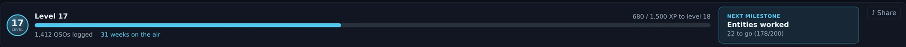
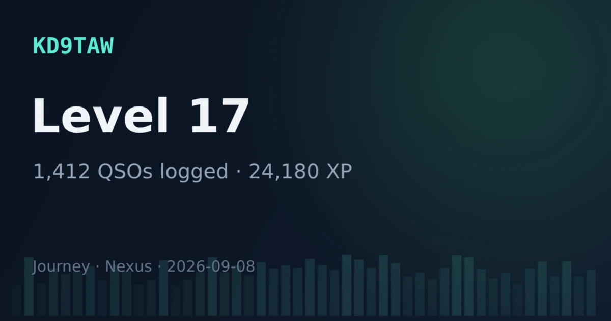

# Awards & Journey

This section has two tabs under one roof: **Official Awards**, the offline
tracker for the official programs (DXCC, Challenge, Honor Roll, WAS, WAZ, VUCC,
IOTA), and **Journey**, a local-only achievement layer that turns your log into
progress you can feel — firsts, ladders, collections, and personal bests. Both
read straight from your [logbook](logbook-qsl.md); neither needs an account or a
network.

Awards is an opt-in section, nudged on after your first QSO. Turn it on any time
in [Settings ▸ Appearance ▸ Features](settings-reference.md#features).

*The Official Awards tab in Nexus 1.10.3. The figures are one station's log;
yours will read differently.*

## Awards — the official programs

Awards are **computed offline** from cty.dat entity resolution — no upload
required to *see* where you stand:

- **DXCC** with per-band and per-mode slots, and **5-Band DXCC**,
- **DXCC Challenge**,
- **Honor Roll**, with a current-entity denominator and a countdown —
  confirmations still needed to get in, then "N to #1" once you're in,
- **WAS** (Worked All States), with the 5BWAS count beside it,
- **WAZ** (Worked All Zones),
- **VUCC**, with satellite grids kept on their own **Sat VUCC** card. ARRL
  credits a bird QSO toward Satellite VUCC only, so the two cards never share
  a grid. Nexus tags pass contacts itself — log one while the transponder is
  held and your dial is in the bird's downlink and it gets `PROP_MODE=SAT`
  plus the LoTW designator, which is what moves this card. The ISS is the one
  exception ([Satellites](satellites.md) explains why), and an imported
  contact moves it only if the file already carried both fields,
- **IOTA** (Islands On The Air).

Under the cards, DXCC is broken out **by band**, and the chase lists start with
**Confirm for a new one** — entities you have worked but not confirmed, chipped
with the bands each is waiting on.

**Confirmation handling is source-aware** — a distinction most loggers blur.
**eQSL and a QRZ-logbook match never count toward LoTW-grade awards**; the
`confirmed` and `award_confirmed` flags are separate and enforced at every
computation. So a contact can be "confirmed" (you have an eQSL) yet not
"award-confirmed" (no LoTW or card), and the awards math respects the
difference. The
[logbook diagnostics](logbook-qsl.md#understand-why-a-contact-isnt-confirmed)
explain per-QSO why a credit hasn't landed.

That is why the **Confirmed** card here reads lower than the **confirmed**
figure on [Stats](stats.md#the-tour) — 52% against 73% in the screenshot
above. Neither is wrong. This card counts only LoTW and paper cards, because
that is what ARRL takes; Stats counts every channel, eQSL and QRZ included,
because it is describing your log rather than judging it.

## Journey — progress you can feel

Journey exists to carry a newer operator through the motivational dead zone
between QSO 1 and QSO 100 — but it credits an imported logbook immediately, so a
veteran importing years of ADIF sees their history light up at once. It's
**local-only**: no accounts, no network, no decaying daily streaks.

*The Journey hero card, DX Marathon and Firsts row in Nexus 1.10.3.*

What's on the board:

- **XP and levels**, with a hero card.
- **Firsts** — auto-detected milestones ("first DX," "first CW," "first park"),
  each named with heritage context.
- **Ladders** — tiered progress toward the official awards, plus:
  - **DX Marathon** — entities and zones worked this calendar year vs. your best
    year (resets Jan 1),
  - **Grid Gems** — rare/ultra-rare grids worked (rungs at 1/5/10/25/50),
  - **Park Hunter** and **Summit Chaser** — distinct POTA/SOTA references hunted
    (they appear after your first hunt),
- **Seasonal feats** — earned in a season, permanent once earned, with no FOMO:
  - **Sporadic-E Summer** (6 m ≥ 1000 km in season),
  - **Top-Band Season** (160 m ≥ 1500 km).
- **Collections and personal bests.**

Some feats read your station power (from
[Settings ▸ Digital](settings-reference.md#digital-ft8ft4)) — set it to
unlock the miles-per-watt and QRP feats.

### Optional weekly streak

Off by default: a gentle **"weeks on the air"** counter (never a daily streak,
never a penalty for a break). Enable it under Journey in
[Settings ▸ Digital](settings-reference.md#digital-ft8ft4).

*The Journey hero in Nexus 1.10.3 with the streak switched on. **31 weeks on the air** sits
beside the QSO count and nowhere else, and it counts weeks, never days — a quiet week ends
nothing but the count. With the setting off the phrase is simply absent and nothing else on the
card changes. Fixture log.*

### Share a card

The **⤴ Share** control renders the hero card (and any unlocked feat) to a PNG
**on your clipboard** — nothing is uploaded. Click it, then paste into a
message, an email, or a post.

*The 1200 × 630 PNG that **⤴ Share** puts on your clipboard, rendered by Nexus 1.10.3 from a
fixture Journey. This is the card itself, not a screen in the app — there is no preview inside
Nexus; you paste it to see it. It carries your callsign, and nothing on it leaves your computer
until you paste it somewhere.*

## Honest limits

- **Everything here is local.** Journey never leaves your machine — no
  leaderboards, no accounts, no telemetry.
- **Awards are as complete as your log and its confirmations.** Offline
  computation shows worked/confirmed from what you have; pull confirmations with
  the [LoTW / eQSL sync](logbook-qsl.md#upload-to-lotw) to fill in the
  award-confirmed column.
- **eQSL and HRDLog.net don't earn ARRL award credit** — Nexus won't pretend they
  do.

## Related guides

- [Logbook & QSL](logbook-qsl.md)
- [Stats](stats.md) — the same log counted rather than judged against a list
- [Needed — DX that's on the air now](needed-dx.md)
- [Contesting & POTA/SOTA](contesting-pota.md)
- [Settings reference](settings-reference.md)
