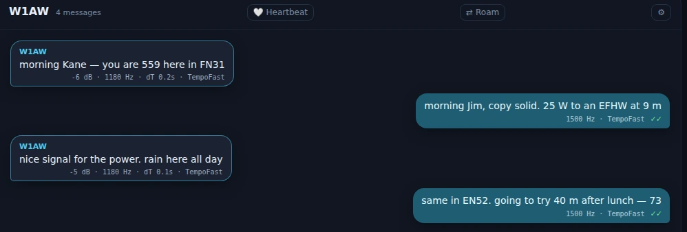
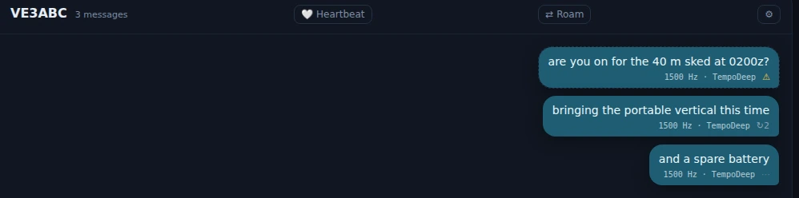

# Chat (Tempo)

Chat is Nexus's own weak-signal conversation mode — the thing the program was originally built
to be, and still the only part of it you cannot get anywhere else. It is a text messenger that
runs over HF: a roster of who is on frequency, a threaded conversation per station, and free
text that goes on the air in slot-synchronous overs like FT8, but carries sentences instead of
a fixed exchange.

Two waveforms sit under it. **TempoFast** is a 4-second cycle, and it is what you will use for
an actual conversation — short overs, quick back-and-forth. **TempoDeep** is a 15-second cycle
that trades speed for depth, and it is the one that keeps working when a path is fading badly.
Both carry the same 77-bit payload the FT8 message set uses, and both decode the whole
200–2900 Hz passband every slot, so you do not have to be tuned onto anybody.

**Be honest with yourself about what this is.** Both tiers have closed real links on the air,
and every sensitivity figure quoted for them is a bench number from simulation — none are
proven on the air yet. Nobody else is running Tempo unless you have arranged it. This is a mode
for a sked with somebody who also has Nexus, for a group net, or for finding out whether the
thing works. If you want contacts today, the [Operate](operate-digital.md) cockpit is where
the population is.

## The tour

![The Tempo workspace. Down the left: a STATIONS column holding the starred "Band — calling CQ" feed, a RECENT CHATS list with three threads and an unread badge, and an ON THE BAND NOW section with All / Heard now / Beaconing / Needed chips and a "Call or PA*…" search box reading "No stations match." The middle is the conversation pane for A61FJ, empty, with a Heartbeat toggle in its header, four quick-reply chips — 73, QSL, Name?, QTH? — and the message composer at the bottom. Above both sits the TempoFast / TempoDeep tier switch, the dial at 7.0430 MHz, and Call CQ.](../img/manual/tempo-workspace.webp)

*The Tempo workspace in Nexus 1.10.3, on 40 m with nothing heard yet. The right-hand
waterfall and Band Activity panes are cropped off — they are the shared digital ones, covered
in [Operate](operate-digital.md).*

The left column, headed **Stations**, stacks three things, top to bottom.

**★ Band — calling CQ** is the broadcast feed: everything heard that was not addressed to
anybody in particular. That is where CQs land, and where your own CQ goes. The number on it is
how many are in that feed.

**Recent chats** keeps your threads, so a conversation stays reachable after its station has
dropped off the live roster. A badge on a row is unread messages; the ✕ archives that thread.

**On the band now** is the Stations roster — who Nexus has heard on Tempo, which is *not* the
FT8 roster. Each card shows the callsign, entity, grid, distance and bearing, how long ago it
was heard, and its SNR. The chips above it filter to **All**, **Heard now**, **Beaconing**
(heard three or more times, so probably sitting there) or **Needed**, and the search box takes
wildcards — `PA*` for every PA prefix, several terms for "any of these". A station stays on
this roster far longer than on the FT cockpit's, because a queued message needs to know you
heard them recently. With nothing heard it says **No stations match**, which on a band with no
other Tempo station is the normal reading.

**The conversation pane** is the middle of the screen and behaves like any messenger: your
messages on one side, theirs on the other, oldest at the top. Each of your bubbles carries its
own delivery state, and this is the part worth learning, because on HF "sent" is not a simple
idea.

**What you see on the bubble is a mark, not a sentence.** The tier the message went out on
(`TempoFast` or `TempoDeep`) is printed under the text, and the delivery state sits beside it
as one of five glyphs. Hover the glyph — or read it with a screen reader — for the sentence:

| Glyph | The sentence behind it | What it means |
|---|---|---|
| ⋯ | "Waiting to send", or "Waiting to send — *call* not heard yet" | Queued. If it names a station, they have not been heard yet — see store-and-forward below. |
| ↻*n* | "Sending — try *n*" | On the air now, attempt *n*. |
| ✓ | "Sent" | It went out. |
| ✓✓ | "On air" · "Delivered" · "Confirmed — they answered after this went out" | Three different states share this mark. **Delivered** means a real acknowledgement came back; **Confirmed** means they answered afterwards, which tells you the same thing by inference. Hover to see which one you have. |
| ⚠ | "Sent *n*× — no acknowledgement. Tap to send it again." · "Not sent — abandoned on restart. Tap to send it again." | Either it went out repeatedly and nothing came back, or it was still queued when Nexus closed. **Tap the bubble to send it again.** |

A partly-received *incoming* message shows how much arrived as its own badge — "⚠ 3 of 5
received" — rather than pretending it is whole or throwing it away.

**The composer** is the box at the bottom. Type and press Enter. The quick-reply chips beside
it are your own macros from Settings, so they say what you told them to say.

**The capacity meter** beside the composer is the thing that has no equivalent in a normal
messenger, and it matters: it counts your text in **overs**, not characters. It reads
`0/9 overs` on an empty box. An over carries ten characters and a message may span nine of
them, so ninety characters is the whole budget; the meter goes amber two overs from the cap
and says **full** at it, and anything past the cap is trimmed before it sends. Overs, not
characters, because words wrap whole — a word never straddles two overs, so a flat character
count would lie to you. On TempoFast an over is four seconds, so a five-over message is twenty
seconds of transmission. Short sentences get through; paragraphs do not.

**Call CQ** transmits the standard `CQ <YOURCALL> <YOURGRID>` on the band feed and arms
transmit. **Heartbeat** is a presence beacon: leave it on and Nexus periodically says you are
here, so other Tempo stations can hear you — which is what lets them deliver anything they have
queued for you. Turn it off to sit silent.

## Core workflows

### Have a conversation

Pick a station from the roster, or click a thread in Recent chats. Type, press Enter, watch the
bubble's state. Keep overs short — this is a mode where a sentence is a transmission.

*A finished exchange in Nexus 1.10.3. The double tick on an outbound bubble is
**Delivered**: an acknowledgement carrying that message's own id came back. It is
not inferred from the reply that followed.*

### Call CQ and be found

Press **📣 Call CQ**. It goes out on the band feed and arms transmit. Anyone running Tempo who
hears it sees you on their roster and can open a thread with you. Leaving **Heartbeat** on
between calls means they can find you even if they missed the CQ.

### Send to a station who is not there yet

This is the feature that makes Tempo different from a chat window, and it is worth
understanding before you need it. **A directed message queues until its recipient is actually
heard, and then delivers.** The bubble sits at "Waiting to send — *call* not heard yet" for as
long as that takes — minutes, or until the band opens.

This is why the roster keeps stations long after they have gone quiet, and why the heartbeat
matters: presence is what turns a queued message into a delivered one. Nothing is broadcast
blindly into an empty band on your behalf.

*The three states an outbound message sits in, in Nexus 1.10.3. **⋯** has never
been on the air — VE3ABC has not been heard yet. **↻2** is on its second transmit
cycle. **⚠** spent its whole cycle budget with nothing coming back; tap it to
re-queue the same text.*

### When a message will not go

Marginal paths are the normal case here, so failures are visible rather than silent.

*An outbound bubble mid-send in Nexus 1.10.3: `↻1` is attempt one. The mark changes as the
message progresses; hover it for the sentence.*

A bubble carrying ⚠, whose hover reads "Sent 4× — no acknowledgement", is telling you the
truth: it went out four times and nothing came back. Tap it to re-queue the same text. Do not
retype it — tapping re-sends the identical message, which is what the error-correction
machinery below wants.

Underneath, failed overs are not simply thrown away. Nexus combines a failed frame with its
retransmissions rather than starting over, so the third attempt at a marginal message is
working with everything the first two brought in as well. It is on by default and there is
nothing to configure; you will see it as messages completing that felt like they should not
have.

### Winter Field Day

When Winter Field Day is active, Tempo is a first-class contact surface for it: the header says
so, the empty pane tells you to call CQ and send your exchange, and the first quick-reply chip
becomes your class and section. That is Winter Field Day only — the summer event's chrome does
not appear here.

## Honest limits

- **There is no population.** Tempo is not a mode you tune to and find people on. Arrange a
  sked, or run it alongside FT8 and see who turns up.
- **Every sensitivity number is from the bench.** Simulation figures, not on-air measurement.
  On-air decode-rate-versus-SNR reports are the single most useful thing a tester can send.
- **Text is charged by the over.** The capacity meter is not a suggestion; text past the limit
  is trimmed before transmission.
- **This screen has no stop control of its own.** Call CQ and the heartbeat put a signal on the
  air, but neither is a transmit latch. Transmit is stopped from the top bar, as it is
  everywhere outside the mode cockpits.
- **Nothing else on the air speaks Tempo.** TempoFast and TempoDeep are Nexus's own waveforms.
  WSJT-X, JS8Call, fldigi and the rest cannot decode them, and Nexus cannot answer anything
  they send. A station has to be running Nexus, in this section, on your frequency. If you want
  a keyboard mode other software can hear, that is [JS8](js8.md) or [PSK](psk.md).

## Related guides

- [Operate (digital)](operate-digital.md) — FT8 and FT4, where the population is.
- [Connect](connect.md) — the situational-awareness screen, including who is on the band.
- [Settings reference](settings-reference.md) — macros, which are what the quick-reply chips
  say.
- [Logbook and QSL](logbook-qsl.md) — where a Tempo contact goes once it is worked.
