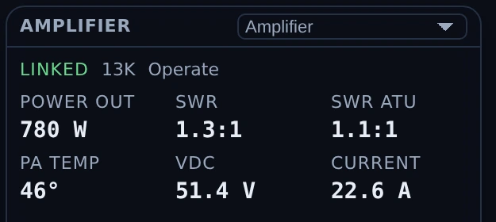
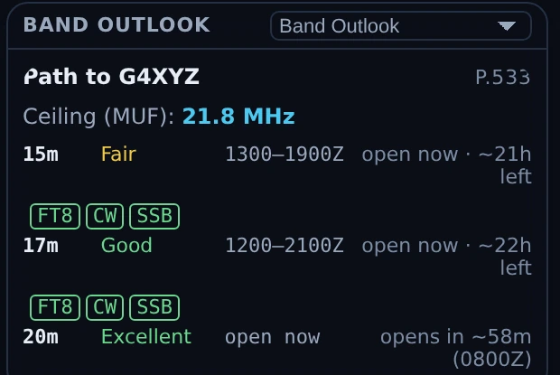

# Connect — map + propagation

Connect is Nexus's situational-awareness surface: one screen that fuses live
spots (PSK Reporter and RBN/DX-cluster) with NOAA space weather, draws them on a
map, and reasons about them with an honest opening detector and a native ITU-R
P.533 propagation engine. It answers three questions all the time — *is the band
open, am I getting out, what do I need* — and lets you double-click anything on
the map to work it.

A design rule runs through the whole section: **evidence or it didn't happen.** A
band is "open" when stations near *you* are demonstrably heard both ways, not
when one big station far away has a good morning. Modelled data is always
labelled "modelled"; the UI never dresses an estimate as a measurement.

<!-- TODO: capture screenshot — Connect — the shaded 3-D globe with panes wrapped around it -->

## The tour

### The map

The map renders in three projections:

- a **3-D shaded globe**,
- an **azimuthal-equidistant beam map** (true great-circle headings from your
  QTH),
- and a **flat world view**.

The **Layers** menu toggles what's drawn on top:

- **Greyline** with graded civil / nautical / astronomical twilight,
- **shaded relief** (bundled offline),
- **band-heat auras**,
- **live spot dots** — grid-placed, age-faded, and colored by what they're worth
  to your log,
- **DXpedition markers** and **range rings**,
- **modelled MUF** and the **NOAA aurora oval**,
- **Satellites (amateur)** — mini icons that *move* in real time (interpolated
  every second), each with a fading trail behind and a dashed projected path
  ahead (~25 min); a chased bird renders larger with its footprint ring,
- **Proton polar cap (PCA)** — violet polar shading that appears **only during a
  real S1+ proton event** (on a quiet sun it honestly draws nothing),
- **CQ zones** — boundary lines and zone numbers (off by default),
- **Grid labels** — field letters that densify to 4-character squares as you zoom
  (off by default).

Everything is interactive: hover for a call / entity / band / age / bearing
tooltip (bearings read like `312°T (316°M)`, magnetic from WMM2025), click for a
detail rail, and **double-click to work** — the same atomic QSY path as the rest
of the app.

Four **intent presets** — Chase DX, POTA/SOTA, Ragchew, 6m/VHF — configure the
whole surface in one tap.

*The Layers menu in Nexus 1.10.3. Which boxes are ticked is one operator's
preference, not a recommendation.*

### The pane grid

Around the globe is a **HamClock-style assignable pane grid** — seven slots
(left ×2, right ×2, bottom ×3). Each pane frame has a picker in its corner: click
it and choose what that slot shows. Every pane renders in full; the one-line
plain-language version of a pane is what you see while it is waiting on data,
offline, or has nothing to report, not a density setting. (There was a
**Basic / Expert** switch that chose between the two by hand; it was removed on
2026-07-26 and there is no such control now.)

The panes you can assign:

| Pane | Shows |
|---|---|
| Conditions | the propagation headline + any warning banners |
| Band Advisor | every HF band ranked best-first, with plain reasoning |
| Selection | detail on the station/spot you clicked, with a ▶ Work button |
| Band Outlook | modelled workable bands to DX (or the path to a selected call) |
| Openings | detected band openings around you |
| Space Wx | solar/geomagnetic gauges + the NOAA scales annunciator |
| Getting Out | who is hearing you right now, on a compass |
| Best Band → Region | the best band to reach each region |
| Activity Matrix | a region × band grid of live activity |
| NCDXF Beacons | the NCDXF beacon schedule, with heard badges |
| Insights | notable propagation events, narrated |
| Chase | the "work THIS now" pane — needs fused with band openness |
| Chase Feed | the ranked chase board (need × openness × rarity × ends-soon) |
| Greyline | your next greyline window |
| 24h Band×Hour | a band × hour likelihood heatmap |
| Sporadic-E | live VHF Es openings when present |
| Measured MUF | real ionosonde MUF measurements |
| Satellite Passes | next amateur-satellite passes over your grid |
| Rotor | rotator control + compass (appears once a rotctld is configured) |
| Amplifier | your linear's own readings (appears once an amplifier is configured) |

The default layout puts the conditions reference on the left, the flagship
**Chase** pane and Band Outlook on the right, and a live "now" ticker (Openings,
Space Wx, Getting Out) across the bottom.

### The Amplifier pane

If you run a linear — an **SPE Expert** (1.3K-FA / 1.5K-FA / 2K-FA) or an **Elecraft
KPA500/KPA1500** — put it on its own serial port, set it under
[Settings ▸ Radio ▸ Amplifier](settings-reference.md#radio), and assign this pane to a
slot. It shows power out, SWR at the antenna and before the tuner, supply volts and
current, PA temperature, and the amplifier's own alarms and warnings.

*The Amplifier pane in Nexus 1.10.3. Everything in it is **telemetry the amplifier reported** —
there is no control here. Operate/Standby and the band ladder ride in the cockpit's own
amplifier strip, where you are transmitting. The temperature prints with a degree sign and no
scale letter because the SPE protocol does not state the unit. No amplifier was connected for
this capture; the readings are a documentation fixture.*

It has to be **its own port**. A serial port can only be opened once, so an amplifier
typed onto the CAT port does not give you a silent amplifier — it gives you a radio
that will not connect. Nexus checks for that and warns, naming the radio and the port.

Two things it deliberately does not do. **Readings clear the moment a poll goes
unanswered**, rather than holding the last value: a stale wattage beside a dead link is
a fabricated number, and an em dash is not. And an **alarm code this build has never
seen still shows as a fault** rather than going quiet — the failure direction in front
of a kilowatt has to be toward telling you.

The SPE temperature carries no °C or °F letter, because the protocol does not say which
it is; the amplifier reports whatever its own front panel is set to. The Elecraft does
carry one, because Elecraft documents it.

**And you can drive it from wherever you are operating.** With an amplifier configured,
every cockpit header — Phone, CW, Operate, RTTY, PSK and SSTV — carries a compact strip:
**Standby/Operate**, band **◀ ▶**, and power out. Nothing is added for the stations that
have no amplifier; the strip simply is not there.

Operate reads from the amplifier itself rather than from your click, so the button shows
where the amplifier actually is even when you press its front-panel key instead. Both
controls are **refused while you are transmitting**: changing band on a keyed amplifier
can damage it, and dropping to standby mid-over does not stop anything — the exciter
keeps keying and the drive passes straight through. For the same reason, standby is not
a way to stop a transmission and the strip is not a stop control.

**Nexus will never switch your amplifier off.** That command is not merely unused; it
does not exist in the code, so no future change can reach it by accident.

**Following the radio's band is optional and off by default.** Turn it on under
[Settings ▸ Radio ▸ Amplifier](settings-reference.md#radio) and the amplifier steps to
whatever band you tune to. It steps one band at a time and reads where the amplifier
actually is after each step, so a step it ignored — or one you undid at the front panel
— is seen and re-issued rather than assumed. On a band your amplifier does not have it
does nothing rather than picking the nearest, and it never moves anything while you are
transmitting.

⚠️ **Most SPE stations should leave it off.** An SPE is normally wired to follow the
radio through its own band-data cable, in hardware. Where that cable is fitted this
setting is a second thing steering one band — redundant at best, and at worst two
controllers disagreeing about where the amplifier should be.

## Core workflows

### Assign a pane to a slot

*A pane picker open in Nexus 1.10.3. The **Panels** / **B2** / **B3** headings
are the picker's own grouping of the pane list — any pane in any group can go
in any slot.*

1. Click the picker in any pane frame's corner.
2. Choose a pane from the list. If that pane already lives in another slot, the
   two **swap** — nothing ever vanishes from the grid.
3. Your layout persists across sessions — the grid comes back as you left it.

### Read an opening

The **opening detector** compares a 10-minute window against a 2-hour robust
baseline (median + MAD z-scores), anchored to your station, and requires
**reciprocal paths (heard both ways)** before it declares — with anti-flap
hysteresis and mode-specific dwell times. When it fires, a rule-ordered
classifier labels the mechanism — **sporadic-E, F2/TEP, aurora** (with skip-hole
disambiguation), or **tropo** — and the right rail shows the band, direction
octant, distance, and the participating stations.

### Chase what's workable now

The **Chase** and **Chase Feed** panes fuse the [Needed board](needed-dx.md) with
band openness and timing: they surface the stations that are both *needed* and
*heard*, scored by need × openness × rarity × time-remaining. Each row has a
why-line and a ▶ **Work** button that QSYs and opens the right cockpit. Chase
leads with the top few; Chase Feed is the full ranked table.

### Track propagation to a specific call

Click a station on the map (or in a pane) and the **Selection** and **Band
Outlook** panes switch to *that call*: the modelled path, its MUF ceiling, and
per-band workability. With the P.533 engine selected you also get per-mode
FT8/FT4/CW/SSB "workable now" chips.

*Band Outlook in Nexus 1.10.3 with a call selected. The heading becomes **Path to G4XYZ** and
the engine names itself on the right (**P.533**) — everything in this pane is *modelled*,
including the FT8/CW/SSB chips. The *observed* half is a different pane: **Getting Out** lists
the stations that actually reported hearing you. Both are documentation fixtures here — no path
was solved for a real contact, and nobody reported this station.*

### Choose the prediction engine

In [Settings ▸ Logging & Connectors](settings-reference.md#integrations--feeds),
**Prediction engine** selects **Modelled (fast heuristic)** or **ITU-R P.533
(full physics)**. P.533 is the real circuit-reliability method (validated
against the ITU reference, ~0.1 s per prediction, and it uses your station power
and antenna gain). **Live spots always win over any model.**

## The Now-Bar

The persistent **Now-Bar** carries the Connect intelligence into every section of
the app: is the band open, am I getting out, what do I need — with feed-health
pills that distinguish "connected but quiet" from "down," so a silent band never
looks like a dead feed.

## Honest limits

- **The per-path 24-hour outlook is a physics-lite in-house heuristic** (MUF +
  D-layer) and is labelled "modelled." The P.533 engine is a fuller model but is
  still a *model*; live spots override both.
- **VOACAP is not integrated.**
- **PSK Reporter's MQTT band topics carry no SNR**, so SNR-derived features
  degrade gracefully where the data isn't present.
- **The "getting out" inference is disabled on VHF**, where sporadic-E patch
  disjointness makes a region-reach claim invalid.

## Related guides

- [Needed — DX that's on the air now](needed-dx.md)
- [Spots](spots.md) — the same cluster/RBN traffic as a table, unranked
- [APRS](aprs.md) — the other map in the app, plotting the packet stations your
  own receiver decodes
- [Satellites](satellites.md)
- [DXpeditions](dxpeditions.md)
- [Settings reference](settings-reference.md)
