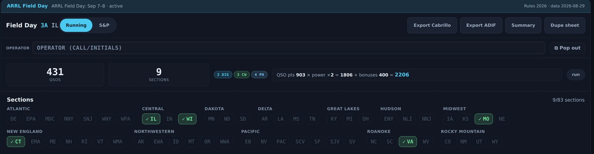
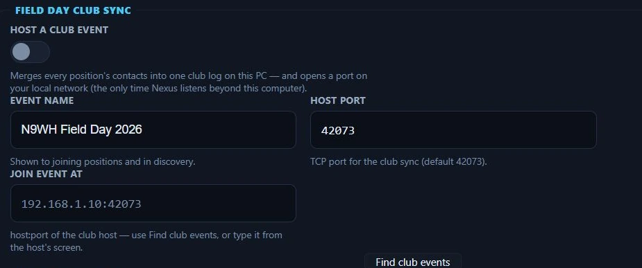
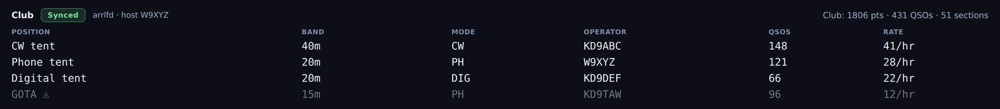
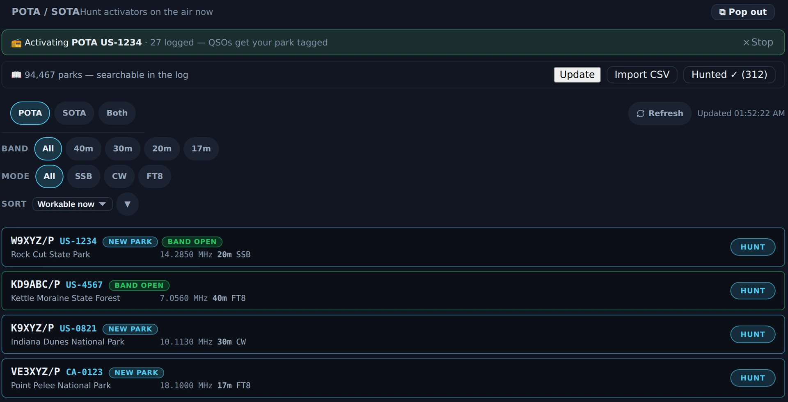

# Contesting & POTA/SOTA

Two portable/event workflows live here: **Field Day** (ARRL or Winter Field Day),
which reshapes the app for the weekend and pushes to the club's master log in
real time, and the **POTA/SOTA hunter**, which finds activators and tags your
contact for upload. The hunter ships enabled — the wizard turns everything on.
**Field Day mode is the exception**: it stays off until you switch it on in
[Settings ▸ Appearance ▸ Features](settings-reference.md#features) or
[Contesting ▸ Field Day Setup](settings-reference.md#field-day-setup), because it
reshapes the app for a weekend most operators are not having.

---

## Field Day

A settings switch turns the event on and the app reshapes for it: the exchange
grammar, a live countdown that knows the real date rules, per-(call, band,
mode-class) dupe checking, and a scoreboard.

<!-- TODO: capture screenshot — Field Day mode — exchange entry, countdown, live scoreboard -->

### Set it up first

*Field Day Setup in Settings ▸ Contesting, Nexus 1.10.3, with Field Day mode
off. The class, section and multiplier shown are one station's own entries —
set yours from the rules for the event you are in.*

In [Settings ▸ Contesting ▸ Field Day Setup](settings-reference.md#field-day-setup):

1. **Event** — ARRL Field Day or Winter Field Day. This changes scoring labels
   and export headers.
2. **Class / Category** and **ARRL Section** — these start **empty on purpose**,
   and Field Day refuses to start until you set yours. (An old default of "WI"
   sent the wrong exchange for everyone outside Wisconsin — now it's a one-time
   deliberate step.) ARRL FD wants a class like `1D`; WFD wants a category like
   `2O`.
3. **Power multiplier** — ×5 (QRP/battery ≤ 5 W), ×2 (≤ 100 W), or ×1 (> 100 W).
   It multiplies your QSO points; the engine clamps it to the legal values.

### Operate the event

Field Day is **all-mode**: once you initiate a contact, the digital sequencer
runs the FD exchange autonomously, and the [CW](cw.md) and [Phone](phone.md)
cockpits' log strips become FD entries with class/section and **shared dupe
checking** — one laptop covers the whole operation.

*A Field Day **test event** in Nexus 1.10.3 — a fixture, not a submitted entry. The banner
names the event and the rules year it is scoring against; the counters and the arithmetic line
show the whole sum (**QSO pts 903 × power ×2 = 1806 + bonuses 400 = 2206**), and the sections
board marks what has been worked out of 83. The per-contact exchange — class and section — is
typed in the cockpit log strips and lists under this panel.*

The one strip that does **not** switch is the log strip in the
[Satellites](satellites.md) section: it is not wired to Field Day yet, so a
contact typed there during FD goes into your general log and scores the club
nothing. Log satellite contacts from the CW or Phone cockpit **while you are
still on the bird** — the FD log stamps each contact with the band the radio is
on at the moment you type it, so one entered after you have QSY'd away files on
the wrong band, both in the Cabrillo and on the N1MM / N3FJP wire.

The scoreboard shows its work: QSO points (phone 1, CW/digital 2) × the legal
power multiplier + a 15-item ARRL bonus checklist = total. **Winter Field Day
deliberately shows raw counts only** — its objectives math isn't ARRL's, and
Nexus won't display a fake total.

Opening **Bonuses** does not cost you the sections board. The board is the only
part of the Field Day column that can give height, so it used to give it for
everything else and collapse to a blank strip when the fifteen-row checklist
opened. It carries a floor now and the column scrolls past that floor, so the
board a club watches all weekend stays a board. The checklist keeps its own cap
and scrolls inside itself: all fifteen rows are there, in a list of their own,
rather than 290 px of checkboxes between you and the log.

### Export and club interop

Exports are submittable: **Cabrillo 3.0** with real per-QSO UTC timestamps and
per-row mode tokens, plus **ADIF** with `CONTEST_ID`.

The club story is native:

- Every FD contact pushes in real time to **N3FJP** over its official TCP API
  (default port 1100). Configure the master log's host/port and use the **Test
  N3FJP** button at the site before the event.
- Nexus also broadcasts the native **N1MM+** `<contactinfo>` UDP datagram for
  N1MM-networked dashboards.

Both are fire-and-forget on background threads, so a hung logging PC can never
stall your TX slot. The WSJT-X UDP Status message sets `special_op = Field Day`,
so JTAlert/GridTracker auto-activate their FD behavior too.

Configure [N3FJP](settings-reference.md#n3fjp-integration-club-master-log) and
[N1MM+](settings-reference.md#n1mm-integration) in Settings ▸ Logging & Connectors.

### Run the whole club on Nexus (club sync)

*Field Day Club Sync in Settings ▸ Contesting, Nexus 1.10.3. Hosting is off
here — nothing is listening on the network until you turn it on.*

If every position runs Nexus, you don't need a third-party master log at all.
One PC at the site turns on **Settings ▸ Contesting ▸ Field Day Club Sync ▸
Host a club event**; every other position presses **Find club events** (or
types the host's address) and joins. From then on:

*The club board in Nexus 1.10.3, torn off into its own window. The chip beside **Club** is the
sync state, the host is named next to it, and the club totals sit on the right; each row is one
operating position, and the greyed **GOTA** row carries a ⚠ because the host has not heard from
it inside the stale line. **This is fixture state, not two instances that actually synced** —
no second Nexus was running, so the picture shows what the board looks like, not evidence that
a club sync worked.*

- Each logged contact streams to the host the moment it lands; the host merges
  everything into one club log and pushes the club totals back.
- Every position gets a **club dupe warning while typing** — if another tent
  already worked that call on this band and mode, you're told before you call.
  It's a warning, not a lock (N3FJP semantics); your own log's dupes still
  refuse.
- A live **band board** shows where every position is (band, mode, operator,
  rate), stale-marked the moment one goes quiet. It has its own **Club Board**
  button in the left rail under Field Day, and its own window — one click, on a
  second monitor or a corner of the big one, in bigger type than the dashboard
  copy because it is watched from across the tent. **Pop out board** in the club
  header opens the same window. The rail button is there whenever Field Day is
  on, before you have switched sync on: with sync off the window names the route
  that starts it rather than showing an empty board. The web scoreboard below
  carries the same band and mode per position, so the screen facing the room
  answers "who's on 20?" too.
- The sync chip tells the truth: **Synced**, **Behind n**, or **Offline** —
  contacts logged offline are journaled and re-sent automatically on
  reconnect. If the host PC dies, enable hosting on any other position;
  everyone re-joins and nothing is lost.
- The host exports the merged **club Cabrillo / ADIF**, deduplicated the way
  the rules score it (earliest contact wins).

Hosting is the one time Nexus listens beyond the local computer, and only
while the toggle is on. There is no join password — a club site LAN is
trusted; the connection can only carry log rows, never key a transmitter or
change a setting. The N3FJP/N1MM pushes above keep working alongside if you
want both.

---

## POTA / SOTA hunter

The hunter is for **finding activators, not running activations**. It polls the
official feeds (pota.app and SOTAwatch) every 60 s.

*The POTA / SOTA hunter in Nexus 1.10.3, showing live activators.*

### The tour

Live spots with program toggles (**POTA / SOTA / Both**), band and mode filter
chips, park names, and two ranking badges:

- **NEW PARK** — the reference has never appeared in your log (computed from your
  own ADIF, not an external tracker),
- **BAND OPEN** — PSK Reporter confirms your signal is reaching that band within
  the last 15 minutes.

### Hunt an activator

*POTA / SOTA in Nexus 1.10.3 with an activation of my own running — the green banner counts the
contacts that will be stamped with the park. Under it the hunter list: **NEW PARK** on
references never logged, **BAND OPEN** where the band is two-way now, and **HUNT** on every
row. The tags themselves land in the logbook's **PARK** column. Fixture spots and a fixture
activation: nothing was hunted, logged or uploaded to POTA.*

1. Click **HUNT** on a spot. Nexus atomically registers the park as a pending
   hunt target, QSYs to the spot's frequency and mode, and opens the right
   cockpit.
2. Work the activator. The **next QSO you log with that call** — matched by base
   call, so `/P` suffixes don't break it — is automatically tagged with
   `SIG`/`SIG_INFO` (POTA) or `SOTA_REF` in standard ADIF, ready for the POTA
   uploader.

The pending hunt tags **only the first matching QSO** and **expires after 4
hours**, so a stale park reference can't contaminate an unrelated contact next
week. Activators also appear as chips on the [Needed board](needed-dx.md) when
they're heard on the air.

## Honest limits

- **The POTA/SOTA section is hunter-only** — Nexus helps you *chase* activators;
  it isn't an activation logger for running your own park/summit.
- **Winter Field Day shows raw counts, not a computed total** — by design.
- Field Day **won't start until class and section are set** — that's a guard, not
  a bug.
- **The Satellites section's log strip doesn't join Field Day yet** — unlike the
  CW and Phone strips it stays on the general log while a session runs. Not a
  design choice; not wired up yet.
- **You can't tell the Field Day log which band a contact was on** — it records
  a band per contact, but always the one the radio is on at the moment you type
  the entry; nothing lets you name a different one. Log as you work, not
  afterwards.

## Related guides

- [Operate — FT8/FT4 digital](operate-digital.md)
- [Needed — DX that's on the air now](needed-dx.md)
- [Logbook & QSL](logbook-qsl.md)
- [Settings reference — Field Day Setup](settings-reference.md#field-day-setup)
