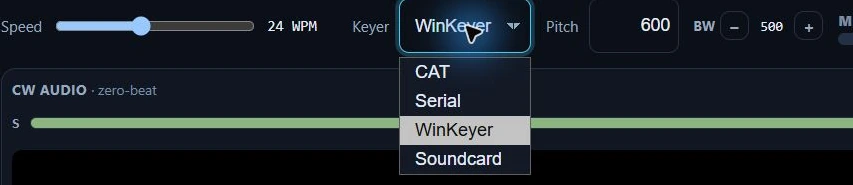
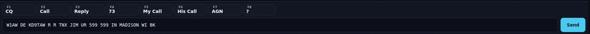
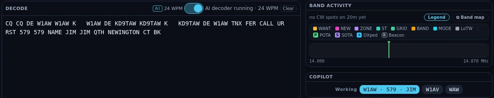

# CW

The CW cockpit is a casual/ragchew CW station in software. It is deliberately
scoped: you key every message yourself — there are no contest serials and no
auto-sequencing. What it gives you is a keyboard keyer with F-key macros, a live
CW decoder so you can read the other station, on-the-fly speed control, a
zero-beat scope, and your license privileges enforced — so you can call CQ and
hold a conversation without a paddle and without copying by ear if you'd rather
not.

CW ships enabled — the wizard turns everything on; there is no mode picker to
miss it in. No goal profile enables it, though, so if you pick one in
[Settings ▸ Appearance ▸ Features](settings-reference.md#features), switch CW
back on there — or take **Everything (expert)**, which includes it.

![The CW cockpit receiving on 14.0310 MHz. Its header carries the Keyer dropdown set to CAT, the Speed slider at 22 WPM, Pitch and the MEM strip, with ⊞ Panels · 2 hidden, Tune and Stop TX on the row above the CW audio zero-beat scope. Below the scope the Decode pane holds the transcript, its title bar carrying the AI badge, the decoded 28 WPM, the AI switch and Clear; Band activity sits under it and the Log pane (WC1D, 599 sent and received) takes the right-hand column, with the eight F-key macros and the type-and-send field along the bottom.](../img/manual/cw-cockpit.webp)

## The tour

**Keyer back-ends.** Four ship, on the header's **Keyer** dropdown. Hovering the
dropdown explains the one you are keying with; each entry in the list carries its
own explanation, so you can read the others before you switch:

- **CAT** — the rig generates the Morse (Hamlib `send_morse`), with speed pushed
  over CAT. Zero extra hardware; needs a rig that supports CW keying over CAT.
- **Serial** — Nexus toggles DTR or RTS into the rig's KEY jack and the rig
  shapes the signal (rig in CW). This is the N1MM/fldigi method for a rig with no
  CAT keying command. Set the keyline port and line in
  [Settings ▸ CW](settings-reference.md#cw).
- **WinKeyer** — a K1EL WinKeyer hardware keyer over serial (rig in CW). It's the
  no-ambiguity option: real hardware timing, nothing to route. Set its serial
  port under **WinKeyer port** in
  [Settings ▸ CW](settings-reference.md#cw).
- **Soundcard** — Nexus synthesizes PARIS-timed, click-free Morse (5 ms
  raised-cosine envelopes) through the TX audio path, for rigs without a CW keyer
  command. This is the workaround, not the clean path: it works **only** if
  Nexus's audio output is routed to the rig (as for FT8) *and* PTT works, and you
  must keep drive below ALC — otherwise it looks like it's sending and nothing
  reaches the air. **This path takes the radio out of CW**, into a data mode
  (DATA-U/DATA-L) — the same mode FT8 uses, and for the same reason: on the common
  Icom and default-Yaesu wiring, plain SSB takes its transmit audio from the MIC
  socket, so the rig would key and radiate nothing. CW mode comes back when you
  pick another keyer. If your interface feeds the rig's **mic jack** instead of its
  data input, tick **plain SSB for data modes** on that radio in
  [Settings ▸ Radio](settings-reference.md#radio) and this path uses plain SSB for
  you, exactly as it does for FT8.

  On a Yaesu FTX-1, CAT keying is flagged as **unproven** where you pick it: its
  Hamlib backend sends a different keying command from the one other radios use and
  reports success either way, so if nothing goes out Nexus cannot tell you. It is a
  notice, not a block.

**The CW decoder.** The **AI** decoder is the default: a neural net (the DeepCW
model by e04) reads the whole 400–1200 Hz window rather than one pitch, which is
what makes it copy a station you have not zero-beat and hold on through QSB. The
switch beside the **AI** badge in the Decode pane's title bar turns it off and
falls back to the classic single-pitch decoder, which reads only the tone at your
marker. Either way you get a running transcript that persists as text scrolls by,
the decoded **WPM** beside it — leave WPM on auto and the keyer follows the
station's speed — and a **Clear** button that wipes the decoded and sent
transcripts together. A **Copilot** pane shows the decoded callsigns as chips;
click one to make that station your worked peer.

**Speed.** WPM runs 5–50 (default 25). Nudge it on the fly with **PgUp / PgDn**
(±2 WPM, hold Shift for ±4).

**The AF scope** is a narrow 300–1100 Hz display with a hairline drawn at your
sidetone pitch, so you can zero-beat a station by ear and eye.

**The zero-beat light** goes further: Nexus measures the tone actually coming in
and tells you where it sits against your pitch. A light comes on when you are on
pitch, and beside it a needle and a signed offset in Hz say which way and how far
off you are — being 80 Hz out no longer looks the same as being 400 Hz out. How
close counts as on pitch follows your rig's CW filter: 25 Hz behind the usual
500 Hz one, tighter behind a narrow filter. With several signals in the passband it
follows the one nearest your marker rather than the loudest, so it does not jump to
a strong station 300 Hz away while you are closing in.

On a dead band it goes quiet and stays quiet. A reading only appears once a tone has
held the same frequency long enough to be a signal you are tuning rather than the
loudest thing the receiver happened to hear — otherwise the needle would twitch at
band noise between overs. That costs about a fifth of a second before a new signal
shows, and the wait is paid when a station starts sending, never between their
letters. It is a display only: it never touches your dial.

**⊞ Panels** in the header shows and hides the panes under the scope, and an
entry with nothing on screen behind it right now says why in a line under it —
it stays keyboard-reachable and reads that reason with the panel name.
**Scope Controls** command the radio's own panadapter, so they appear only while
an Icom CI-V or FlexRadio scope is streaming; **DSP Toggles** and **RX DSP
Levels** offer only what your radio reports over CAT. Those three draw inside one
**Rig controls** card and sit on a single row at the default width, which is one
title bar and one border instead of three — they are still three separate menu
entries, each switching its own group and explaining itself when your radio
cannot feed it. **Sent Echo** holds what you have transmitted this session, so it
is empty until your first over; **TX Meters** read on transmit. The line explains
the screen; the tick is still yours — untick Sent Echo at start-up and it stays away after your first over,
rather than making you transmit before you can hide it. Once you have unticked an
entry its line goes with it: the pane is off your screen because you said so, not
because of anything the rig is doing. **Esc** closes the menu and puts focus back
on the ⊞ button. See [Phone](phone.md) for the same menu on the voice side.

**What the cockpit gives room to.** The Decode transcript is the pane a CW
operator works from, and it is the one the layout grows: everything beside it —
the Sent echo, Rig controls, Band Activity, the Copilot — is exactly as tall as
what it holds, and the transcript takes the rest. There is a floor under it, so a
column full of control strips can no longer starve it toward nothing. At the
window Nexus opens at that comes to four lines of copy with one short drag left
to scroll; on a wide window the aux panes get a column of their own and the
transcript keeps the whole gain. The leading column scrolls when it stands taller
than the space it has, so a control never renders past the edge. **Stop TX**,
**Tune** and **Esc** sit outside the pane region — no layout you save can put
them out of reach.

<!-- TODO: capture screenshot — the eight F-key macro buttons with the recommended-next highlight -->

## Macros

Eight F-key macros cover a normal ragchew, in the order you'd send them:

| Key | Label | Sends |
|---|---|---|
| `F1` | CQ | `CQ CQ DE {MYCALL} {MYCALL} K` |
| `F2` | Call | answer a CQ with just your call (so they copy it — no report yet) |
| `F3` | Reply | your report + name, once they've come back to you |
| `F4` | 73 | sign off (`TU 73 SK`) |
| `F5` | My Call | `{MYCALL}` |
| `F6` | His Call | the worked station's call |
| `F7` | AGN | `AGN AGN` |
| `F8` | ? | a bare `?` |

Macros expand `{MYCALL}`, `{NAME}`, `{RST}`, and his-call tokens, and **599 is
cut down to `5NN`** automatically. Set your operator name (for `{NAME}`) in
[Settings ▸ Station](settings-reference.md#station).

## Core workflows

### Keying backends, and what each one puts the rig into

Entering the cockpit commands the rig's mode for you, and **which mode depends on
the keyer you picked**. Three of the four leave the rig in CW and let it shape the
signal; the Soundcard backend plays an audio tone, so it needs the rig on the SSB
side in a data submode — the same reason FT8 does.

*The four keyer backends in Nexus 1.10.3. Each entry in the list explains itself
on hover, so you can read the others before you switch.*

| Keyer | What makes the Morse | Mode Nexus commands | Does Nexus key PTT? | TX audio | Extra setup |
|---|---|---|---|---|---|
| **CAT** | the rig's own keyer (Hamlib `send_morse`, fed one word at a time) | **CW** at 30 m and up, **CW-L** (Hamlib `CWR`) on 160/80/40 m | no — the rig keys itself | not used | none |
| **Serial** | the rig, keyed by DTR or RTS on its KEY jack | same as CAT | no — the rig keys off its KEY line | not used | **Keyline serial port** and **Keying line** in [Settings ▸ CW](settings-reference.md#cw) |
| **WinKeyer** | a K1EL WinKeyer over serial | same as CAT | no — the keyer and the rig handle it | not used | **WinKeyer port** in [Settings ▸ CW](settings-reference.md#cw) |
| **Soundcard** | Nexus, as a keyed audio tone | **DATA-U** at 30 m and up, **DATA-L** on 160/80/40 m — plain USB/LSB only if **plain SSB for data modes** is ticked for that radio | **yes** | yes — the same TX audio path FT8 uses | your PTT method, plus Nexus's audio routed to the rig and drive under ALC |

The 10 MHz split is the ordinary CW and sideband convention: below it the lower
side, above it the upper. It is the same rule the Phone cockpit follows, and it
is why a rig on 40 m lands in CW-L rather than CW-U.

**When nothing goes out**, the cockpit names the backend that failed rather than
leaving you guessing:

- **CAT** — "Your rig didn't accept CAT CW keying (Hamlib `send_morse`)." Many
  Hamlib backends serve frequency, mode and PTT but not keying. Move to WinKeyer
  or Soundcard.
- **Serial** — the operating system's own error on the port, verbatim, with the
  reminder that CAT or another program may be holding it.
- **Soundcard** — "the rig didn't accept PTT". Audio-routing faults cannot be
  detected here: a tone that plays locally while the rig is in plain SSB on a
  data-input interface radiates nothing, and looks identical to a good send.
- On a **Yaesu FTX-1**, CAT keying is flagged **unproven** where you pick it: its
  Hamlib backend sends a different keying command from the one other radios use
  and reports success either way, so a silent failure cannot be reported. It is a
  notice, not a block.

### Call CQ and work an answer

1. Set your band and frequency. Entering the cockpit commands the rig's mode for
   you — CW (CW-L below 10 MHz) on the CAT, Serial and WinKeyer keyers, a DATA
   submode on the Soundcard keyer. See the table above.
2. Press **`F1`** to send CQ.
3. When someone answers, type or click their call into the his-call field, then
   run **`F3`** (report + name) → **`F4`** (73) as the QSO progresses. You send
   each over — nothing fires automatically.
4. **`Esc`** aborts keying instantly: it clears the queue and stops the rig.

*The macro row and the typed buffer in Nexus 1.10.3. Enter sends what is in the
field, and it queues behind whatever a macro is already sending.*

### Read the other station

1. Watch the transcript fill in, with the decoded WPM beside it. Leave WPM on
   auto and the keyer matches the station's speed for you. With the AI decoder on
   you do not have to zero-beat first — it reads the whole 400–1200 Hz window.
2. If you turn AI off, the classic decoder reads only the tone at your marker, so
   zero-beat the station you want using the AF scope's hairline.
3. **Clear** wipes the decoded and sent transcripts together and re-pins both to
   follow the next copy, even if you had scrolled up.
4. Click a decoded-call chip in the Copilot to make that station your worked peer
   — it fills the his-call token in your macros and the Log pane.

*Decode and Copilot in Nexus 1.10.3. The WPM beside the AI badge is the speed
read off the air, not a setting. The Copilot's first chip is its best candidate
for the call and the two after it are the near-misses it also considered.*

### Land here from the Needed board

Click a CW row on the [Needed board](needed-dx.md) and Nexus QSYs to the spot and
opens this cockpit with the **callsign already typed** in the Log pane, ready
for your first over. The Log pane pre-fills **CW / 599**.

## Honest limits

- **The decoder prints one transcript, not a skimmer's rows.** The AI decoder
  reads the whole 400–1200 Hz window, but everything it copies lands in the same
  running text — it does not split two stations into two columns the way a
  full-band skimmer does. Expect ordinary machine-copy behavior either way: clean
  sending decodes well, heavy QSB and swamped signals less so. The classic
  decoder is narrower still, reading only your marker pitch.
- **The AI model ships as an app resource** (DeepCW, AGPL-3.0, © e04). A build
  without it says so in the pane and the classic decoder carries on — nothing
  else in the cockpit is affected.
- **Unassisted mode turns the AI decoder off**, whatever the switch says, because
  a declared unassisted entry means no machine copy. That is the one case where
  the AI decoder is silent with the setting still on.
- **No contest exchanges or serials** — this is a casual keyboard station by
  design. (Contest exchange modes aren't built.)

The license-class gate blocks keying outside your segment — including the
Technician CW-only segments on 80/40/15 m. Set your class in
[Settings ▸ Station](settings-reference.md#station).

## Related guides

- [Phone (SSB)](phone.md)
- [RTTY](rtty.md) — the other type-it-and-send-it mode, with its own F-key macros
  and live decoder
- [Memories](memories.md) — the bank behind this cockpit's MEM strip
- [Operate — FT8/FT4 digital](operate-digital.md)
- [Needed — DX that's on the air now](needed-dx.md)
- [Settings reference](settings-reference.md)
