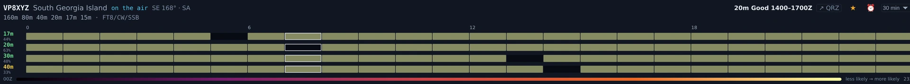

# DXpeditions

The DXpeditions section is your expedition planner: active operations on the air
now, the forward calendar of what's coming, your **needed status** for each one,
and — the part that earns its keep — a per-day forecast of *your* best shot at
each entity plus a wake-me alarm that only fires when the expedition is actually
on the air.

DXpeditions ships enabled — the wizard turns everything on — and the DX/awards
and 6m/VHF goal profiles both keep it. If you have trimmed sections, switch it
back on in
[Settings ▸ Appearance ▸ Features](settings-reference.md#features). It never
touches the rig on its own: nothing here retunes until you press **▶ Work** on a card, and the
QSO itself still happens in a cockpit. It tears off to a second monitor with **⧉ Pop out**.

## The tour

The section is two halves: **Work now** at the top, for what is on the air this minute, and
the **calendar** below it, for planning.

![The top of the DXpeditions board. A hero panel reads "20 DXpeditions on the air now · 35 announced" beside a green LIVE badge. Under a heading "WORK NOW — NEEDED × ON THE AIR" is a grid of cards. The first reads: FS, St Martin, an amber NewBand chip and a ☆; then "40m Excellent ✓ live spots" and "SE 129° · 3,621 km"; then "open now — live spots"; then "Standard FT8 — call at your offset"; then a "▶ Work 40m" button, with "◎ show on map" beneath the card. Other cards read Good, Fair or Marginal instead of Excellent, some show "best 1125–2025Z" in place of "open now", and some carry a green ✓ Confirm chip instead of NewBand.](../img/manual/dxpeditions-work-now.webp)

*The Work-now grid in Nexus 1.10.3 on one evening. The counts, entities and workability ratings
are whatever the feeds and the propagation model said at that moment — they are not a target
and they will not match your screen.*

**The hero line** counts what is on the air now against what is announced, and the badge beside
it is the data's own provenance: **LIVE**, **PARTIAL**, **CACHED *n*m** or **NO LIVE DATA**. A
cached badge means you are reading the last good fetch, not the present.

**Work now — needed × on the air** is the crossing of two questions: expeditions you still need,
*and* a band with a modelled path to you right now. Each card carries:

- the **call** and **entity**, and your **need chip** for it — `NewBand`, `Confirm` and the rest
  of the [Needed board's vocabulary](needed-dx.md#the-tour);
- the **★ chase toggle**, which alerts you when your modelled window opens *and* live spots
  confirm them;
- the **band and its workability** — Excellent, Good, Fair, Marginal or Closed — with a
  **✓ live spots** mark when PSK Reporter spots confirm that band toward the DX region rather
  than only the model;
- the **bearing and distance** from your grid;
- **open now**, or **best HHMM–HHMMZ** when the window is later;
- what to expect on the air (`Standard FT8 — call at your offset`, or a SuperFox warning);
- **▶ Work *band*** — jump the rig to that band and open the right cockpit;
- **◎ show on map** — open Connect with that expedition selected.

**▸ details** on a card opens the full 24-hour × band reliability grid for that path, which is
where a "Marginal" turns back into numbers you can argue with.

When nothing crosses both tests the grid says so plainly rather than sitting empty: *"Nothing
you need is workable right now."*

## Core workflows

### Plan your shot

![The DXpedition calendar. A heading reads "DXPEDITION CALENDAR — WHEN TO PLAN YOUR CHASE". Under it a "WHAT TO CHASE" block lists four colour-dotted rows: RI1FJZ Franz Josef Land 8° starts tomorrow; KH0N Mariana Is 307° starts in 2 days; KH8WW American Samoa 254° starts in 2 days; S79 Seychelles 50° starts in 3 days. Below that a month grid with weekday columns MON, TUE, WED, THU, a cyan-outlined "8 TODAY" cell, and coloured horizontal bars labelled RI1FJZ, KH8WW, KH0N, S79, 8Q7JH, JD1, 5W0AF, VP9I, H49A running across the days each operation is announced for, with "+1" and "+2" markers where more operations are stacked on a day and band summaries such as "160m·80m·40m+6" at the right end of a bar.](../img/manual/dxpeditions-calendar.webp)

*The calendar in Nexus 1.10.3. The grid runs Monday to Sunday — the last three columns and the
per-bar band summaries continue off the right of this crop, and the **Calendar / Details** tabs
sit at the top right of the panel.*

**What to chase** is the digest above both views and it does not change with them: the
operations worth your attention, each with its bearing and how soon it starts, and beside each
one the band, workability and UTC window Nexus models as its best, with the days to aim for.

The panel has two views:

- **Calendar** is the month grid, and it is what you land on. One bar per operation across the
  days it is announced for, today outlined, `+n` where a day has more operations than fit, and
  each bar's own band list at its end. A bar names its call, entity, dates, bands and modes on
  hover, and says `· chasing` when you have starred it.
- **Details** is the per-operation list, and it is where the planning controls live: the 7-day
  strip, the reliability heatmap, the ★ chase toggle, the ⏰ alarm and the link to the
  expedition's own website (or their QRZ page, labelled as the fallback when no site was
  announced).

Clicking a bar in the grid — or a row in the digest — switches to **Details** and scrolls to
that operation.

**The week planner** is that 7-day strip on a Details entry: one chip per day, `Su` through
`Sa`, coloured by *your* modelled best shot that day. Dimmed chips are days the operation is
not on the air — the model still runs, the expedition just is not there. Hover a chip for that
day's best band and window, or "no modelled path" when there isn't one. This is your own
station's forecast, not a generic one: it uses the propagation engine you picked in
[Settings ▸ Logging & Connectors](settings-reference.md#integrations--feeds), and each entry
says which engine produced its number.

To plan a chase:

1. Find the operation in **Details** and read its 7-day strip.
2. Hover the best-coloured day for the band and window Nexus models as your
   strongest opportunity.
3. When the window comes, work them from the **Work now** grid's **▶ Work *band*** button, or
   through the [Operate cockpit](operate-digital.md) — turn on **Hound** mode for the pileup
   ([Settings ▸ Digital](settings-reference.md#digital-ft8ft4), or the
   DXpedition chip selector in the Operate cockpit). Active expeditions also
   surface on the [Needed board](needed-dx.md) and the
   [Connect map](connect.md) when heard.

### Set a wake-me alarm

*An armed wake-me alarm in Nexus 1.10.3, staged on a fixture operation. The ★ is the chase
toggle and the ⏰ beside it is the alarm; the lead selector reads **30 min**. The time basis is
the strip underneath — a 24-hour band × hour grid running 00Z to 23Z — so the lead counts back
from the window's UTC start, never from local time. No alarm was left armed on a real
operation.*

1. Switch the calendar to **Details** and click the **⏰** beside the **★** on the operation's
   entry. (The ★ is the *chase* toggle — it alerts you when your window opens and live spots
   confirm them. The ⏰ is the loud one.)
2. Pick a lead time — 5, 15, 30, or 60 minutes before the window opens.
3. At window-start minus your lead, you get a loud repeating beep (~60 s, with a
   Stop button) plus a banner that stays until you dismiss it.

The alarm is honest about *when* it fires: it only goes off while the expedition
is **actually on the air**, it survives an app restart, and it never re-fires the
same window twice. To test it cheaply, arm one whose strip shows an opening
within the hour and set a 5-minute lead.

## Honest limits

- Best-shot colors and windows are **modelled**, using your prediction engine and
  station details — treat them as a forecast, not a guarantee. The **✓ live spots** mark on a
  card is the exception: that band is confirmed by real PSK Reporter reception toward the DX
  region. Live spots on the [Needed board](needed-dx.md) are the ground truth.
- **The board sets you up; it does not work anybody.** **▶ Work *band*** jumps the rig to that
  band and opens the right cockpit — the QSO happens there, in the digital, CW or Phone
  cockpit, as it does everywhere else. Nothing on this screen keys a transmitter.
- **Nothing here retunes on its own.** Opening the section, an alarm firing, a chase alert — none
  of them move the radio. Only **▶ Work** does.
- **The counts are as fresh as the badge says.** **LIVE** means the feeds answered; **CACHED
  *n*m** means you are reading a fetch that old; **NO LIVE DATA** means the board is showing
  nothing current at all. Read the badge before you trust a "on the air now".
- **A SuperFox operation cannot be worked here.** Nexus has no SuperFox decoder in this
  version, so those transmissions never reach the decode list and Hound mode cannot help. The
  card says so. Work it in WSJT-X and log it back in Nexus.

## Related guides

- [Needed — DX that's on the air now](needed-dx.md)
- [Operate — FT8/FT4 digital](operate-digital.md) (Hound mode)
- [Connect — map + propagation](connect.md)
- [Awards & Journey](awards-journey.md)
