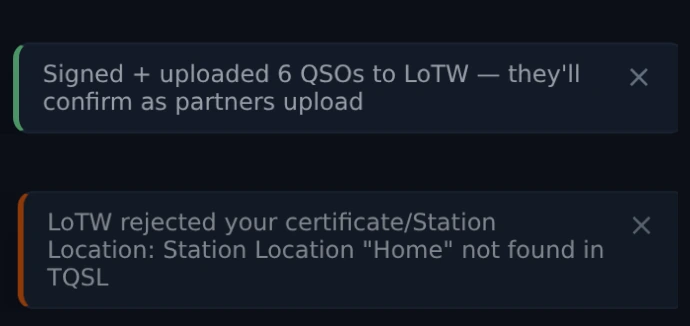
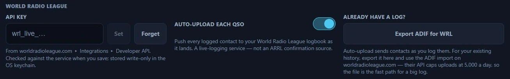
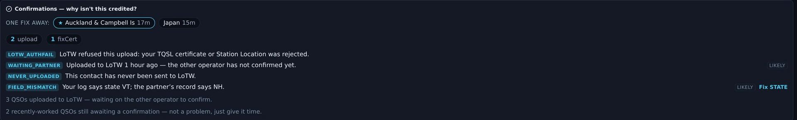

# Logbook & QSL

The logbook is Nexus's system of record: a persistent ADIF 3.1.4 store with full
round-trip fidelity. It holds callsign, grid, entity, state, band, frequency,
mode, the string RSTs each mode actually uses (FT8's "−12" and CW's "599" are
both first-class), name/QTH, notes, POTA/SOTA references, and a per-QSO upload
state for every online service — so "what has actually been uploaded where"
survives restarts.

## The tour

*The logbook table in Nexus 1.10.3, sorted newest first.*

Each row is one QSO. The columns you'll use most:

- **Call, band, mode, date/time, RST** — the contact itself.
- **Entity / DXCC** — resolved from cty.dat, first-class in the table.
- **QSL** — *which source* confirmed the contact. It shows one of four things:
  - **L**, **C**, **E** — LoTW, a paper card, eQSL, joined by `·` when more
    than one channel confirmed. Hover for the eligibility tooltip.
  - **✓** — award-confirmed, on an older record that predates the per-channel
    split and so cannot say which channel.
  - the word **eQSL** in yellow — confirmed, but by nothing that earns award
    credit. ⚠️ **A QRZ-logbook match also lands here and is labelled eQSL**,
    which is a mislabel: if the Confirmations card in [Stats](stats.md) shows
    eQSL at zero while your logbook is full of yellow eQSL marks, those marks
    are QRZ matches.
  - **—** — not confirmed.

  **eQSL is clearly labelled non-award**: it counts as a confirmation but not
  toward DXCC/WAS (ARRL doesn't accept it). Nor does a QRZ match. This matters
  — see [Awards & Journey](awards-journey.md).

**Search** matches callsigns *and grids*. The **"needs confirmation"** chip
beside the search box filters to contacts without an award-eligible (LoTW/paper)
confirmation — a QSL you've *requested* but not received still counts as
unconfirmed and stays in that list.

<!-- TODO: capture screenshot — the QSL column tooltip explaining L / C / E eligibility -->

## Core workflows

### Add or edit a QSO by hand

Press **Log QSO** for the manual entry form. It seeds the draft from **what you
were actually running**: log a contact from the [Phone cockpit](phone.md) and the
draft says SSB, from [CW](cw.md) it says CW — no more accidental "FT8" voice
contacts. Edit any field inline; the store round-trips to ADIF, so an export
re-imports without loss.

*The manual entry form in Nexus 1.10.3. Every box here is showing its
placeholder — nothing has been typed yet.*

When the open form stands taller than the pane holding it — 1024×768 at a large
UI zoom is where you meet this — the pane scrolls and the **Log** button that
commits the contact is one drag away. It is a scrollbar rather than more room:
nothing moves at any window size where the form already fits.

### Upload to LoTW

*The two answers to **Upload to LoTW**, in Nexus 1.10.3 — **from two separate runs**, stacked
here so you can tell them apart. Above, the batch was signed and sent and now waits on the
other operators. Below, TQSL refused it, and the notice names the thing to go and fix rather
than saying "failed". Both replies are mocked for this capture: nothing was signed and nothing
reached LoTW.*

1. Set your **LoTW Station Location** (and optionally the TQSL path) in
   [Settings ▸ Logging & Connectors](settings-reference.md#confirmations).
   Nexus signs through *your installed TQSL* against that named Station Location
   — no certificate or password is stored by Nexus.
2. Click **Upload to LoTW** in the logbook. The button shows the count of
   un-uploaded QSOs; it signs and uploads the unsent batch. If you would rather
   not remember, turn on **Upload to LoTW automatically** in the same Settings
   group and Nexus runs that batch every few hours. It stops and waits for you if
   a batch is ever refused, and it is unavailable while *Sign from ADIF location*
   is on — that mode signs everything from wherever you are now, so it needs you
   to pick the moment.
3. Pull confirmations back with **Download confirmations** (Settings ▸ Logging &
   Connectors ▸ LoTW). That button only goes one way, *down*; the upload is step 2
   above. The first pull covers your whole history; later ones are incremental.
   Pulling also
   marks which of *your* uploads LoTW holds on file, so a pending contact reads
   "waiting on the other op," not "never uploaded."

   Purging the logbook resets that incremental position, so the next sync after a
   purge pulls your whole history again rather than only what LoTW has matched
   since you last synced.

   You can also feed Nexus a report you downloaded from the LoTW website by hand —
   either **Sync confirmations** (which only ever updates contacts you already
   have) or **Import ADIF** works. Import adds any contacts the file has that you
   lack *and* applies the confirmations and award credits to the ones you already
   hold; its toast reports the two separately, so "0 imported, 24,163 existing QSOs
   updated" is the normal and correct result for a confirmation download.

### Push a single QSO to QRZ / ClubLog / HRDLog / WRL

Auto-upload (configured per service in
[Settings ▸ Logging & Connectors](settings-reference.md#confirmations)) pushes
each QSO as you log it. When one fails — a service was down, a key was
wrong — the logbook gives you a **per-row re-push** for **QRZ**, **ClubLog**,
**HRDLog.net**, and **World Radio League** so you can retry that one contact
after fixing the cause. A "duplicate" result is the benign "already there"
answer, not an error.

The buttons live at the right-hand end of the row and appear on hover, so an
untouched table shows none of them. Left to right they are **📢** (spot this
station), **↥** (push to QRZ), **CL**, **HL**, **WRL**, a **QSL▸** menu, **✏**
to edit and **✕** to delete. On a narrow window the leading buttons can be
clipped off the left of that cell; widen the window if 📢 and ↥ are missing.

### World Radio League

*World Radio League in Settings ▸ Logging & Connectors, Nexus 1.10.3. The key
box here is empty and showing its placeholder.*

Paste your WRL API key in Settings ▸ Logging & Connectors and it is verified
against your WRL account the moment you save it — your destination logbook is
found automatically. From then on every contact flows to WRL as you log it (the
auto-push switch is beside the key), and each logbook row carries a WRL button
for anything logged earlier. Bringing an existing log across? **Export for WRL**
writes an ADIF shaped for WRL's own bulk importer — the right road for thousands
of historical contacts, which would otherwise trickle through a rate-limited
API one at a time.

### Mark a QSL sent

When you send a card or request, record it on the contact with **Mark QSL sent**,
choosing the method — **bureau**, **direct**, or **electronic**. The row then
shows a quiet "QSL sent … via …" note. Marking a request sent does **not**
confirm the contact — it stays in the "needs confirmation" list until the reply
comes back.

### Understand why a contact isn't confirmed

A per-QSO **diagnostics** view explains why award credit hasn't landed yet — no
upload sent, waiting on the partner, a date mismatch — with one-click fixes where
they exist. Reconciliation tolerates ±1 day of midnight skew and matches by
mode-class, so an FT4-vs-FT8 labelling difference doesn't orphan a confirmation.

*The confirmation diagnostics in Nexus 1.10.3, on a fixture log. Each row names its reason in
code and in words — a rejected certificate, a partner who has not uploaded yet, a contact never
sent, a state that disagrees — and a row with a fix carries it on the right (**Fix STATE**),
with the batch actions above it. The two closing lines separate what is stuck from what is
merely young.*

## How uploads flow

Uploads happen in the **backend log funnel**: when a QSO is logged, the
configured connectors push it. You don't push from the logbook UI for the
auto-upload path — the per-row buttons are for *recovery* when an automatic push
failed. Credentials live only in the **OS keychain**; the Connections panel reads
back presence, never the secret itself.

### Which service does what, and which way

Eight services, and they do not all do the same job. Read the **direction**
column first: *out* means Nexus sends your contacts, *in* means Nexus fetches
somebody else's answer, and a service can be one, the other, or both. Only two
of them earn ARRL award credit.

| Service | Direction | What it needs | What starts it | Award-grade? |
|---|---|---|---|---|
| **LoTW** | out | your installed **TQSL** and a Station Location name (Nexus stores no certificate and no signing password) | **Upload to LoTW (N)** in the logbook, or the every-few-hours batch if you turn it on | **yes** |
| **LoTW** | in | your LoTW *website* login and password | **Download confirmations** in Settings, or an ADIF report you downloaded yourself | **yes** |
| **eQSL** | out | eQSL username + password (and the QTH Nickname if your account has several) | logging a contact, with auto-upload on | no |
| **eQSL** | in | the same | **Sync** in Settings — it pulls your InBox | no |
| **QRZ lookup** | in | a QRZ.com account username + password | typing a call in a log strip or pressing **QRZ** in the entry form | n/a — it fills name/QTH/grid, it is not a confirmation |
| **QRZ Logbook** | out | a QRZ **Logbook API key** — a *different* credential from the lookup password | logging a contact, with auto-upload on; or the per-row ↥ button | no |
| **QRZ Logbook** | in | the same API key | the hourly pull, if you turn it on | no — a QRZ match sets *confirmed*, never *award-confirmed* |
| **HamQTH** | in | a HamQTH username + password | the same lookup, when QRZ is not configured or has no match | n/a — the free fallback for grid and state |
| **ClubLog** | out | account email, an **Application Password** (not your main one), the logbook callsign, and an API key | logging a contact, with auto-upload on; or the per-row **CL** button | no |
| **HRDLog.net** | out | your station callsign and the account **upload code** | logging a contact, with auto-upload on; or the per-row **HL** button | no |
| **World Radio League** | out | a WRL API key — saving it *is* the opt-in | logging a contact; or the per-row **WRL** button. **Export ADIF for WRL** for a historical log | no |

Two of those pairs are the ones that catch people out. **QRZ is two separate
connectors** — the XML callbook lookup and the Logbook API — with two separate
credentials, and configuring one does nothing for the other. And **LoTW's two
directions are two different passwords**: TQSL holds your certificate for the
upload, while the download uses your ordinary LoTW website login.

### How to tell it worked

Nothing here asks you to trust it. **Settings ▸ Logging & Connectors ▸
Connections** carries one row per configured connector, and the dot is painted
from the **last round trip**, never from whether a credential exists — a
revoked ClubLog app-password or a rotated QRZ key used to sit green forever
because the secret had not stopped existing. The row says one of seven things:

- **no credential** (grey) — nothing configured. There is nothing to be
  healthy about.
- **paused — auth failed, fix credentials** (red) — a kill-switch is holding
  every upload back. Fix the credential, then clear it.
- **failing** (red) — the last thing that happened was a failure. A second
  line gives the service's own words and how long ago: "failed 10m ago — …".
- **auto-upload off** (grey) — it can upload; you turned it off.
- **working** (green) — an upload got through and nothing has failed since.
  The second line reads "last upload 3h ago".
- **lookup only** (grey) — it never uploads, so it cannot be behind. This is
  what QRZ lookup and HamQTH read.
- **stored — not verified yet** (amber) — configured, on, and never once
  exercised. **This is not a problem and it is not a pass.** No news is no
  news.

Under the rows is a **connector log** — the last few dozen events with their
times, so "my log is missing a QSO" has a place to start. The QRZ Logbook row
also carries a **Test** button, which does a real round trip and reports what
came back.

Per contact, the QSL column tells you what came *back* (L / C / E), and the
per-row push buttons are the retry. A **duplicate** answer from any of these
services is the benign "already there", not a failure.

**When a push fails**, the fix is always the same shape: read the second line
on the Connections row for the reason, fix the credential or wait out the
outage, then press the per-row button on the contacts that missed. Turning
auto-upload off and on again does not resend anything.

## Honest limits

- **eQSL and a QRZ-logbook match never count toward LoTW-grade awards** —
  they're a separate confirmation tier, enforced everywhere credit is computed.
- **HRDLog.net and World Radio League are logging/awards sites, not ARRL
  confirmation sources** — an upload there never earns DXCC/WAS credit.
- **The per-row push buttons cover four services, not five.** QRZ (↥),
  ClubLog (CL), HRDLog (HL) and WRL — there is no per-row LoTW or eQSL push,
  because both of those go in batches rather than one contact at a time.
- **Only LoTW, eQSL, QRZ and ClubLog leave a per-QSO upload stamp.** HRDLog
  and WRL pushes are recorded in the connector log and on the Connections row,
  not on the contact, so "did this one reach WRL" is answered by the log
  rather than by the record.
- **Nexus doesn't store your TQSL certificate or LoTW signing password** — LoTW
  signing is delegated to your installed TQSL.

## Related guides

- [Awards & Journey](awards-journey.md)
- [Stats](stats.md) — these same records counted by band, mode, year and entity
- [Settings reference — Confirmations](settings-reference.md#confirmations)
- [Operate — FT8/FT4 digital](operate-digital.md)
- [Contesting & POTA/SOTA](contesting-pota.md)
