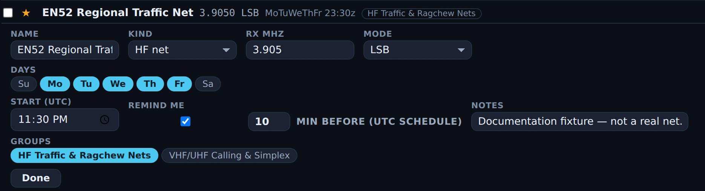

# Memories

Memories is Nexus's saved-channel bank — the repeaters, HF nets, calling
frequencies, POTA watering holes and digital dial frequencies you tune back to.
One click tunes the rig, applies the repeater shift and access tone, and opens
the cockpit that mode belongs in. It is *Nexus's* bank, not the radio's: nothing
here writes channels into your rig's memory slots, and the trip to a real radio
is a CHIRP CSV, which Memories reads and writes both ways.

Every goal profile turns Memories on; switch it off in
[Settings ▸ Appearance ▸ Features](settings-reference.md#features). Entering the
section never touches the rig — only an explicit **Tune** retunes.

<!-- TODO: capture screenshot — the Memories section: sidebar showing All memories / ★ Favorites / Nets plus two installed pack groups, list view with both an HF and a VHF / UHF band section, and one repeater row's inline editor open showing Offset and Tone -->

## The tour

![The Memories section in List view. The sidebar holds All memories with a count of 88, ★ Favorites 12, Nets 11, then five group rows — Well-Known HF Nets 3, VHF/UHF Calling & Simplex 9, Emergency & EmComm 12, HF Traffic & Ragchew Nets 10, Reference: Time, Beacons … 22 — and a New group… box. The main pane has a Search all… box and a List / Grid switch above an HF section headed "HF 65", whose rows each show a checkbox, a ★ toggle, the name, the frequency and mode, and group chips: FT8 40 m 7.0740 FT8, FT8 30 m 10.1360 FT8, Maritime Mobile Service Net 14.3000 USB with two group chips, and so on. Three rows are starred.](../img/manual/memories-list.webp)

*The bank in List view in Nexus 1.10.3, 88 channels in it. The per-row controls — ▲ ▼ for
hand-ordering, ✎, **Tune** and ✕ — and the toolbar's ＋ Save / ＋ New / Import / Export / Pop
out / Packs buttons sit at the right-hand end of each row and of the toolbar, off the right of
this crop.*

**What a memory holds.** The RX (repeater-output) frequency in MHz is the one
required field; a mode string is the other thing a row cannot be without. On top
of that: a name (typed, or derived as `146.940 FM` when you save without one), a
**kind** — Repeater, Simplex, HF net, Calling, POTA/SOTA, Digital, Satellite,
EmComm, Reference, Other — an offset direction (simplex / + up / − down / odd
split) with either an offset in MHz or an absolute TX frequency, a tone mode
(None / Tone / TSQL / DTCS) with its CTCSS frequency or DTCS code, a callsign,
free-text notes, group membership, the ★ favorite flag, and for an HF net the
days and UTC start time. A repeater sent over from the **Program** section also
carries the site's latitude and longitude, so its distance and bearing are
recomputed from wherever you are now rather than baked in at save time. Nexus
stamps the last recall time. It does **not** store power, filter width or tuning
step — a CHIRP export writes a fixed 5.00 kHz step.

**The sidebar** holds three built-in views with live counts — **All memories**,
**★ Favorites**, **Nets** (every row whose kind is HF net) — then your groups
below a separator. A memory can be in several groups at once. Select a group and
✎ / ✕ appear beside it: rename, or delete the group. Deleting a group keeps its
memories; they just lose the membership. **New group…** at the bottom adds one.

**The toolbar** runs across the top of the main pane: a search box scoped to the
selected view (it matches name, mode, callsign, notes and frequency), the
**List** / **Grid** switch, **＋ Save 14.074 FT8** — the button is labelled with
the dial frequency and mode it will capture — **＋ New**, **Import CSV**, **Export
CSV (n)** where *n* is the number of rows the current view is showing, **↗ Pop
out**, and **Packs**.

**The list** is one row per channel: the ★ toggle, then the name, the frequency
and mode, and a one-line summary of everything else — `−0.600 · 103.5` for a
minus-shift repeater on a 103.5 Hz tone, `→52.030` for an odd split, `MoWe
01:00z` for a net, `18 mi NE` for a repeater whose site is known. Group chips
follow. Clicking the row body tunes it, as does the **Tune** button at the right
end; **✎** opens the inline editor and **✕** deletes the row. In **All memories**,
with no sort and no search active, ▲ ▼ arrows appear for hand-ordering the bank —
that order is what the cockpit MEM strip and the Ctrl+1…9 hotkeys follow. Rows
are split into an **HF** section (below 30 MHz) and a **VHF / UHF** section (30
MHz and up), with the headers appearing only when the view actually spans both.

**The inline editor** opens under the row and shows only the fields that kind
needs. Name, Kind, RX MHz and Mode are always there — Mode is free text with
USB / LSB / FM / NFM / AM / CW / FT8 / FT4 offered as suggestions. Repeater,
Simplex and Calling rows add Offset, the offset MHz or TX MHz that direction
implies, Tone, the CTCSS frequency (the standard 38-tone EIA ladder is offered,
so typing is optional) or DTCS code, and Callsign. An HF net row instead gets
day chips **Su–Sa**, a **Start (UTC)** time, and a **Remind me** row: a checkbox
and a lead time in minutes, 1 to 120. Notes and group chips close the editor, and
**Done** shuts it. Every text field commits on Enter or when you click away, and
**Esc** inside a field reverts *that field* — an edit the store rejects (a blanked
frequency, for instance) snaps back rather than looking saved. The same editor
opens for **＋ New**, but pinned along the bottom of the pane instead of under a
row, so the channel you are making is always in front of you rather than
somewhere in a long list.

**The grid** is the same rows as a CHIRP-style spreadsheet: ★, Name, RX MHz,
Mode, Offset, Tone, Kind, and a Tune / ✕ pair. Name, RX MHz and Mode are editable
in place; click **Name**, **RX MHz**, **Mode** or **Kind** in the header to sort
ascending, again for descending, a third time for none. The Offset column carries
the same one-line summary the list shows, and the Tone column shows which tone
system a row uses (TONE / TSQL / DTCS), not its frequency — for that, open the
editor in List view.

**Starter packs** (the **Packs** button, or **Browse starter packs** on an empty
bank) is a dialog of eleven bundled channel sets: VHF/UHF calling and simplex, HF
FT8 & FT4, digital watering holes, CW & QRP, EmComm, HF traffic and ragchew nets,
VHF+ weak signal, satellites, POTA/SOTA/WWFF, DX and contest, and a reference set
of time stations and beacons. Each card shows its channel count and region.
Installing creates a group named for the pack and puts the channels in it; the
button reads **Update** once that group exists, and the toast separates what it
added from what it refreshed, so "already up to date" means nothing changed.
Re-installing is safe — duplicates are skipped — and a row whose *content* you
have edited is yours from then on: a later pack update leaves it alone. The
dialog closes on **Esc**, the ✕, or a click outside. The first-run wizard offers
the same packs, pre-ticking calling frequencies and FT8/FT4, and only on a bank
that is still empty.

![The Starter packs dialog. Its opening line reads "One-click channel sets. Duplicates are skipped, so installing again is safe. Net schedules are UTC and approximate — enable a reminder per net." Below it, one card per pack with a name, a description, a channel count and region, and a button: VHF/UHF Calling & Simplex, 10 channels · North America, Update; HF FT8 & FT4, 20 channels · Worldwide, Install; Digital Watering Holes (JS8, PSK31, RTTY, SSTV, VarAC), 20 channels · Worldwide, Install; CW & QRP Watering Holes, 18 channels, Install; Emergency & EmComm, 12 channels, Update; HF Traffic & Ragchew Nets, 10 channels, Update; VHF+ Weak-Signal & Digital, 10 channels, Install; Amateur Satellites, Install.](../img/manual/memories-packs.webp)

*Starter packs in Nexus 1.10.3. The button is the tell: **Install** where the pack's group does
not exist yet, **Update** where it does. Nothing here is a recommendation — install the ones
that match how you operate.*

**The MEM strip** is the same bank in the header of the Phone, CW and Operate
cockpits — the ★ favorites only, in bank order. **MEM** labels it; **＋** saves
the current dial and mode as a favorite; each chip tunes; **≡** opens this
section. A chip highlights when the dial is within 500 Hz of its frequency, so
you can see at a glance that you are sitting on a saved channel. Chip tooltips
carry the full name, the frequency to four decimals, the mode, the tone if there
is one, and — for the first nine — the **Ctrl+1** … **Ctrl+9** hotkey that
recalls it from any section. The strip is **one row that never wraps**: past
about 40 rem of chips it scrolls sideways inside itself, so the cockpit header
cannot grow taller as your favorites pile up (the header used to, and that is the
bug this shape exists to kill). Long names truncate with an ellipsis at 10 rem.
The strip is not a ⊞ Panels entry — no layout you save hides it — and it appears
only while the Memories section is enabled.

<!-- TODO: capture screenshot — a cockpit header MEM strip with ~10 favorite chips, one chip in its active (dial-matched) highlight and the row scrolled part-way sideways -->

## Core workflows

### Save the frequency you are on

1. From a cockpit, press **＋** on the MEM strip. The channel goes in starred, so
   a chip appears immediately. Saving the same frequency and mode twice never
   piles up duplicates; if a matching channel is already in the bank but not
   starred, ＋ stars that one instead of adding a second.
2. From this section, **＋ Save** does the same without starring — unless you are
   looking at **★ Favorites**, in which case it stars, or at a group, in which
   case it joins that group.
3. Either way you get frequency and mode **only**. A repeater needs its shift and
   tone typed in afterwards (below) or brought over from Program.

### Tune a saved channel

1. Click the row (or its **Tune** button, or its MEM chip, or **Ctrl+1**…**9**
   for the first nine favorites — the hotkeys work from any section and are
   ignored while you are typing in a field).
2. Nexus applies the Phone submode and, for an FM memory, the repeater shift and
   access tone **before** the retune, so the rig keys the machine and not just its
   output. The band, mode and frequency then change in one atomic call, so the
   rig never lands in the new mode at the old dial.
3. The cockpit follows the mode: CW opens the CW cockpit, FT8/FT4/JS8/PSK/RTTY
   and anything marked Digital opens [Operate](operate-digital.md), everything
   else opens [Phone](phone.md). A saved USB or LSB memory keeps its exact
   sideband even where it runs against the band convention — an off-convention
   net on USB below 10 MHz comes back on USB.
4. A toast confirms with the name and where you landed.

### Enter a repeater by hand

**Read this before you press ＋ New.** The channel is written to the bank the moment you press
the button — before you have typed anything. The count in the sidebar goes up straight away,
and so does the number on **Export CSV**. There is no draft state and no "save" step: the
panel that opens is editing a channel that already exists.

That means backing out is the thing to get right:

| What you do | What happens to the channel |
|---|---|
| **Enter** in a text field | Commits that field and closes the panel. **The channel is kept.** |
| **Esc** in a text field | Reverts *that field* to its previous value and leaves the field. The panel stays open. |
| **Esc** anywhere else in the panel — a chip, a button, after leaving a field | Closes the panel. **The channel is kept.** |
| Click away, switch section, close the window, crash | **The channel is kept.** |
| **Discard**, at the right-hand end of the panel's header | Deletes this new channel and closes the panel. This is the only way out that leaves the bank as you found it. |

Keeping it is the deliberate choice, not an oversight — a row seeded from the dial is a valid
channel, and a stray click or a closed window cannot lose the one you were making. But it does
mean an abandoned ＋ New leaves a channel named for a frequency behind. Pressing ＋ New again
while an untouched new row is still sitting there re-opens *that* row rather than adding a
second, so repeated presses do not pile up blanks — but a row you typed into, or one made at a
different dial, is a separate channel. And **delete has no confirmation and no undo**, on
Discard as on the row ✕.

*＋ New in Nexus 1.10.3, one press in. The bank read **88** before the press (the List-view
picture at the top of this chapter) and reads **89** here, with nothing typed and nothing
saved — the channel is already in the bank. The panel says so in its own header. **Discard**
sits at the right-hand end of that header row, off this crop.*

1. **＋ New** adds a row seeded from the current dial and opens its editor. The
   new row matches the view you are in, so it is visible where you created it —
   starred under Favorites, an HF net under Nets, a member of the group you have
   selected.
2. Set **Kind ▸ Repeater**, type the output frequency in **RX MHz** and set
   **Mode ▸ FM**.
3. Set **Offset ▸ − down** (or + up) and the **Offset MHz**. Leave the offset at
   0 to use the band standard. For a machine with an odd split, choose **Odd
   split** and enter the absolute **TX MHz**.
4. Set **Tone ▸ Tone (encode)** and the **CTCSS Hz** the machine wants —
   **TSQL** if you also want your receiver squelched by the same tone, **DTCS**
   for a digital code.
5. Name it, and star it if you want it on the cockpit strips.

### Send repeaters over from Program

The **Program** section searches repeaters near your grid and builds channel
lists. Two paths land here:

1. **★ a machine in the results list** — it goes straight into Memories as a
   favorite, with its shift, tone and site coordinates, and appears on the
   cockpit MEM strip without a trip through the list builder. The star toggles
   back off, and starring a machine the bank already holds stars *that* row
   rather than duplicating it.
2. **Save to Memory Bank** in the channel-list builder writes the whole list in
   one go — analog rows only (digital-only machines are skipped), deduped,
   unstarred, and each one lands as FM. Star the ones you want on the strips.
   Rows saved this way carry shift and tone but no site coordinates (the builder
   persists channels, not the source records), so they show no distance.

Repeater rows carry `−0.600 · 103.5`-style summaries in the list, and their
distance and bearing from your grid — miles and an eight-point octant — recompute
on every render. Set your grid in
[Settings ▸ Station](settings-reference.md#station); operate portable and the
mileage follows you.

### Track a net and get a reminder

*The net editor in Nexus 1.10.3 on a temporary fixture memory. **Days** has Mo–Fr lit and
**Start (UTC)** holds the meeting time; the row above prints the same schedule back as
`MoTuWeThFr 23:30z`, and it is UTC, so it does not drift when the clocks change. **Remind me**
is ticked with a ten-minute lead. The net is invented for this picture.*

1. Set a memory's **Kind ▸ HF net** (or install the **HF Traffic & Ragchew Nets**
   pack, which arrives pre-scheduled). Net rows collect under **Nets** in the
   sidebar.
2. Click the days it meets and set the **Start (UTC)** time. The schedule is UTC,
   so it does not drift when the clocks change.
3. Tick **Remind me** and set the lead time. Nexus checks every 30 seconds and
   raises one prominent toast per meeting, with a **Tune** button on it that
   recalls the memory. Reminders are opt-in per net — nothing fires for a net you
   did not tick.

### Move channels between Nexus and a radio

1. **Export CSV** writes the rows the current view is showing — filtered, sorted,
   in the order on screen — as a CHIRP CSV in your Downloads folder, named for the
   view (`nexus-memories-favorites.csv`). The toast reports the full path.
2. Open that file in CHIRP and upload it to the radio. CHIRP drives the
   programming cable; Nexus builds the list.
3. **Import CSV** reads a CHIRP CSV back — header-keyed, so extra or reordered
   columns are fine. Rows join the group you have selected, duplicates are
   skipped, and the toast says how many of each. A file with no Frequency and
   Mode columns is rejected with "No channels found — is this a CHIRP CSV?"

## Honest limits

- **＋ Save captures frequency and mode, nothing else.** Save an FM repeater off
  the dial and you get a plain simplex channel — the shift and tone you have set
  in [Settings ▸ Phone](settings-reference.md#phone-ssb--fm) do not come
  with it. Type them into the editor, or bring the machine over from Program,
  which does carry them.
- **Nexus never writes to the radio's own memory channels.** There is no CAT path
  that fills a rig memory slot; the CHIRP CSV is the whole delivery story. The
  Location numbers in an export are the row order of what you exported, not
  channel numbers in your radio.
- **Memory scan is not built.** The CHIRP Skip flag survives a round-trip through
  import and export, but nothing in Nexus scans a bank and no field sets that
  flag.
- **Recall reaches three cockpits only** — Phone, CW and Operate. An RTTY or PSK31
  memory is treated as digital and opens the FT8/FT4 Operate cockpit, not the RTTY
  cockpit. SSTV is not on that mode list, so a row whose **mode** reads `SSTV`
  gets no digital inference: it saves as **Kind: Other** and recall sends it to
  the **Phone** cockpit in SSB, tuned to the frequency, with "set SSTV on the rig"
  in the toast. **Kind** is the override — set it to **Digital** in the editor and
  the same row opens Operate instead. The three SSTV rows in the bundled Digital
  Watering Holes pack already carry it: they are stored as mode `USB` with
  **Kind: Digital**, so they recall to Operate rather than Phone.
- **Phone recall commands USB, LSB and FM only.** An AM, WFM or DV memory tunes
  the dial and then tells you to set the mode on the rig rather than claim a mode
  Nexus did not command — a WWV or shortwave reference channel behaves this way.
- **Recall into a disabled cockpit does nothing but explain itself.** With the CW
  or Phone section switched off in Features, a memory for that cockpit is
  refused with "Enable the … section in Settings to recall this memory" — the rig
  is not tuned and no settings are written. In a torn-off Memories window the same
  case is silent, with no toast at all.
- **The Operate cockpit's MEM ＋ labels every non-FT4 tier as FT8.** Save the dial
  from the strip while running Q65, WSPR or JT65 and the memory says FT8. The
  ＋ Save button inside this section uses the tier's real name; the strip's does
  not.
- **Duplicate detection is frequency (to 100 Hz) + mode + CTCSS encode tone.**
  Two channels that differ only by offset, name, group or DTCS code count as the
  same channel, so the second one is skipped on import or on a Program save.
- **＋ New saves before you type.** The channel exists in the bank from the press, and the
  count moves with it. **Escape keeps it; Discard is the only way out that removes it.** See
  [Enter a repeater by hand](#enter-a-repeater-by-hand).
- **Delete is immediate — no confirmation, no undo.** That applies to the ✕ on a
  row in both views, and to **Discard** in the ＋ New panel. An **Export CSV** is
  your only copy.
- **The bank is local to this machine.** It lives in the app's local storage, not
  in the logbook and not in any cloud sync; a torn-off Memories window shares it
  live, another computer does not. If local storage is unavailable or full, edits
  apply for the session and are gone at restart.
- **Search covers name, mode, callsign, notes and frequency** — not group names
  and not tone. Sorting is by name, frequency, mode or kind; there is no drag
  reordering, and the ▲ ▼ arrows appear only in All memories with no sort and no
  search active.
- **Net schedules are days-of-week plus a UTC time.** There is no "third Thursday"
  rule and no per-occurrence exception, pack schedules are approximate by their
  own admission, and reminders only fire while Nexus is running. The live "is
  this net on the air now" cross-check against NetLogger is not built — a memory
  can carry a NetLogger net name, but nothing reads it yet.
- **The offset and tone fields appear for Repeater, Simplex and Calling kinds
  only.** A Satellite or Reference channel imported with a tone keeps it, shows it
  in the row summary and exports it, but has no editor field to change it — switch
  the kind to edit it.
- **CHIRP cannot represent every mode Nexus saves.** FT8, FT4, JS8 and PSK31
  export as USB with the real mode tagged into the Comment (`[FT8] …`), which a
  Nexus re-import undoes; another program reading that file sees a USB channel.
  The D-STAR columns (URCALL, RPT1CALL, RPT2CALL, DVCODE) are written empty and
  ignored on import.
- **Starter packs are bundled conventions, North America first.** They ship inside
  the app, so they work offline and never go stale mid-contest — and never
  refresh either. Region 1 differences are written into the channel notes, not
  applied for you.
- **Distances are in statute miles**, with no metric option.

## Related guides

- [Program](program.md) — building a repeater list for a location, and **Save to
  Memory Bank**, which drops it straight into this bank
- [Phone (SSB)](phone.md)
- [CW](cw.md)
- [Operate — FT8/FT4 digital](operate-digital.md)
- [Field Day & POTA/SOTA](contesting-pota.md)
- [Settings reference](settings-reference.md)

