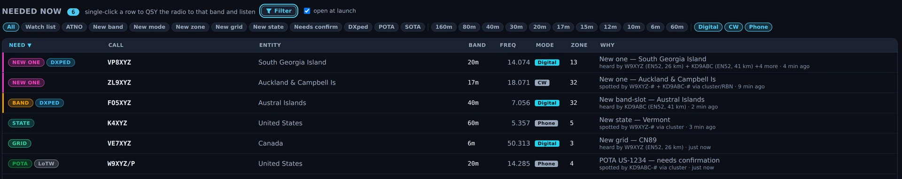

# Needed — DX that's on the air now

The Needed board is the flagship DX-chasing surface: every station on the air
right now, ranked by what it's worth to *your* log. It's the answer to "there are
400 stations on the band — which one should I turn the beam at?" And it's built
so you can trust the answer: every row carries the **evidence** that the path to
that station is real for *you*, not for a superstation two time zones away.

## The tour

![The Needed board. Its header reads "NEEDED NOW 326 · single-click a row to QSY the radio to that band and listen", with a Filter button and an azimuth box, and under it a green line reading "Phone source: ve7cc.net:23 +2 · live · 111 SSB spots → 37 needs". The table columns are NEED, CALL, ENTITY, BAND, FREQ, MODE, ZONE and WHY. The first row carries a magenta NEW ONE chip: YV0DX, Aves Island ~133°, 20m, FT8, zone 8, and a WHY of "New one — Aves Island / heard by N0TB (EN34, 392 km) + WB9FIU (EM79, 473 km) + K0EG (EM48, 476 km) +6 more · 8 min ago". Below it green GRID rows, several carrying a purple ULTRA badge, then green STATE rows on 60 m whose evidence reads "spotted by KM3T-5-# + WC2L-# + KM3T-3-# via cluster/RBN · 3 min ago". One row carries both a STATE and a GRID chip.](../img/manual/needed-board.webp)

*The Needed board in Nexus 1.10.3, 326 opportunities on the air. Read a row left to right: the
**need chip** is what it is worth to your log, the **call** and **entity** are who and where,
**band / freq / mode / zone** is where to point the radio, and **WHY** is the receipts — which
receivers heard them, how far away those receivers are, and how long ago. The counts and calls
are one evening's traffic, not a target.*

Each row is one opportunity, ranked by value to your log:

- **wanted** (120) — a call on your wanted list; nothing outranks it,
- **ATNO** (all-time-new-one, 100) — an entity you've never worked,
- **new zone** (70),
- **new state** (60) — a state you still need for WAS,
- **new grid** (55) — a Maidenhead square you have not worked,
- **new band** (50) — an entity you've worked, but never on *this* band,
- **new mode** (30) — an entity you've worked, but never in this **mode class**
  (CW / Phone / digital) on **any** band. The row reads "(any band)" because that
  is the whole claim: it is the per-mode DXCC axis, not a band slot. Working the
  station on the band in front of you closes it.
- **confirmation opportunity** (10) — worked on this band, not yet confirmed.

**The chips, and what each one says.** The chip is the short form; hover it for the sentence.
The same vocabulary appears on the decode feed in the cockpits, so the two read as one system:

| Chip | Need type | What it means |
|---|---|---|
| **WANTED** | wanted | On your wanted watch list. |
| **NEW ONE** | ATNO | New DXCC entity — an all-time new one. |
| **ZONE** | new zone | New CQ zone on this band (5BWAZ). |
| **STATE** | new state | New US state on this band (5BWAS) — inferred from the grid, so confirm from the log. |
| **GRID** | new grid | New grid square on this band (VUCC counts per band). |
| **BAND** | new band | A new band-slot for an entity you have worked. |
| **MODE** | new mode | A new mode class for an entity you have worked, on any band. |
| **LoTW** | confirmation opportunity | Worked on this band, not yet confirmed. A LoTW match or a paper card closes it; eQSL and QRZ do not count toward awards, so they do not clear it. |

**DXPED**, **POTA** and **SOTA** layer on top as icons and never set the row's colour — the
award tier keeps that. A row can carry several, as the **STATE + GRID** row in the picture
does. A separate **💎 ULTRA** pill (or the quieter **RARE** gem) rides in the Need cell for a
grid-square rarity tier: RARE is almost no land, ULTRA is open water — only a rover, a
maritime mobile or a DXpedition can activate it.

Rows dedupe by (call, band, mode-class), so the same DX on 20m CW and 20m FT8 are two
distinct, separately clickable opportunities.

**The phone-source line** under the header is the SSB feed's own health: the node it is
talking to, whether it is live, connected, connecting, idle or down, and how many of its SSB
spots became needs. RBN carries no SSB, so this line is the whole of your phone coverage — if
it says the source is off, phone needs cannot appear at all.

**The evidence line is what makes it trustworthy.** Every row shows *why* it
believes the station is reachable from your QTH:

- *"heard by K9LC (EN52, 26 km) + N9CO (62 km), 4 min ago"* — near receivers on
  PSK Reporter heard them,
- *"decoded by YOUR radio on this band"* — you heard them yourself,
- *"spotted by 2 near skimmers"* — nearby RBN skimmers spotted them.

Spots age out at 15 minutes, and each row shows its age, so you're never chasing
a station that left twenty minutes ago.

### The alert that finds you

You do not have to be looking at this board. When a needed station lands in the cluster/RBN
firehose, a banner comes across the top of whatever section you are in, after an earcon has
already played:

*The alert in Nexus 1.10.3. Chip, call, entity, beam heading from your grid, and where to point
the radio — then **Work it**, which QSYs and sets up the QSO. It fires the moment the spot
lands rather than waiting for the board's own 30-second poll.*

It carries the same need chip vocabulary as the board, and the bearing is there because turning
the antenna is what those seconds get spent on. **It does not time out.** An alert that
vanished while you were turning the rotator would be worse than none, so it stays until you
work it or close it with the ✕.

## Reading an evidence line

The admission rules are deliberately conservative, so a row only appears when the
path is genuinely plausible for you:

- **PSK Reporter evidence must come from receivers near you** — within 1500 km on
  HF, 250 km on VHF (the sporadic-E patch radius).
- **VHF needs require at least two distinct near receivers** *and* a far
  transmitter, so a single superstation can never light up 6 m for you.
- **Cluster spots on VHF need two near spotters.**
- The **"getting out" inference** (your signal is reaching region X) is **disabled
  on VHF entirely**, where Es-patch disjointness makes it invalid.

If a row is on the board, the receipts are on the row. If the evidence looks thin,
it's telling you the truth about a marginal path.

## Core workflows

### Work a spot in one click

1. Click any row. Nexus **QSYs band + mode + exact frequency atomically**, opens
   the matching cockpit, and — for CW/Phone rows — prefills the callsign in the
   log strip.
2. If the DX is running split, Nexus reads it: it **parses pileup split offsets
   from cluster comments** (`UP 2`, `DN 1.5`, `QSX 7.205`) and pre-sets rig split
   so your transmit lands where the DX is listening.

That's the same atomic "work it" path as double-clicking a spot on the
[Connect map](connect.md) or pressing ▶ Work in a Chase pane.

### Filter the board

![The Needed board header with the filter row open. The header reads "NEEDED NOW 327 · single-click a row to QSY the radio to that band and listen" beside a lit Filter button and an azimuth box, over the green line "Phone source: ve7cc.net:23 +2 · live · 111 SSB spots → 37 needs". Under it one row of chips: All, Watch list, ATNO, New band, New mode, New zone, New grid, New state, Needs confirm, DXped, POTA, SOTA, then a separator and the bands 160m 80m 40m 30m 20m 17m 15m 12m 10m 6m 60m 2m, then a separator and Digital, CW, Phone — the three mode chips outlined as shown, everything else unselected and All lit.](../img/manual/needed-filters.webp)

*The filter row in Nexus 1.10.3 with nothing narrowed — **All** lit and the board still at its
full 327. The Filter button reads **Filtered** once any chip is set, so a short board always
says what is shortening it.*

Filters persist across restarts. **Filter** opens one row of chips in three groups:

- **Need type** — All, Watch list, ATNO, New band, New mode, New zone, New grid, New state,
  Needs confirm, then the programme chips DXped, POTA and SOTA.
- **Band** — 160 m through 2 m, multi-select. Selected means *show only these*.
- **Mode class** — Digital, CW, Phone.

**Clear** wipes them all. Which chips are offered follows what your station can produce:
CW and Phone rows appear **only when those operating modes are enabled**
([Settings ▸ Appearance ▸ Features](settings-reference.md#features)), so a
digital-only operator's board stays clean. This is also why phone/SSB needs can
look sparse: RBN auto-spots only CW and digital, so SSB needs come from the
human DX cluster — add cluster nodes in
[Settings ▸ Logging & Connectors](settings-reference.md#integrations--feeds)
to widen phone coverage.

### Pop it out to a second monitor

The board tears off into its own OS window. A header checkbox, **"open at
launch,"** controls whether that detached window force-opens on every start —
untick it and it stays where you left it (the setting persists).

*The detached Needed window in Nexus 1.10.3. It carries its own header count, its own
**Filter** drawer and chips, its own column sort and its own **open at launch** tick — none of
them shared with the docked board. The rows are documentation fixtures. The way back is the
window's own close button, which belongs to the operating system and is outside this capture.*

## Honest limits

- **The board only shows what's on the air now** — it's a real-time chase tool,
  not an all-time wanted list. Age-out is 15 minutes.
- **Phone/SSB needs are sparse by design** — RBN carries only CW and digital;
  SSB depends on human cluster spots you configure.
- **VHF is held to a higher evidence bar** (two near receivers, no getting-out
  inference) — this is deliberate, to keep a single superstation from
  fabricating an opening.

## Related guides

- [Spots](spots.md) — the same cluster and RBN traffic as a raw table, with none
  of this scoring applied
- [Connect — map + propagation](connect.md)
- [DXpeditions](dxpeditions.md)
- [Awards & Journey](awards-journey.md)
- [Operate — FT8/FT4 digital](operate-digital.md)
