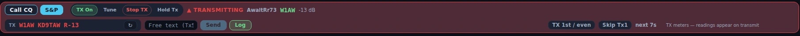
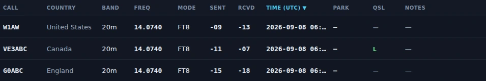
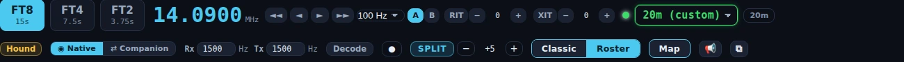
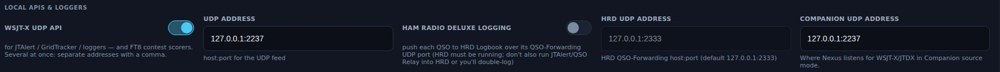
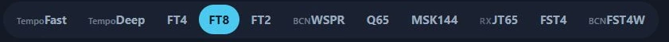

# Operate — FT8/FT4 digital

The Operate cockpit is the production core of Nexus: FT8 and FT4 operating
brought to operational parity with stock WSJT-X, verified line-by-line against
a 207-row behavior matrix and run on the air daily. If you already operate
WSJT-X, everything here works the way you expect — the sequencer state table,
the decode cadence, the split arithmetic, the UDP wire format. Nexus modernizes
the *shell* around that behavior, never the protocol behavior other operators
and tools depend on.

This is the cockpit you land in when the mode switch (top of the left rail) is
set to **FT8/FT4**. Flip it to **Tempo** for the TempoFast/TempoDeep chat cockpit, covered
[at the end of this page](#the-tempo-chat-layer-tempofasttempodeep).

![The Operate cockpit in Classic layout, receiving on 20 m FT8: the 14.0740 MHz rig readout and the mode row run across the top, a full-width waterfall sits beneath them, and the QSO strip — Call CQ, S&P, TX On, Tune, Stop TX, Hold Tx — runs under that, reading "TX — listening". Three columns fill the bottom: Band Activity scrolling at the left, the RX Frequency decodes above the Tx1–Tx6 message panel with DX Call and DX Grid in the centre, and a Stations list of callers with Work and QRZ buttons at the right.](../img/manual/operate-classic.webp)

## The tour

**Waterfall + decode feed.** The waterfall spans the full width of the cockpit
by default, between the rig controls and the QSO strip.
Drag the dividers between panes to resize it (double-click a divider to reset),
or use the ⊞ menu to show and hide panes; **Reset pane sizes** in
[Settings ▸ Appearance ▸ Workspace](settings-reference.md#workspace) restores the
defaults.
Decoding is **always on** — there is no Monitor toggle to forget; the decoder
runs every RX slot regardless of TX state.

*The ⊞ Panels menu in Nexus 1.10.3. Untick a pane to hide it; **Reset layout**
puts the default arrangement back. An entry with nothing behind it right now says
so in a line under it, as TX Meters does here.*

**Waterfall gestures.** RX and TX are two separate cursors, and the click that
moves one leaves the other where it is. The pane header prints the whole rule
next to the word WATERFALL:

| Gesture | Moves |
|---|---|
| **Left-click** | the **RX** cursor (green) — where the decoder listens |
| **Right-click**, or **Shift**-click | the **TX** cursor (red) — where you will transmit |
| **Ctrl**-click | **both** cursors together |

Working split — answering a station on your own frequency rather than theirs — is
therefore a right-click, and moving the pair together to a clear patch of band is
a Ctrl-click. These are the same three gestures the [quick
start](../quick-start.md#3-a-tour-of-the-digital-cockpit-about-2-minutes) uses in
its two-minute cockpit tour.

**Band Activity** scrolls chronologically, bottom-pinned, with a reviewing pause
when you scroll up and period separators between T/R cycles. Every row carries
annotations stock WSJT-X never had:

- the **country / DXCC entity** name,
- a **B4** chip when you've worked the call before,
- **new-DXCC** and **new-grid** tags,
- **CQ** and **YOU** badges,
- **AP** / low-confidence markers,
- **JTAlert highlight colors** (honored over UDP if JTAlert is feeding them),
- a teal **L** mark on calls known to upload to LoTW (populate the users list in
  [Settings ▸ Logging & Connectors](settings-reference.md#lotw-users-list)).

**The QSO strip** sits directly under the waterfall, above the decode panes,
carrying your transmit controls — **TX On/Off**,
**Tune**, **Stop TX**, **Hold Tx** — beside **Call CQ** and **S&P**. (These live
in the QSO strip in this view; Phone and CW keep the cluster in the top bar.)

*Band Activity in Nexus 1.10.3, with the annotations stock WSJT-X never had.
Rows worked before carry **B4**; **L** and **LoTW** mark calls known to upload to
LoTW; **POTA** flags a park activation; the entity name and bearing sit at the
right of every row.*

**Classic ↔ Roster.** A single toggle switches the layout:

- **Classic** is the stock-style Band Activity view, with the Tx1–Tx6 message
  panel, editable DX Call / DX Grid fields, and Generate Std Msgs.
- **Roster** is a modern sortable call roster — one row per station, sorted by
  what matters to you.

Use Classic when you want the familiar WSJT-X message-by-message control; use
Roster when you're scanning a busy band for the one call worth working.

## Core workflows

### Answer a CQ (search & pounce)

1. Find the station in Band Activity or the roster. New-DXCC/new-grid rows are
   tagged; a **B4** chip means you've worked them before.
2. **Double-click the decode.** Nexus jumps to exactly the Tx step stock WSJT-X
   would choose given what that station last sent, and — with "Double-click arms
   TX" on (the default) — enables TX so your reply goes straight out.
3. The sequencer runs the exchange automatically: your report → their
   roger-report → RR73 → 73. It locks onto the worked station, so a report from
   a bystander never advances your QSO, and portable suffixes are matched by
   base call.
4. On the final 73, TX disarms (WSJT-X default — see "Disable TX after sending
   73" in [Settings ▸ Digital](settings-reference.md#digital-ft8ft4)).
   The QSO logs automatically if Auto-log is on.

*The sequencer three overs in, in Nexus 1.10.3. The state word is the engine's
own — **AwaitRr73** means your rogered report has gone out and it is waiting for
their RR73 — and the **TX** line is what goes on the next slot.*

*The same contact after the 73, at the top of the [Logbook](logbook-qsl.md) in
Nexus 1.10.3. Digital reports are logged as the dB figures the mode exchanged,
not as 59.*

### Run CQ (call and work the pileup)

1. Set your band and audio frequency, then click **Call CQ**. Directed CQ (CQ DX,
   CQ NA, CQ POTA, CQ 040…) persists across the run exactly like stock Tx6.
2. When a station answers, the sequencer works them, then **auto-returns to CQ**
   for the next caller.
3. Optional guards in
   [Settings ▸ Digital](settings-reference.md#digital-ft8ft4): "Stop CQ
   after N calls" ends an unanswered run; "Auto-CQ: drop a silent caller after N
   overs" abandons a station that answered then went quiet.

Remember to pick your **transmit period** (Tx 1st / even, or Tx 2nd / odd) —
the two stations in a QSO must be on opposite periods. The choice is on the top
bar and in [Settings ▸ Digital](settings-reference.md#digital-ft8ft4).

### Work a needed station

The [Needed board](needed-dx.md) ranks everything on the air by what it's worth
to your log. One click on a row QSYs band + mode + exact frequency atomically and
opens this cockpit with the DX ready to work — the same atomic path as
double-clicking a spot on the [Connect map](connect.md).

### Hound a DXpedition (Fox/Hound)

1. Turn on **DXpedition mode ▸ Hound** in
   [Settings ▸ Digital](settings-reference.md#digital-ft8ft4) (or start
   it from a [DXpedition board](dxpeditions.md) row).
2. Nexus spreads your initial calls above 1000 Hz (session-salted so callers
   don't stack) and **auto-moves your TX to the Fox's frequency** the moment
   you're answered.
3. Multi-payload Fox frames are split and attributed safely — a bystander's "73"
   can never fabricate a confirmation in your log.

*Hound armed and split set in Nexus 1.10.3 — nothing in this frame is
transmitting. The split stepper appears only once CAT is answering, because the
offset is programmed into the radio rather than faked in audio.*

Nexus implements the **Hound** side. The **Fox** role (running the DXpedition
end) is not implemented.

### Split, decode depth, and re-decode

- **Split Operation** offers the stock trio in
  [Settings ▸ Radio ▸ Rig & CAT](settings-reference.md#rig--cat): **None**, **Rig**
  (VFO B), and **Fake It** (TX audio held to 1500–2000 Hz with the dial shifted
  in 500 Hz steps for a cleaner signal).
- **Decode depth** (Fast / Normal / Deep) and the **decoder passband**
  (default 200–2900 Hz) are in
  [Settings ▸ Digital](settings-reference.md#digital-ft8ft4).
- **`F6`** re-decodes the retained last period and adds only what the first pass
  missed. **`Esc`** halts TX, **`F4`** clears the DX call, **`Alt+1`–`Alt+6`**
  fire the Tx slots.

## Working with the rest of the shack

Nexus speaks WSJT-X's UDP protocol byte-for-byte, so **GridTracker, JTAlert, and
your logger see Nexus as WSJT-X**. Outbound Heartbeat / Status / Decode /
QsoLogged and inbound HaltTx / Clear / Replay / Location / HighlightCallsign all
use the canonical type numbers, and PSK Reporter spotting batches on the stock
schedule.

If another app owns the rig, **Companion mode** rides an upstream WSJT-X/JTDX
decode stream over UDP (default :2237) instead of decoding itself — point it at
the source in
[Settings ▸ Logging & Connectors](settings-reference.md#integrations--feeds).

*The two ends of the UDP link in Nexus 1.10.3, and they point opposite ways. The
left pair is what Nexus **sends** — the feed GridTracker and JTAlert read. The
right field is what Nexus **listens to** in Companion mode. Loopback here because
both programs are on one PC; across the shack it is the other machine's address.*

## Honest limits

- **Fox role is not implemented** — you can hound a DXpedition, not run one.
- **No contest modes** in the digital cockpit beyond Field Day (no NA VHF,
  RTTY RU, WW Digi).

### What each tier can do in 1.10.3

Every tier the dial offers decodes *and* transmits. Two of them transmit on a
schedule instead of working a QSO, and the sequencer is not offered on those.

| Tier | Decode | Transmit | Auto-sequencer |
|---|---|---|---|
| FT8 | yes | yes | yes — plus Fox/Hound (Hound side) and contest exchanges |
| FT4 | yes | yes | yes |
| FT2 | yes | yes | yes |
| Q65 | yes | yes | yes |
| MSK144 | yes | yes | yes |
| FST4 | yes | yes | yes |
| FST4W | yes | yes | **no** — a beacon: callsign, grid and power on a transmit-percentage schedule |
| JT65 | yes | yes | yes |
| WSPR | yes | yes | **no** — a beacon, as FST4W |
| TempoFast | yes | yes | yes |
| TempoDeep | yes | yes | yes |

The table is the code, not a promise: `Capabilities.tx` in
`crates/modes/src/mode.rs` is what the engine reads, `modes::tx_mode` is the only
path to a mode that may key the radio, and
`tx_capability_is_declared_not_inherited` in that file asserts the two agree for
every tier above. A mode that declared no transmitter could not be armed at all —
`Engine::set_tx_enabled` refuses the arm outright.

**One label in the app is wrong about this.** The JT65 pill in the top bar still
carries an **RX** badge and a tooltip reading "Receive only in this build
(transmit is disabled pending a fix)". That was true for 0.19.17 only, as a
mitigation while a decoder fault crashed Windows on Call CQ; the fault was fixed
and the restriction lifted, but the badge and the tooltip were not. **JT65
transmits in 1.10.3** — arm TX and call CQ on it exactly as on FT8.

*The tier pills in Nexus 1.10.3. **BCN** on WSPR and FST4W is correct — those are
beacons. **RX** on JT65 is a stale label; that mode transmits.*

---

## The Tempo chat layer (TempoFast/TempoDeep)

Flip the mode switch to **Tempo** and the operating cockpit becomes a
chat-first, per-station conversation surface. This is the original Tempo product,
and still the novel part of Nexus: two experimental weak-signal protocols that
carry the same WSJT-X 77-bit message set as FT8, so structured exchanges stay
bit-compatible with the FT8 ecosystem.

Two tiers share the cockpit, selected on the dial:

- **TempoFast** — a **4-second-cycle** coherent waveform (~−15 dB AWGN threshold in
  simulation). The short cycle is the point: keyboard chat that feels like a
  conversation instead of a slideshow.
- **TempoDeep** — a **15-second** non-coherent 8-FSK robust tier, built to shrug off
  fading (~3.7 dB fading penalty in simulation where coherent modes lose 10+).

Nexus remembers your tier per area, so setting the dial to one tier and stepping
away to another section brings you back to the same tier.

On top of the waveform:

- **Threaded per-station chat** with word-wrapped chunked free text.
- **Presence / heartbeat roster** — who's on frequency and reachable.
- **Presence-gated store-and-forward** — a directed message queues until the
  recipient is actually heard, then delivers with correct attribution.
- **IR-HARQ** (on by default) — a weak frame that fails isn't wasted; its
  retransmissions are joint-combined (RV0 → RV1 → RV2) until the message lands,
  for a simulated ~+2.5 dB / ~2× completion gain in the marginal zone. A session
  rescue counter in the UI shows how often it saved a frame. Toggle it in
  [Settings ▸ Digital](settings-reference.md#digital-ft8ft4).
- **Coordinated QSY (Roam)** — an announced, plain-text, in-the-clear frequency
  move for keeping an off-grid net together, with deterministic timing and
  automatic return-home on lost sync. It is a net convenience, **not** privacy
  and **not** encryption; it is off by default.

### Honest status of TempoFast/TempoDeep

Two questions live here and they have different answers. **Do the tiers work on
the air? Yes** — the first over-the-air TempoFast decode was on 2026-07-21 and the
first two-station Tempo QSO (KD9TAW and N9UM, 6 m) completed on 2026-07-26, which
retires the question every new waveform faces. **Did the threshold numbers come
from the air? No.** Every TempoFast and TempoDeep performance figure above is a
**bench number** from AWGN and fading sweeps, and it is labelled that way for that
reason. **TempoFast does not beat FT8 on raw sensitivity — it trades roughly 6 dB
of raw single-shot sensitivity for a nearly 4× faster cycle plus HARQ.** What is
still owed is decode rate against signal level on real paths, and an on-air report
is the single most useful thing you can send. The FT8/FT4 tier carries the
daily-driver load meanwhile.

## Related guides

- [Needed — DX that's on the air now](needed-dx.md)
- [RTTY](rtty.md) — the sibling digital cockpit, free-running instead of slotted
- [SSTV](sstv.md) — the same waterfall instrument, carrying pictures
- [Memories](memories.md) — the bank behind this cockpit's MEM strip
- [Connect — map + propagation](connect.md)
- [Logbook & QSL](logbook-qsl.md)
- [Settings reference](settings-reference.md)
