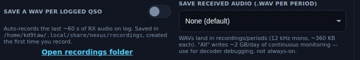

# Phone (SSB)

The Phone cockpit is a traditional rig-panel experience for voice operating —
SSB on HF and FM for VHF/UHF and repeaters. It doesn't try to reinvent voice —
you talk on the rig's own mic — but it gives you the shack-monitor conveniences a
modern app should: live dial read-back, a fast colored bandscope, a voice keyer
for the calls you make over and over, and crash-safe QSO recording, all with your
logbook and license privileges wired in.

Phone ships enabled — the wizard turns everything on; there is no mode picker to
miss it in. No goal profile enables it, though, so if you pick one in
[Settings ▸ Appearance ▸ Features](settings-reference.md#features), switch Phone
back on there — or take **Everything (expert)**, which includes it.

![The Phone cockpit on 15 m: the dial reads 21.2000 MHz, the mode chips show AUTO-FM selected next to USB, LSB and FM, and a rig: USB badge beside them flags that the radio itself is still on USB. The bandscope fills the upper half — a panadapter trace over a scrolling waterfall, with the Full / Voice / Low / High span chips above it — while Band Activity and the six-slot voice keyer, F1 CQ through F6 Again, stack in the left column and the LOG pane runs down the right. PUSH TO TALK and its Lock tick sit in the dock across the bottom; Panels, the Power slider, Tune and Stop TX ride in the header above the scope.](../img/manual/phone-cockpit.webp)

## The tour

**Live dial read-back.** The cockpit polls the rig about every 750 ms: spin the
VFO knob and the displayed frequency follows. On SSB the sideband is automatic —
LSB below 10 MHz, USB above — so the rig lands on the right sideband for the band.
The mode chips — **AUTO / USB / LSB / FM** — set what the cockpit commands, and
AUTO shows the sideband it settled on (`AUTO·USB`, `AUTO·FM`). If the rig's own
mode knob disagrees, a **rig:** badge appears beside them naming what the radio
is actually on; logging and TX follow the commanded mode until you match it up.

**The bandscope** is a fast (~30 Hz) colored display split into a panadapter
trace and a scrolling waterfall, with per-frame AGC so signals stay visible as
conditions shift. **Span chips** above the scope — Full / Voice / Low / High —
zoom the view to the part of the passband you care about.

**RF power slider.** Wired to CAT and *follows the rig*: turn the rig's power
knob and the slider tracks it (it won't sit lying at 100%). Your drags win while
you're dragging.

**⊞ Panels** in the header shows and hides the panes under the scope. Where there
is something you would want to know before you tick — nothing on screen behind
the box, or a consequence to unticking it — the entry says so in a line under it:

- **Rig Scope Controls** command the *radio's own* panadapter (span sets the
  hardware sweep width, ref sets weak-signal visibility), so they appear only
  while an Icom CI-V or FlexRadio scope is streaming. On the audio bandscope
  there is nothing to command, and the entry says so. The span chips over the
  scope are a different thing: they zoom what is already on screen.
- **DSP Functions** (NB / NR / Notch / COMP / VOX) and **RX DSP Levels** (NR
  level, AGC) only ever offer what your radio reports over CAT. A rig that
  reports none of them has nothing for those panes to hold, and the entries say
  so rather than hiding an empty pane behind a silent checkbox.
- **TX Meters** (SWR / ALC / PO / COMP) read on transmit, so the panel is empty
  while you listen. The entry says when it reads.
- **Voice Keyer** puts the F-key message pane away if you work with a mic and
  never use it. Unticking it stops a message that is playing and throws away a
  recording you are part-way through making; the entry says both before you tick
  it, and **Undo last change** — which can put the pane away again — carries the
  same line before you press it. Whichever way the pane closes, including simply
  leaving the Phone screen, Nexus tells you what it ended: the over it cut short,
  or the recording it discarded. Nothing else changes: PTT, Tune and Stop TX are
  not panels and have no entry, so no layout you save can put them out of reach.

The line explains the screen; the tick is still yours. Every box in the menu can
be ticked and unticked whenever you like, and what you choose applies the moment
that panel has something to show — untick one now and it stays away when your rig
starts feeding it. Once you have unticked an entry, its line goes with it: the
pane is off your screen because you said so, and a note still blaming the rig
would no longer be true. Tick it back and the line returns if it still applies.
Each entry is a keyboard tab stop and reads its reason with the panel name;
**Esc** closes the menu and puts focus back on the ⊞ button rather than at the top
of the app. If the list outgrows your window it scrolls inside the menu, so **Undo
last change** and **Reset layout** stay reachable.

**The control column.** Band Activity, the voice keyer and the rig-scope / DSP /
RX-DSP strips share the leading column, and none of them can shrink. When the
stack stands taller than the space it has — a small window, or a large UI zoom —
that column scrolls, so the NR slider, the AGC chips, the DSP toggles and the
keyer's F-keys are always reachable rather than rendered past the edge. **PTT**,
**Stop TX** and **Tune** are not in the pane region at all, so nothing you do in
⊞ Panels and no window size moves them.

<!-- TODO: capture screenshot — the bandscope with the Full / Voice / Low / High span chips -->

## Core workflows

### Get on the air and make a call

1. Set the band and frequency — type it, pick a band-plan channel, or just spin
   the rig's knob and watch the read-back follow.
2. **Push to talk** one of three ways:
   - hold the on-screen **PTT** button,
   - **hold the Space bar** (works unless you're typing in a field),
   - or let the configured rig method key it (CAT, serial RTS/DTR, or VOX) — set
     in [Settings ▸ Radio ▸ Rig & CAT](settings-reference.md#rig--cat).
   For hands-free operating, toggle **Lock**.
3. Talk on the rig's microphone. Nexus handles the canned messages, recording,
   scope, and CAT/PTT — the voice path itself is the rig's own mic.
4. The cockpit **unconditionally drops PTT when you navigate away**, so there is
   no stuck-transmitter path.

### Work FM and repeaters

1. Set **Phone mode ▸ FM** in
   [Settings ▸ Phone](settings-reference.md#phone-ssb--fm). The cockpit's mode
   badge switches to FM and the rig is driven to FM.
2. For a repeater, set the **Repeater shift** (simplex / plus / minus — the
   offset is the band standard, e.g. 600 kHz on 2 m, 5 MHz on 70 cm) and the
   **CTCSS (PL) tone** in the same Settings tab.
3. Tune to the repeater's output frequency and operate — Nexus applies the shift
   and access tone through CAT.

### Use the voice keyer

The voice keyer has six F-key slots: **CQ, My Call, Report, QRZ?, 73, Again**.

*The voice keyer in Nexus 1.10.3. **F2 My Call** holds a recording, so it shows a
▶; an empty slot reads **record** instead. **●** records into the slot, the arrow
imports a WAV, **✕** clears it, and the pane's **■ Stop** ends whatever is
playing.*

1. **Record in-app** or **import any WAV** (Nexus resamples and downmixes
   automatically). Choose your recording mic in
   [Settings ▸ Phone](settings-reference.md#phone-ssb--fm) — on a
   digital setup the default input is the rig's RX audio, so point "Voice mic
   (recording)" at your actual microphone. Both controls that start a recording
   — the **●** button and an empty slot — carry that warning, so it reaches you
   where you are standing when it matters. Recording the rig's RX audio into a
   slot is how a canned call goes on the air with the wrong voice in it.
2. Press a slot to play it. Playback keys PTT for the duration; **Esc** aborts.

If you never use it, untick **Voice Keyer** in ⊞ Panels and the pane goes away.
Closing the pane is itself a stop: a message that is playing is aborted rather
than left transmitting behind a pane you just closed. A recording running at that
moment is thrown away — Nexus says so when it happens, and the menu entry says so
first. Leaving the Phone screen does the same thing, for the same reason: there is
no abort button off-screen.

### Record a QSO

QSO recording streams the rig's RX audio straight to a timestamped WAV on disk,
with crash-safe headers and a 2-hour auto-stop, so a long ragchew or a dropped
session never leaves you with a corrupt file.

*Where the recordings go, in Nexus 1.10.3 — the path shown is this station's, and
**Open recordings folder** opens yours. The per-period setting next to it is a
decoder-debugging tool, not a QSO recorder: "All" writes about 2 GB a day.*

## Field Day and logging

The log strip pre-fills **59 / SSB**. Log a contact and — because the draft is
seeded from what you were actually running — it says SSB, never an accidental
"FT8." The **Log** button sits inside the log pane at every window from 1024×768
up, so committing a contact never means scrolling to find the button that commits
it. The strip takes its name from the pane head above it (**LOG**), which is also
what a screen reader reads — the printed repeat and the strip's own inner card
are gone, and that is where the height came from. Nothing is in a smaller type.
During [Field Day](contesting-pota.md), the strip becomes an FD entry with
class and section, sharing dupe checking with the other cockpits, and each
contact routes to the event log.

License-class enforcement hard-blocks PTT outside your privileges — see
[Settings ▸ Station](settings-reference.md#station).

## Honest limits

- **No live mic-through-app audio bridge.** You use the rig's mic for live voice;
  Nexus handles canned messages, recording, the scope, and CAT/PTT — not a
  software voice path to the transmitter. This applies to SSB and FM alike.

## Related guides

- [CW](cw.md)
- [RTTY](rtty.md) — the teleprinter cockpit on the same rig: typed, not spoken
- [SSTV](sstv.md) — pictures in the phone segment, through this same transmitter
- [APRS](aprs.md) — the packet side of the same 2 m radio
- [Memories](memories.md) — the bank behind this cockpit's MEM strip
- [Program](program.md) — building the repeater channels you work here
- [Operate — FT8/FT4 digital](operate-digital.md)
- [Field Day & POTA/SOTA](contesting-pota.md)
- [Settings reference](settings-reference.md)
