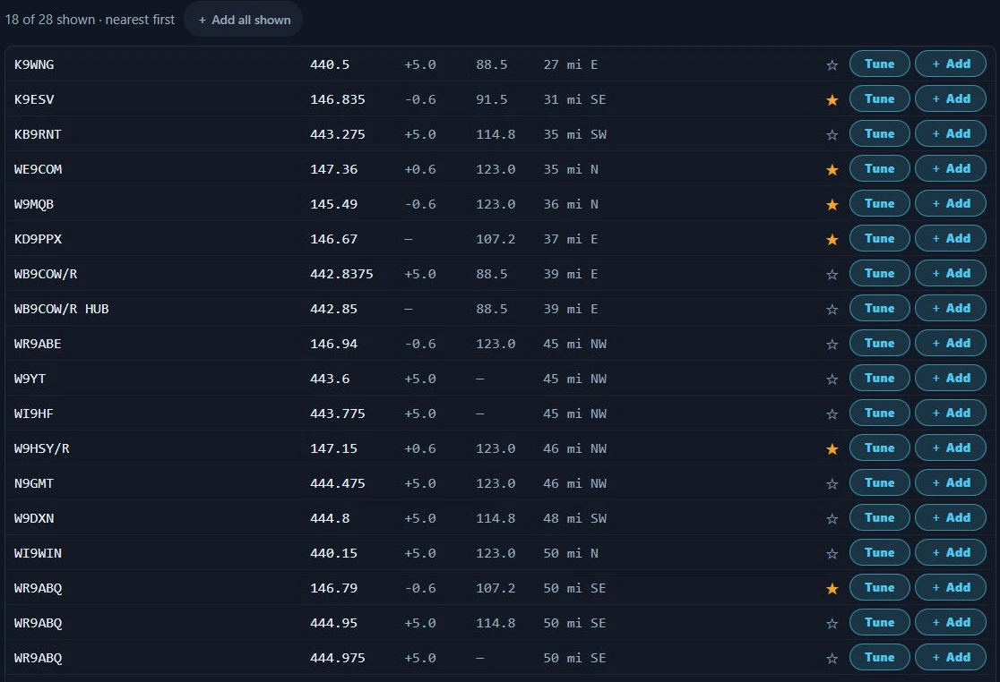
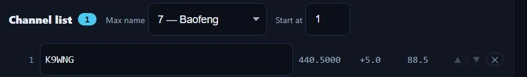

# Program

Program is the radio-programming workbench: it turns the repeaters around a
location into a channel list, and gets that list out to a radio. The channel
list is the artifact — the repeater results are a source feed that fills it, and
nothing is fetched until you press **Fetch repeaters**. Nexus never drives a
programming cable; **CHIRP** does that, free, for about a thousand models, and
this section builds the CSV CHIRP imports. It is deliberately not a repeater
directory: no map, no polling, no browsing for its own sake.

Program ships on: it is enabled under the **Just getting started**,
**POTA / SOTA** and **6m / VHF** goal profiles and wherever no goal profile was
chosen, and off only under DX chasing and contesting; it toggles either way in
[Settings ▸ Appearance ▸ Features](settings-reference.md#features).

<!-- TODO: capture screenshot — the Program section on a wide window: fetched results on the left showing FM rows plus one badged DMR row and one OFF-AIR row, a six-channel list built on the right, the whole delivery row visible under it -->

## The tour

*The source column in Nexus 1.10.3, before a fetch.*

Two columns. The **source** column on the left is where you say where you are
and what you want; the **Channel list** on the right is what you are building.
They sit side by side from about 1100 px of effective width. Below that —
1024×768 included — they stack, the list under the source, and the panel itself
scrolls, so the delivery row at the bottom is reached by scrolling rather than
lost off the edge.

**Near** picks the origin, and there are three ways to give one. **My station**
carries your grid from [Settings ▸ Station](settings-reference.md#station) and
needs no input at all. **Grid** takes a square typed by hand, up to six
characters, outlined in red until it is a real one. **City** takes free text
("Gatlinburg, TN") and geocodes it on an explicit **Search** click — never per
keystroke — offering up to five OpenStreetMap candidates to pick from; a single
match is picked for you, and no match says "No places matched — try 'City,
State'". The candidate you pick becomes the point the search runs from, not your
station grid, so programming for a town you have never been to is the same job
as programming for home. **Recent** holds the last five origins that answered,
with their resolved coordinates, so a place you program often is one click to
select — then you press Fetch, which is always yours to press.

**Radius** is chips at 10, 25, 50, 100 and 200 miles plus **Auto**, which is the
"radius from the selected bands' realistic repeater reach": 25 mi for 70 cm and
1.25 m, 50 for 2 m, 75 for 6 m, 100 for 10 m, the widest of what you have
selected, and 50 with no band chip lit. Auto prints the number it resolved to
beside the chips, so it never moves the search without telling you.

**Fetch repeaters** is the one filled accent button on the screen and the only
control that pulls repeater data; the City **Search** click is the section's
only other network call, so nothing here reaches out unless you pressed
something. After a fetch, the line beside it says which directory answered and
how old the data is — "RepeaterBook · 3h ago", "hearham · 2d ago" — and adds
"stale (fetch failed, cached data shown)" when you are looking at cache because
the fetch did not land. Directory data caches for seven days per source and a
RepeaterBook state re-tries at most every 15 minutes, so repeated fetches from
the same spot are free and instant; a directory does not change hourly and this
one does not pretend to.

**Where the data comes from.** With no token, hearham.com — an open, no-account
directory pulled whole (~22,000 rows worldwide) and cached. Add your own
RepeaterBook token (`rbuapp_…`, from your RepeaterBook account's **API Apps**
page) under **RepeaterBook** in Settings and US searches pull RepeaterBook state
exports under your own account instead. RepeaterBook's API has no radius query,
so Nexus pulls the origin's state plus whatever states sit under eight compass
points at your radius and filters by distance locally — a search on a state line
gets the neighbouring state too, rather than half a circle of results. Shared
RepeaterBook access for every Nexus user is pending RepeaterBook's approval:
until it is granted that path answers 503 and the search falls through to
hearham, which is why an install with no token is a hearham install. The
attribution line under the results names whichever source answered, and the
exported file carries it as a trailing comment.

hearham has real holes in rural country, so Program checks for one. When the
results inside your radius carry nothing at all on 2 m, or nothing on 70 cm, a
note says so: "hearham lists no **2 m** repeaters here, which is unusual for an
area that has any — its rural coverage is patchy, so this list is probably
missing machines." It looks for a missing *band* rather than a low count,
because genuinely thin country stays balanced across the two bands and would
otherwise cry wolf. A short list is not flagged; a one-sided list is.

**Filters** run under the fetch row: **All** plus per-band chips (2m, 70cm,
1.25m, 6m, 10m — 2 m and 70 cm lit to start, and they multi-select), **FM** or
**+Digital**, **On-air only**, and a box that filters on callsign or city as you
type. A machine on a band with no chip of its own — 33 cm, say — shows only
under All. The count line reads "12 of 47 shown · nearest first" and grows a
**＋ Add all shown** button whenever there is anything left to add.

**A result row** is callsign, output frequency, offset (`-0.6`, `+5.0`, `→` and
the absolute input for a true split, `—` for simplex), tone (`103.5`, `D023`,
`—`), then distance in miles and compass octant from your origin, with the city
and state on hover. FM machines carry ☆, **Tune** (only while CAT is up) and
**＋ Add**; the Add button reads "✓ Added" afterwards and clicking it again takes
the channel back out. Digital-only machines are listed, greyed and badged DMR /
D-STAR / YSF, with Add disabled — "Digital repeater — programming
DMR/D-STAR/Fusion comes in a later version". An FM machine that also runs Fusion
badges **+YSF** and programs as plain FM. Off-air machines are dimmed with an
OFF-AIR badge and hidden by the On-air only filter, but nothing stops you
programming one once you have chosen to see it.

**The channel list** heads with the row count, **Max name** and **Start at**.
Max name is your radio's channel-name length — 6 (FT-60 class), 7 (Baofeng, the
default), 8 (most HTs), 12 (Yaesu mobile), 16 (Anytone) — and the derived names
re-fit the moment you change it, so you see the file you are about to export
rather than discovering the truncation on the radio. **Start at** is the first
memory slot number, for keeping the channels a radio already holds.

Names are derived so that most lists need no typing: the callsign when it fits
the cap and is unique ("that's the W9ABC repeater"); the truncated call plus the
frequency nickname operators actually say — `W9AB 94` for 146.940 — when a club
has a second machine or the call overruns the cap; the city squeezed to
consonants plus that nickname — `GTLNB94` — when the directory has no call at
all. Type over a name and it is yours: that row stops re-deriving. Two rows that
would land on the same name go red ("the radio will show two identical
channels"), and so does a name longer than the cap, whose hover tells you the
exact string it will export as.

Each list row is the slot number, the name field, RX frequency, offset, tone,
and **▲ ▼ ✕** to order and remove. The order on screen is the order it programs.
The list auto-saves about a second after every change and is there when you come
back to the section or restart the app.

**The delivery row** sits under the list — four buttons, all disabled while the
list is empty:

- **Export for CHIRP…** writes a CHIRP generic CSV to your Downloads as
  `nexus-chirp-YYYY-MM-DD.csv` and tells you the full path it wrote. The first
  time, a **Flash with CHIRP** dialog explains the three steps first ("Nexus
  builds the list; CHIRP drives the cable. One list, every radio you own") and
  offers a "Don't show this again — just save the file" tick.
- **Export CSV** writes `nexus-channels-YYYY-MM-DD.csv`: a plain sheet with RX
  *and* TX frequency both spelled out, for spreadsheets, Anytone CPS and RT
  Systems. It is not the CHIRP format.
- **Save to Memory Bank** puts the channels into Nexus's own Memories with the
  machine's shift, offset and tone, deduped on frequency + mode + tone so
  re-saving the same list never piles up duplicates. A recall from a cockpit MEM
  strip then retunes the rig as a repeater, not just to a frequency.
- **Clear** asks "Clear the whole channel list?" and empties it.

## Core workflows

### Program a handheld for a trip

1. Set **Near** to the place you are going — **City** for a town you can name,
   **Grid** for a square, **My station** for home — and press **Fetch
   repeaters**.
2. Leave **Auto** radius on unless you want a different circle; with 2 m and
   70 cm selected it works out to 50 mi.
3. Set **Max name** to your radio (7 for a Baofeng) *before* you review names,
   so what you read is what the file will hold.
4. Add machines with **＋ Add**, or **＋ Add all shown** to take the whole
   filtered list at once — it confirms first past 50 and adds at most 200.

   

   *Fetched results in Nexus 1.10.3 — 18 of 28 machines showing, after the 2 m
   and 70 cm band chips and On-air only.*

5. Put the list in order with **▲ ▼**, rename anything you want to recognise on
   the radio's display, and drop the rest with **✕**.
6. **Export for CHIRP…**, then follow the three steps the dialog gives:
   open CHIRP → **File ▸ Import** and pick the saved file → connect the
   programming cable → **Radio ▸ Upload To Radio**.

⚠️ **Before you export, know what Start at does and does not do.** It renumbers
the **preview** so you can plan around channels the radio already holds. It is
not carried into either export: both the CHIRP CSV and the plain CSV number
their rows from 1, every time, whatever the box says.

*One channel in the list, in Nexus 1.10.3. Set **Start at** to 21 and this row
would read 21 on screen — and would still be written as channel 1 in the
exported file.*

So if the radio already holds twenty channels you want to keep, **Start at is
for reading, not for the file.** Import the export as it stands and CHIRP
overwrites from slot 1. The way to keep the existing twenty is to read them
out of the radio with CHIRP first, then paste these rows in below them — or to
renumber the exported CSV yourself before you import it.

<!-- TODO: capture screenshot — the "Flash with CHIRP" dialog open over a built channel list, showing the three numbered steps, the Get CHIRP link, the "Don't show this again" tick and the Save the CSV button -->

### Star one machine onto the cockpit strip

1. Press ☆ on the result row of the machine you actually want on the radio in
   front of you. Starring skips the channel list and the export entirely.
2. Nexus saves it to Memories as a proper FM channel — shift, offset and access
   tone — named the way it is said out loud (`W9ABC 94`), and puts it on the MEM
   strip in the Phone, CW and Operate cockpits. Starring a machine Memories
   already holds stars *that* row rather than adding a second one.
3. Recall it from the MEM strip when you want it. The star saves the machine's
   coordinates too, so Memories shows distance and bearing recomputed from
   wherever you are operating today.
4. Press ★ again when you are done with it: that only takes it off the cockpit
   strip, and the channel stays in Memories.

### Tune the rig to a repeater now

1. Press **Tune** on an FM result row — it is there whenever CAT is up: "Tune
   your CAT rig to this repeater now (FM + shift + offset + tone)".
2. The machine's frequency, its exact shift and offset, and its CTCSS tone all
   land together, on FM, routed to the radio you have mapped for FM on that
   band. It is one step, not a QSY followed by fixing the tone, and naming FM
   explicitly is what makes it correct when you arrive from a data section,
   since a repeater is inaudible in a data mode.
3. Read what Nexus confirms — "Tuned 146.9400 FM — −0.60 MHz · tone 103.5" — or
   the refusal in plain words when the rig cannot get there: "This radio doesn't
   cover 146.9400 MHz, so it can't work that repeater."
4. **Tuning is all it does — nothing here arms transmit**, and you stay in
   Program with the rig sitting on the repeater.

### Keep the list inside Nexus

Use this when the channels are for operating from Nexus rather than for a
handheld; ☆ on a result row is the one-machine version.

1. Build the channel list, then press **Save to Memory Bank**.
2. Read what it reports — "6 channels saved to Memories (2 already there) —
   star ★ the ones you want on the cockpit MEM strip".
3. In [Memories](memories.md), star the channels you want reachable from a
   cockpit MEM strip.

## Honest limits

- **Start at renumbers the screen, not the file.** It moves the slot numbers in
  the builder so you can plan around channels a radio already holds, but both
  exports number their rows from 1 regardless. Importing into a radio image
  without allowing for that overwrites from slot 1. Spelled out with the
  preview beside it under
  [Program a handheld for a trip](#program-a-handheld-for-a-trip).
- **v1 programs analog FM only.** Digital machines are listed and badged so you
  know they exist, but they cannot be added, and a CHIRP export refuses an
  all-digital list: "No FM channels in the list — digital channels export in a
  later version". The DMR/D-STAR/Fusion fields are stored in the saved list so
  today's work survives that version — they are not written to any file yet.
- **The name cap applies to the CHIRP export, not the plain CSV.** Export CSV
  writes names as typed, uncapped and unsanitised; the CHIRP file is the one
  that matches the preview.
- **Nothing merges two rows that program the same machine.** Rows are tracked by
  their directory id, so a linked system listed once per node adds once per
  node. Save to Memory Bank does dedupe (on frequency + mode + tone); the
  builder list does not.
- **Max name and Start at reset each launch**, and a list restored after a
  restart keeps the names it had — those rows count as hand-edited, so changing
  Max name afterwards does not re-derive them. The CHIRP export still truncates
  to the current cap.
- **Save to Memory Bank does not carry the machine's coordinates**, so channels
  saved that way show no distance or bearing in Memories. ☆ on a result row is
  the path that carries them.
- **Exports overwrite the same day's file.** The filename is date-stamped only,
  so a second export on the same day replaces the first in Downloads without
  asking.
- **The attribution comment follows this session's fetch, not the channels.**
  Export a list you built yesterday from RepeaterBook without fetching again
  first and the trailing comment credits hearham.com, because nothing has
  answered yet this session.
- **One list, not named projects.** There is a single working list, auto-saved;
  the file format holds many, but nothing in the UI creates, names or switches
  between them.
- **Nothing refreshes itself.** Fetch and the City **Search** click are the only
  network calls and both wait on a press, cached data can be up to seven days
  old, and there is no bundled offline directory — a first fetch with no network
  and no cache fails with the reason and a **Retry** button rather than showing
  an empty list.
- **hearham is the default source and it is incomplete in places.** The
  missing-band note catches the case where a whole major band is absent; it
  cannot tell you about the individual machines a directory never listed. A
  RepeaterBook token is the fix, and shared access is not available until
  RepeaterBook approves it.
- **Program has no ⧉ pop-out** — it renders in the main window only. (Memories
  does detach, if you want a channel list on a second monitor.)
- **Nexus does not talk to your radio's programming port.** No cable, no CPS, no
  cloning. The one thing it moves directly is a CAT rig's VFO, from the per-row
  **Tune** button.

## Related guides

- [Memories](memories.md) — where **Save to Memory Bank** puts the channel list,
  and what the cockpit MEM strip recalls
- [Phone (SSB)](phone.md) — working FM and repeaters once the channels are in
- [Field Day & POTA/SOTA](contesting-pota.md)
- [Settings reference](settings-reference.md)
