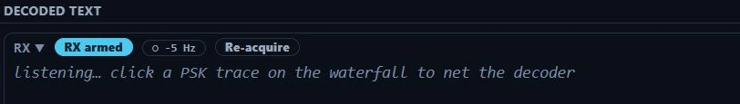
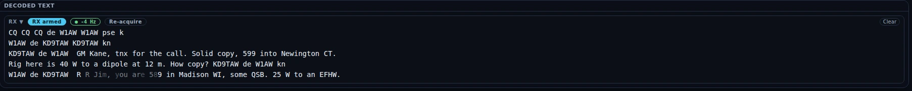
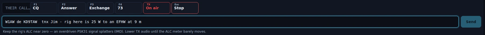

# PSK

The PSK cockpit is a keyboard station for the classic narrow-band phase-shift modes:
**PSK31** and **QPSK31**, both at 31.25 baud in about 60 Hz of spectrum. It gives you a live
decoder with per-character confidence, a waterfall you click to net onto a signal, four F-key
macros and a type-and-send bar, a continuous-TX latch that lets you type straight into a
transmission the way a teleprinter operator does, and a log strip for the contact when it is
done. **PSK31 transmits here** — this is not a monitor. It is a ragchew station, not a
contest station: no serials and no dupe check outside Field Day.

PSK ships enabled — the wizard turns everything on; there is no mode picker to miss it
in. No goal profile enables it, though, so if you pick one in
[Settings ▸ Appearance ▸ Features](settings-reference.md#features), switch PSK back on
there — or take **Everything (expert)**, which includes it.

## The tour

**The header.** Left to right: a mode badge reading **PSK31 · 31.25 Bd** or
**QPSK31 · 31.25 Bd**, then the sub-mode selector, and — on QPSK31 only — a **Rev** toggle
(see [Which one, and when](#which-one-and-when)). A **TX ▲** pill appears while an over is on
the air.

The big frequency readout is editable: type a dial and press Enter. It tunes wherever you
type, off the ham bands included. Beside it a compact band picker serves the built-in PSK
watering holes — eleven channels from 160 m (1.838) through 6 m (50.290), with both the US
(7.070) and EU/DX (7.040) entries on 40 m, and **20 m parked at 14.070**, the worldwide PSK31
hole just below the FT8 cluster at 14.074. The list is filtered by license class per band, so
a band where your class holds no digital privileges never appears.

On the right: **⊞ Panels**, a **Power** slider, **Tune**, an **ATU** button when your rig
reports a tuner, the **TX On / TX Off** latch, **Stop TX** and the CAT pill. The latch is this
cockpit's Enable-Tx — the top bar's TX cluster is hidden behind the digital chrome here, so
without it a send would sit at "TX is off" with no way to arm from this screen.

Power and Tune are here for one reason, and it is the most important thing on this page: see
[Drive, and why it matters more here](#drive-and-why-it-matters-more-here).

**The waterfall** runs at the live-band cadence — a new row every 50 ms — so a signal drifting
across the passband moves smoothly. A single green **RX** cursor marks where the decoder is
listening, and **clicking a trace nets the decoder onto it**. The click moves the decoder, not
the radio: your dial does not change, which is how PSK is operated. Transmit follows the
decoder, so the station you netted is the station you answer.

**The decoded-text pane** prints copy as it arrives, with faint characters marking
low-confidence copy — that is the demodulator's own phase-margin metric, not a guess, so
fading text is a real signal that the copy is getting hard. Its head carries:

- **Arm RX / RX armed** — the decoder. Arming it starts the receiver and nothing else; it
  never keys the rig, and transmit is armed separately by the header's TX latch. It arms
  itself when you open the screen — switch **Start receiving when PSK opens** off in
  [Settings ▸ Digital ▸ PSK](settings-reference.md#psk) to arm it by hand instead. If you
  turn it off yourself, that choice is remembered for the session rather than fought with
  every time you come back.
- A **carrier** indicator that shows the AFC offset from where you netted. The AFC is
  slew-limited and never pulls more than ±25 Hz, so it tracks a drifting station without
  wandering onto a neighbour.
- **Re-acquire** — drops and rebuilds the demodulator for a fresh AFC pull from the netted
  frequency. Use it when the AFC has pulled onto the wrong signal.
- **Clear** — empties the transcript.

*The decoded-text pane, armed and waiting, in Nexus 1.10.3. The carrier pill is the AFC's
offset from where you netted; **Re-acquire** rebuilds the demodulator from that frequency.*

**The LOG pane** sits under the transcript — call, sent and received report, name, QTH,
state, country, a POTA reference and private notes, with a **Log** button. The call you put
in the dock's **{CALL}** field carries across to it once you stop typing, and the record is
written with the sub-mode you were actually running (`PSK31` or `QPSK31`), not folded
together. During [Field Day](contesting-pota.md) the strip becomes the class/section entry
and the contact routes to the event log, scored as Digital.

**The TX dock**, pinned at the bottom: four macros (**CQ**, **Answer**, **Exchange**, **73**),
a **{CALL}** field for the station you are working, the compose bar, the continuous-TX latch,
and **Esc / Stop**.

*The TX dock in Nexus 1.10.3. **Continuous** is the latch that holds the transmitter up so
you can type into a live over; **Esc / Stop** cuts it. The drive reminder is printed under
the compose bar because it is the one thing you cannot see going wrong on your own
waterfall.*

## Core workflows

### Receive, and net onto a station

Open PSK, pick 20 m from the band picker (14.070), and watch the waterfall. PSK31 looks like a
narrow double line — two rails about 31 Hz apart — and sounds like a warble. Click it. The RX
cursor jumps there, the carrier indicator lights, and text prints. If it prints garbage,
re-click slightly more precisely, or press **Re-acquire**.

You do not need to tune the radio to work up and down the band. Everything in the passband is
reachable by clicking, which is why PSK operators park on a watering hole and stay there.

*Netted and printing, in Nexus 1.10.3. The dot on the carrier pill is the quality
squelch — lit means the demodulator has a signal right now — and the number
beside it is how far the AFC has walked from where you clicked.*

### Work a station

Put their call in the **{CALL}** field, then use the macros: **Answer** calls them,
**Exchange** sends a report, **73** signs. The macros expand `{MYCALL}` and `{CALL}` as they
are sent. Anything you type in the compose bar and send with Enter goes out as typed.

Every send is checked before anything is queued, and a refusal names the reason:

- a macro carrying `{MYCALL}` needs your callsign set in
  [Settings ▸ Station](settings-reference.md#station); one carrying `{CALL}` needs their
  call in the dock field,
- the **TX** latch must be on,
- the dial must be inside your license privileges,
- the PSK section must own the transmitter — a tune carrier, or another mode's over, holds
  it,
- and the text must have something PSK31 can carry (it is filtered to ASCII, case
  preserved). One over is capped at 500 characters.

Sending while an over is already going out queues behind it; sending while the continuous
latch is up types into the transmission instead.

When the contact is done, write it in the **LOG** pane — the call carries over from the dock
field, and the mode is recorded as the sub-mode you were running.

### Type into a live transmission

The continuous-TX latch keys the transmitter and holds it up, idling on reversals when you
have nothing typed — the way a PSK31 QSO actually runs. Type and the characters join the
transmission already on the air. Click it off and what you have typed finishes keying, then
the rig unkeys.

That is a transmission with no pre-computed end, so it carries its own limits: every transmit
gate is re-checked continuously and drops the latch — not just the text feed — if one goes
down, so a band change, a QSY out of privileges or a radio handoff unkeys within a moment. A
hard per-over ceiling bounds it no matter how long you keep typing.

**Esc stops it, from anywhere in this cockpit**, as does **Esc / Stop** in the dock and
**Stop TX** in the header.

*Continuous running in Nexus 1.10.3. Every keystroke goes out as you make it, so
the field is append-only — backspace, paste and a drop are all refused, because
there is nothing to un-send.*

### Drive, and why it matters more here

PSK31 is an amplitude-shaped mode. Between characters the envelope is a steady carrier, but
through real text it swings — and if the rig's ALC is compressing those swings, the signal
splatters into the operators either side of you as **IMD**. The cruel part is that it looks
perfectly clean on your own waterfall while it happens. You will not know unless somebody
tells you.

The procedure is the reason Tune and Power sit in this header:

1. Press **Tune** to key a steady carrier.
2. Wind **Power** back until the rig's ALC meter barely moves.
3. Press **Tune** again to stop.

Nexus keys at a modest drive by default and the dock repeats the reminder, but the setting is
yours — there is no automatic ALC compensation, on purpose. A guess would be a wrong guess on
somebody's rig.

### Which one, and when

**PSK31** (BPSK) is the standard, and what you will hear on the watering holes.

**QPSK31** carries the same 31.25 baud through a rate-1/2 convolutional code with soft-decision
decoding, which buys real robustness against flutter and static crashes at the cost of needing
a cleaner phase reference. It is **sideband-sensitive** in a way BPSK is not: its ±90° phase
rotations mirror on LSB, where BPSK's 0/180° shifts do not care. That is what the **Rev**
toggle is for — if a QPSK31 station warbles but prints garbage, click **Rev** and try again.
Normal is USB, the convention this section uses throughout.

## Honest limits

- **One signal at a time.** The decoder follows the cursor. There is no decode-everything
  browser listing every PSK signal in the passband; click to move.
- **No auto-sequencer.** The FT and RTTY cockpits can run a QSO for you. PSK does not — you
  drive it.
- **No dedicated PSK settings beyond the receive default.** There is one option
  ([Settings ▸ Digital ▸ PSK](settings-reference.md#psk)): whether the decoder arms itself when
  the screen opens. Everything else is on this screen.
- **One label in the app still calls PSK receive-only.** The PSK entry in
  [Settings ▸ Appearance ▸ Features](settings-reference.md#features) ends "click a trace, read
  the ragchew (receive)". That wording is left over from the phase when the decoder shipped
  ahead of the transmitter. PSK31 and QPSK31 both transmit in 1.10.3 — **Send**, the macros
  and the continuous latch on this screen all key the rig.
- **QPSK31's absolute rotation sense is not bench-confirmed.** Loopback proves Nexus agrees
  with itself, which is not the same as agreeing with the rest of the world. If you work a
  QPSK31 station with another program and the polarity is backwards, the **Rev** toggle is the
  fix and a bug report is very welcome.
- **No cockpit-wide screenshot yet.** The panes above are captured; a whole-screen tour shot
  of this cockpit is still owed.

## Related guides

- [RTTY](rtty.md) — the other keyboard mode, and the closest sibling to this screen.
- [Operate (digital)](operate-digital.md) — FT8/FT4, the slot-synchronous modes.
- [Settings reference](settings-reference.md#psk) — the receive-on-open option.
- [Logbook and QSL](logbook-qsl.md) — where a contact worked here goes.
