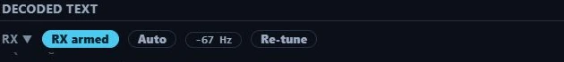
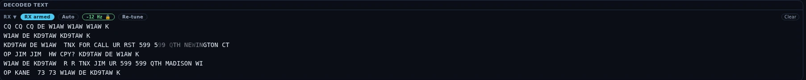
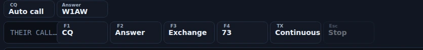

# RTTY

The RTTY cockpit is a Baudot/ITA2 teleprinter station — 45.45 baud and a 170 Hz
shift out of the box, the HF standard. It gives you a live decoder with
per-character confidence, a mark/space waterfall you click to net onto a signal,
four F-key macros and a type-and-send bar, two keying back-ends (soundcard AFSK
or true FSK on a serial line), an optional QSO auto-sequencer that never
transmits until you start it, and a log strip for the contacts you work by hand.
It is deliberately not a contest station: no serials and no dupe check outside
Field Day.

RTTY ships enabled — the wizard turns everything on; there is no mode picker to
miss it in. No goal profile enables it, though, so if you pick one in
[Settings ▸ Appearance ▸ Features](settings-reference.md#features), switch RTTY
back on there — or take **Everything (expert)**, which includes it.

![The RTTY cockpit filling an ultrawide window, so the waterfall runs far wider and shallower than in the other captures in this manual, and the Decoded Text pane below it is correspondingly tall. The header carries the RTTY 45.45 · 170 Hz badge, an AFSK pill, 7.0800 MHz on the 40 m channel, and ⊞ Panels, TX On, Stop TX and CAT on the right; the waterfall below shows band noise across the whole passband, with the green M and orange S cursors standing at the 2125 / 2295 Hz tone pair and no signal between them. The decoder is not armed — the pane head offers only RX, Arm RX, Auto and Clear, with no AFC pill and no Re-tune, above the empty-state line "Arm RX to decode RTTY from the receive audio" — while the macro row and compose bar stay pinned at the bottom, Esc / Stop greyed out.](../img/manual/rtty-cockpit.webp)

## The tour

**The header.** Left to right: a mode badge reading **RTTY 45.45 · 170 Hz** —
your live baud and shift, so you can see at a glance what the decoder and the
transmitter are set to — then a keying-backend pill reading **AFSK** or **FSK**,
then a **TX ▲** pill that appears only while an over is on the air or queued
behind one. The badge explains itself on hover: "RTTY — Baudot/ITA2 at the
configured baud + shift (45.45 / 170 Hz is the HF standard; change it in
Settings → RTTY)."

The big frequency readout is editable — type a dial and press Enter. It tunes
wherever you type, off the ham bands included, so a shortwave RTTY station is
reachable from here. Beside it, a compact band picker serves the built-in RTTY
watering holes: ten HF channels from 160 m (1.838) through 10 m (28.083), each
with a note on what shares the window — 40 m carries both the US 7.080 and the
EU/DX 7.045 entries, and 20 m parks at 14.083, above the FT4 cluster at 14.080.
The list is filtered by license class per band, so a band where your class holds
no digital privileges never appears.

On the right: **⊞ Panels**, the **TX On / TX Off** latch, **Stop TX** and the CAT
pill. The latch is this cockpit's Enable-Tx — the top bar's TX cluster is hidden
behind the digital chrome here, so without it a send would sit at "TX is off"
with no way to arm from this screen. Since 1.7.5 the header also carries a **Power**
slider, **Tune**, and an **ATU** button when your rig reports a tuner — RTTY keys the
carrier for the whole over, so most rigs want it run well under their SSB rating. Set it
the way you would on the radio: key **Tune**, wind Power back until the ALC barely moves,
press **Tune** again. Soundcard drive is still **Tx Power** in
[Settings ▸ Radio ▸ Audio](settings-reference.md#audio).

**The waterfall** is the same instrument the FT cockpit uses, run at the
live-band cadence: a new row every 50 ms rather than the 120 ms the slot-synchronous
FT surfaces use, so a signal drifting across the passband moves smoothly instead
of in steps. Two named cursors replace the usual RX/TX markers — a green **M** at
the mark tone and an orange **S** at the space tone, drawn from exactly the tone
pair the demodulator built its filters from, so what you see and what you decode
can never disagree. The hint above the canvas reads **click nets the decoder**:
any click moves the decode centre to that audio frequency (clamped 300–3700 Hz)
and drops the demodulator for a clean re-acquire. Palette, view span, the G/Z
contrast knobs, the 3D stacked-spectrum toggle and pause-with-scrollback all work
as they do elsewhere.

The scope is a fixed share of the window — 22% of the effective viewport height,
with a floor that yields on a short or heavily zoomed display so it can never eat
the transcript. **RTTY is the one scope in Nexus with no operator splitter**:
there is no grip to drag, so the scope/transcript split is what the window gives
you. On a short window the whole cockpit scrolls rather than clipping anything.

**Decoded text** is the pane you work from. It and the waterfall are the two
entries in this cockpit's ⊞ menu; the LOG pane below it is not removable. Its
head carries, in order:

- **Arm RX** — "start decoding RTTY from the receive audio (RX only, never keys
  the rig)." **Opening the section arms it for you**, so most of the time you
  will find it already reading **RX armed** and never press this. It arms by hand
  in two cases: when you have switched **Start receiving when RTTY opens** off in
  [Settings ▸ Digital ▸ RTTY](settings-reference.md#rtty), and after you have
  stopped the decoder yourself — that stop is remembered for the rest of the
  session, so re-entering the section will not restart it behind you. Arming is
  session state and is never persisted either way, so the app never launches with
  a decoder running. Disarmed, the pane reads "Arm RX to decode RTTY from the
  receive audio."
- **Auto** — arms the QSO sequencer. "It runs the QSO after you click CQ (run) or
  answer a heard CQ (search & pounce); it never transmits on its own." Turning it
  off is itself a stop: the queue is cleared and the rig unkeyed.
- **The AFC pill**, shown while armed: a signed offset such as `+12 Hz`, gaining
  a 🔒 once the correction has acquired and frozen. It freezes on purpose — a
  locked decoder that keeps tracking walks onto a stronger neighbour mid-QSO.
- **Re-tune**, shown while armed: "drop and rebuild the demodulator (use when it
  froze on the wrong signal)."
- **Clear** wipes the transcript and re-pins it to the bottom, so an emptied pane
  follows new copy even if you had scrolled up.

The transcript itself prints every character the demodulator produced, and fades
the ones it was unsure about. Confidence is the ATC slicer's own margin, carried
out per character: above 75 prints solid, then progressively fainter at 50 and
25, and the weakest copy at 30% opacity. Nothing is ever hidden — faint means
"read this twice", not "discarded". The ring holds the last 4000 characters and
follows new copy while you are at the bottom; scroll up and it stays where you
put it, so you can re-read a callsign mid-over.

**Underneath the print**, the decoder is a Rust port of fldigi's receive path.
Mark and space go through baseband mixers into 1024-point overlap-add FFT
filters — one matched filter per tone, so what reaches the bit decision is your
tone pair rather than the rest of the passband. The W7AY SNR-optimized ATC slicer
leans each decision on whichever of the two tones currently has the better
signal-to-noise, which is what holds copy together through the selective fading
that takes one tone of a pair down. Straddle-point bit-clock recovery judges every
bit at the middle of its window and re-centres on each character's start bit, so a
sender running a little off 45.45 baud does not slide into garbage part-way down a
line. Phase-difference AFC is clamped so it can never cross onto the neighbouring
tone (±45% of your shift — about ±76 Hz at 170). A signal-presence squelch gates
the printed output, so an armed decoder on a quiet band stays silent instead of
streaming garbage. It runs
in its own thread on a 100 ms drain and keeps decoding while you are on another
section; the cockpit polls it twice a second while RTTY is the visible view, so
the first tick after you come back catches the display up.

**The LOG pane** sits under the transcript: call, sent and received report, name,
QTH, state, country, a POTA reference and private notes, with a **Log** button.
It is where a contact you work by hand is written down — see the limits below for
what does and does not fill it in.

**The TX dock** — macros, compose, and the sequencer row when Auto is on — is
pinned below the pane and cannot be scrolled out of reach or hidden. The macro
row holds a **Their call…** field feeding the `{CALL}` token, four macros, the
**TX** continuous-transmit button and **Esc / Stop**:

| Key | Label | Sends |
|---|---|---|
| `F1` | CQ | `CQ CQ CQ DE {MYCALL} {MYCALL} K` |
| `F2` | Answer | `{CALL} DE {MYCALL} {MYCALL} K` |
| `F3` | Exchange | `{CALL} DE {MYCALL} UR 599 599 K` |
| `F4` | 73 | `{CALL} DE {MYCALL} TU 73 SK` |

Hovering a macro shows it fully expanded with your call and theirs, so you can
read what will key before you click it. `{MYCALL}` comes from
[Settings ▸ Station](settings-reference.md#station); `{CALL}` from the Their-call
field. Both tokens also expand in the compose bar, where **Enter** sends.

Every send is checked by the engine before anything is queued, and a refusal tells
you why: not in the RTTY section, TX not armed, the frequency outside your license
privileges, another mode holding the transmitter, or — on the FSK backend — the
data line and a serial PTT line configured onto the same physical line. Sending
while an over is already going out queues behind it (type-ahead); **Stop TX** or
**Esc / Stop** drops the whole queue and unkeys.

**Errors surface as a banner** above the pane: an FSK port that would not open,
a rig that refused PTT, or a sequencer whose gate closed mid-QSO.

### How this differs from the FT8 cockpit

RTTY is free-running. There is no slot clock, so nothing here is timed against
UTC, the clock-offset discipline FT8 lives or dies by does not bear on your copy,
and there are no transmit periods to pick — you key when you key. The sequencer,
when you use one, is driven by pattern-matching the decoded text rather than by a
slot boundary, which is why it needs timeouts where the FT8 sequencer needs
none. The decoder prints one running transcript instead of a decode list, a band
activity table and a call roster, because a teleprinter signal is text and there
is nothing to tabulate. One tone pair decodes at a time: whatever the M and S
cursors sit on, not the whole passband. And you start every transmission,
directly or by starting a sequencer run — there is no double-click-a-decode-to-call
path. RTTY and FT8/FT4 are mutually exclusive by construction: the transmit gate
demands the RTTY section owns the rig, so the two sequencers can never key
together.

## Core workflows

### Copy a station

1. Pick a band from the header's channel list, or type a dial into the readout.
   Entering the cockpit commands the rig's mode for you — a DATA submode on the
   LSB side for AFSK, the rig's own RTTY mode for FSK — and re-homes the
   frequency when you have genuinely changed mode, not when you are returning to
   a section you were already in.
2. Check the decoder is running. The pane head reads **RX armed** already if you
   have left **Start receiving when RTTY opens** on (the default) and have not
   stopped the decoder yourself this session; otherwise click **Arm RX**. On a
   quiet frequency the pane then reads "listening…" — the squelch is holding the
   print closed until a real signal opens it.

   

   *The decoded-text pane head with the receiver running, in Nexus 1.10.3. The
   AFC pill and **Re-tune** appear only while armed; **Auto** is the QSO
   sequencer and is off here.*
3. Click the signal on the waterfall. The M and S cursors jump there and the
   demodulator re-acquires; the AFC walks onto the tone and freezes after eight
   consecutive clean frames, which on a diddle preamble is a handful of
   characters. The pill shows the offset it settled on and gains its 🔒.
4. If the copy is upside down — the classic all-garble against a strong signal —
   turn on **Reverse (swap mark/space)** in
   [Settings ▸ Digital ▸ RTTY](settings-reference.md#rtty). There is no reverse
   button in the cockpit; the M and S cursors trading places on the waterfall are
   the only on-screen sign of which sense you are running.
5. If the AFC locked onto the wrong signal, press **Re-tune** to drop and rebuild
   the demodulator rather than fighting it with the VFO.

*Copy running in Nexus 1.10.3. The padlock means the AFC has frozen on the
signal. The faint run is the decoder's own per-character confidence — those are
the characters to ask **AGN** about rather than the ones to write in the log.*

### Send an over by hand

1. Arm transmit with the header's **TX Off** latch, so it reads **TX On**.
2. Type the other station's call into **Their call…** — it feeds `{CALL}` and
   nothing else.
3. Click a macro, or type in the compose bar and press Enter. Text is uppercased
   and filtered to the ITA2 character set before it is queued, so what is queued
   is exactly what keys — a line with nothing encodable in it is refused with
   "Nothing to send — RTTY carries A–Z, 0–9 and basic punctuation."
4. **Esc / Stop** is live exactly while an over is on the air. It aborts the
   transmission, drops anything queued behind it, and unkeys. **Stop TX** in the
   header does the same and is never disabled.

### Key up and type

The dock's **TX** button keys up and stays keyed, the way MMTTY does. It reads
**Continuous** when it is off and **On air** while you are transmitting. Type
and the characters go out as you type them; between keystrokes the air carries
diddle — the LTRS idle every RTTY station sends — so the far end holds sync
instead of hearing you drop out at the end of every line. Click **TX** again and
it sends the rest of what you typed and unkeys.

While the latch is up, **Enter** puts a new line on the air instead of sending,
and the F-key macros type into the transmission already in progress rather than
queueing an over behind it. Enter-per-line works exactly as before with the
latch down. Continuous TX and the auto-sequencer will not run at the same time,
and each says so if you try.

This is the one transmission in Nexus with no fixed end, so it carries more
stops than the rest. **Stop TX**, the dock's **Esc / Stop** macro, the header's
**TX On** latch and the **Esc** key each cut it immediately, and so does
anything that takes RTTY off the rig without you pressing a stop at all —
leaving the RTTY section, tuning to a frequency you are not licensed for,
starting a tune carrier, or switching radios. Your TX watchdog applies as it
does to any other over (typing keeps it happy, walking away does not), and above
it one continuous over is capped at ten minutes, which no amount of typing
extends.

### Run a QSO with the auto-sequencer

1. Turn on **Auto**. This builds the state machine and nothing else — no
   transmission happens on the toggle.
2. To run: click **CQ · Auto call**. To pounce: when a `CQ … DE <CALL>` appears in
   the transcript the **Answer** button lights up with that callsign; click it.
   Those two clicks are the only doors in, which is what keeps a contact
   operator-initiated (ARRL Field Day rule 6.4). Answer offers the newest CQ still
   in the 4000-character transcript, so it can be several minutes old — **Clear**
   drops a stale one. Until there is one the button sits disabled showing a dash,
   explaining itself on hover: "No CQ heard yet — Answer lights up when the
   decoder surfaces one." Nexus only looks for CQs at all while Auto is on.

   

   *The sequencer's two doors in, in Nexus 1.10.3. **Answer** carries the newest
   CQ still in the transcript and stays dead until there is one, so nothing here
   starts a contact except a click.*
3. The row then shows the live state — Calling CQ, Answering, Exchange sent,
   Confirmed, Done — plus the station being worked and their exchange as you copy
   it. Callsigns are matched with one character of fuzz, forgiven only where the
   demodulator itself was unsure; `599` garbled to `TOO` by a lost FIGS shift and
   the `5NN` cut convention both normalize.
4. When both exchanges validate, the contact is logged — if **Auto-log QSOs** is
   on — your sign-off goes out, and the row reads **Confirmed** while it waits
   for their 73. It reaches
   **Done** on whichever comes first: their 73, your sign-off finishing keying,
   or 30 seconds.
5. **Done is where the run stops.** The CQ and Answer buttons come back only from
   idle, so press **Esc · Abort** to end the session before you can start
   another. Abort also drops the queue and unkeys, and it works from any state.

**Where the machine goes, and why.** Every wait is 30 seconds; three fruitless
cycles inside a QSO end it.

| State | It advances when… | 30 s of silence does | Ends at |
|---|---|---|---|
| **Idle** | you click **CQ · Auto call** or **Answer** — nothing else | nothing; decoded text only accumulates | — |
| **Calling CQ** | a station answers you → your exchange goes out | sends the CQ again, **indefinitely** | never on its own |
| **Answering** (S&P) | the runner comes back to *you* with their exchange | calls them again while they have not come back to you, otherwise asks AGN; the third cycle aborts to **idle** | idle |
| **Exchange sent** | running: their exchange arrives · S&P: their TU/QSL arrives → logged | asks AGN; the third cycle aborts — running falls back to **Calling CQ**, S&P to **idle** | Calling CQ, or idle |
| **Confirmed** | their 73 arrives, or your sign-off finishes keying | goes to **Done** | Done |
| **Done** | — | nothing | terminal — **Esc · Abort** to return to idle |

"Falls back to Calling CQ" is the *timeout* path, not the finish line: a run that
loses a station mid-exchange goes back to calling, while a run that **completes**
a contact stops at Done like any other. A peer who asks for a repeat (`AGN`) is
alive, so that resend does not count against the three.

The exchange is table-driven: casual RST/name/QTH, taking name and QTH from your
[Settings ▸ Station](settings-reference.md#station) operator name and state, or
Field Day class and section when the [Field Day](contesting-pota.md) master
switch is on. Once both exchanges validate, the contact is logged — if
**Auto-log QSOs** is on — with mode RTTY, 599 sent, their copied report received,
and any class/section riding the comment field so nothing you copied is lost.

### Choose a keying backend

Set this in [Settings ▸ Digital ▸ RTTY](settings-reference.md#rtty); the cockpit's
pill shows which one is live.

- **AFSK** (default) plays a two-tone waveform through the same TX audio path
  FT8 uses, with the rig in a DATA submode on the LSB side (DATA-L / LSB-D /
  PKTLSB) — soundcard-clocked, so the bit timing is jitter-free. The DATA submode
  is what routes the USB codec to the modulator: plain LSB takes TX audio from the
  mic on most Icom and default Yaesu setups, which is the red-light-no-output
  failure. Mark and space NCOs run continuously and each
  bit edge is a raised-cosine cross-fade, which is what keeps the keying
  sidebands narrow. This is the robust path: if FT8 transmits on your station,
  RTTY will.
- **True FSK** bit-bangs DTR or RTS into the rig's FSK input with the rig in its
  own RTTY mode, which unlocks its narrow RTTY filters. Bit edges come from OS
  thread scheduling, so a loaded machine can jitter individual edges by a few
  ms — casual and Field-Day grade rather than contest grade. Edges are scheduled
  against absolute deadlines, so jitter never accumulates into baud drift.
  PTT must ride CAT or the other control line; Nexus refuses the send outright if
  you point PTT at the same line as the data.

Either way the bit stream is identical — the same framed Baudot, 1 start bit,
5 data bits, 1.5 stop bits, at true 45.45 baud never rounded to 45.

### Land here from the Needed board

Click an RTTY row on the [Needed board](needed-dx.md) and Nexus QSYs to the
spot's exact frequency and opens this cockpit. Unlike CW and Phone it does not
pre-fill a callsign — type it into **Their call…** yourself. If the RTTY section
is switched off, the click still QSYs the rig to the spot so you can work it from
wherever you are.

## Honest limits

- **The F-key labels are labels.** `F1`–`F4` name the macro buttons and you
  click them; none of them is bound to the keyboard. (The CW cockpit does bind
  its keys; this one does not.) The two real bindings are **Enter** in the
  compose bar and **Esc**, which stops RTTY from anywhere in the cockpit.
- **A contact you work by hand you also log by hand.** The **LOG** pane under the
  transcript is the strip for it — call, sent and received report, name, QTH,
  state, country, POTA reference and notes, with a **Log** button. Nothing
  reaches it from the transcript or from the dock's **Their call…** field — type
  what you copied. (The PSK cockpit's strip does carry its dock's call across;
  this one does not.) The
  auto-sequencer is the only path that writes a QSO on its own, and only when
  **Auto-log QSOs** is on in
  [Settings ▸ Digital](settings-reference.md#digital-ft8ft4) — with auto-log off,
  even a completed auto-run contact is not written anywhere. During
  [Field Day](contesting-pota.md) the strip becomes the class/section entry and
  routes the contact to the event log, scored as Digital.
- **An auto run works one station and stops.** After the contact is logged and
  your closing goes out, the sequencer reaches Done and stays there. Press
  **Esc · Abort** to return it to idle before you can call CQ again — it will not
  chain into the next QSO. See the state table under
  [Run a QSO with the auto-sequencer](#run-a-qso-with-the-auto-sequencer).
- **An unanswered auto CQ repeats indefinitely** — every 30 seconds, by design
  ("the operator owns stopping a run"). A bare repeat deliberately does not reset
  the transmit watchdog, so the **Tx Watchdog** in
  [Settings ▸ Digital](settings-reference.md#digital-ft8ft4) (6 minutes
  by default) is the backstop that eventually disarms TX. Abort and Stop TX are
  the immediate ones.
- **The report is always 599.** The `F3` macro sends it literally and the
  sequencer substitutes it; there is no field to change it and no signal-report
  control anywhere in the cockpit.
- **The sequencer's messages are not editable.** The CQ, answer, exchange, AGN
  and sign-off templates ship as fixed text — there is no Settings surface and no
  in-cockpit editor for them. No shipped exchange sends a contest serial either;
  casual and Field Day are the two schemas.
- **Netting the waterfall moves the receiver only.** Your transmitted tones are
  fixed — AFSK always keys 2125 Hz mark with space at mark plus your shift — so
  clicking a station 400 Hz away lets you copy them but does not move your
  transmission onto them. Use the VFO for that. There is no TX marker on this
  waterfall at all, only M and S.
- **One signal at a time.** A single demodulator sits on a single tone pair, so
  two stations in the passband do not decode into two columns and the second one
  does not decode at all. This is a receiver, not a skimmer.
- **Send-and-done between overs, unless you latch TX.** Sent a line at a time,
  the transmitter unkeys the moment the final stop bit ends — no idle mark is
  held between overs, which some stations' AGC and some contest software expect.
  The **TX** button is the way round it: it holds the carrier up and idles on
  diddle. See [Key up and type](#key-up-and-type).
- **The character set is ITA2 and nothing else** — A–Z, 0–9 and the classic
  punctuation. Everything is uppercased, and anything with no Baudot code (`+`,
  `=`, `@`, accented letters) is dropped silently before it reaches the rig. One
  over is capped at 1000 characters, about 2¾ minutes at 45.45 baud.
- **Unshift-on-space and AFC are always on.** Both are decoder defaults with no
  control in the cockpit or in Settings — you cannot hold the figures shift
  across spaces for contest-style `599 599` copy, and you cannot pin the AFC off.
- **The fade is approximate on badly broken copy.** Above 200 quality changes in
  the transcript the per-character fading regroups into equal blocks scored by
  their mean confidence, which can average a short bad burst back into a good
  block. Every decoded character still prints in order; only the fade is
  smoothed, and only on copy already too broken for per-character fading to mean
  much.
- **Baud and shift are picked from lists**, not typed: 45.45 or 75 baud;
  170, 425 or 850 Hz shift. The band plan is HF only — 160 m through 10 m, with
  no VHF RTTY channel.
- **The scope has no splitter and no pop-out.** It takes its share of the window
  and that is that.

Hiding **Decoded Text** in ⊞ Panels takes the Auto toggle away with it, since
that toggle lives in the pane head. Stop TX, the Esc/Stop macro and the TX-enable
latch all render outside the pane, so no layout you save can leave you unable to
stop a transmission.

## Related guides

- [CW](cw.md)
- [SSTV](sstv.md) — the other free-running mode in the Digital group
- [Phone (SSB)](phone.md)
- [Operate — FT8/FT4 digital](operate-digital.md)
- [Needed — DX that's on the air now](needed-dx.md)
- [Logbook & QSL](logbook-qsl.md)
- [Contesting & POTA/SOTA](contesting-pota.md)
- [Settings reference](settings-reference.md)
