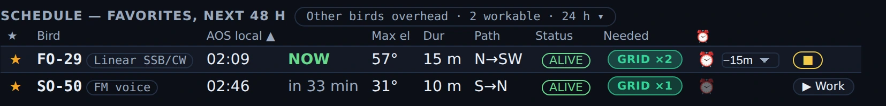
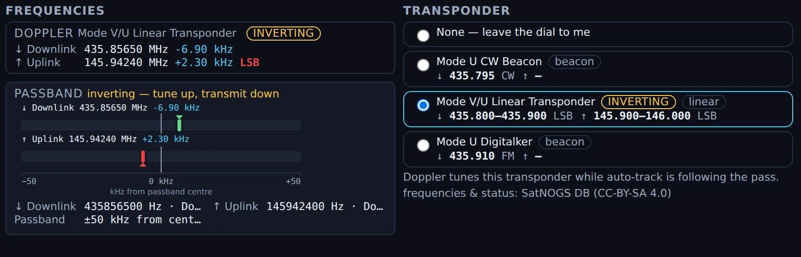
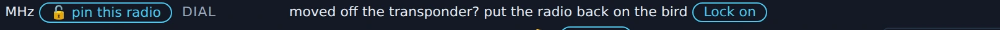
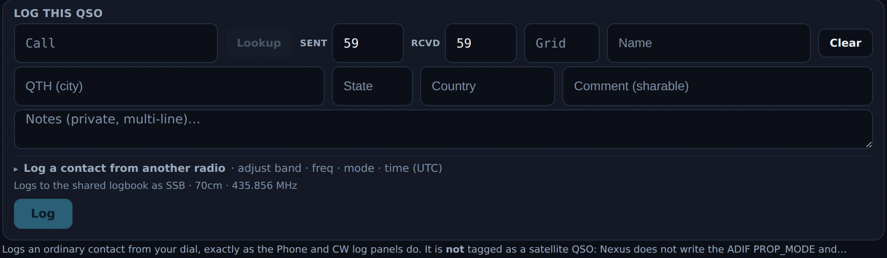
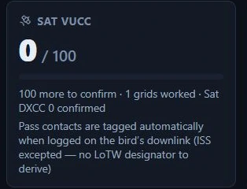
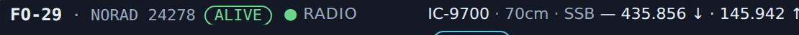

# Satellites

The Satellites section answers "which bird can I work, and when?" for *your*
grid. It predicts amateur-satellite passes over your location, schedules your ★
birds 48 h out, plots each pass, lists the working frequencies, and — if you
have a rotator — can auto-track a bird across the sky through a pass.

Satellites ships enabled — the wizard turns everything on — and the
getting-started and 6m/VHF goal profiles both keep it. If you have trimmed
sections, switch it back on in
[Settings ▸ Appearance ▸ Features](settings-reference.md#features). It needs
your grid set in [Settings ▸ Station](settings-reference.md#station) to compute
passes.

*The pass column in Nexus 1.10.3 — FO-29 open, nothing armed yet.*

## The tour

The section is laid out as a **pass console**: everything you need to work a pass
is on one screen, and you scroll only for the things you use between passes. From
a 1200×750 window upward that is literal — the dome, its rise/set readout, the
globe, the pass timeline and the log strip down to its **Log** button are all
visible at once. At 1024×768, the smallest window Nexus supports, the last inch
of the log strip sits just under the fold; see
[what fits at which window size](#what-fits-at-which-window-size) below.

*The Next / Best-24 h passes and the 48-hour favorites schedule, in Nexus 1.10.3.*

Across the top, the **arm bar** says what is armed and what it is driving — the
bird, which rig is bound, the readiness gates (pass, rotor, transponder, Doppler,
elements), the ■ that stops the track and the ✕ that closes the bird.

**On the left, the planning column.** *Next* and *Best 24 h* lead with the two
soonest workable passes and the two best ones, each with a ▶ Work this pass. Under
them the **48 h schedule** for your ★ birds scrolls inside its own box — the rest
of the page does not move when you scroll it — with the "other birds overhead"
disclosure pinned above it so it never scrolls away. At the bottom sit the
**frequencies** (the live Doppler-corrected dial and where you are inside the
passband) and the **transponder chooser**. Those two stay put: picking a
transponder is the most consequential thing you do here, so it is never behind a
scroll.

**On the right, the pass column.** The **sky dome** draws the pass in az/el with
the AOS and LOS bearings on their marks, and the **ground-track globe** sits
beside it showing where the bird is over the earth and whose grids its footprint
crosses. Under them the pass timeline, then the **log strip**, then your Birds
catalog — which is the one thing deliberately below the fold.

### What fits at which window size

The console does not shrink its contents to fit; it tells you where the fold is.
Measured with a full 42-pass schedule, mid-pass, with a track armed:

| Window | Schedule rows | The whole pass set on screen? |
|---|---|---|
| 1024×768 (the supported minimum) | 5 | Almost — the **Log** button is 6 px under the fold, the note under it 36 px |
| 1280×800 | 8 | Yes |
| 1366×768 | 7 | Yes |
| 1600×900 | 7 | Yes |
| 1920×1080 | 16 | Yes |
| 1200×1390 (tall) | 24 | Yes |
| 3440×1440 (ultrawide) | 30 | Yes |

The schedule is the only thing that grows, so every pixel the rest of the console
gives back becomes another row — and the *"first ten lines"* worth of schedule
arrives at about 900 px of window height.

Two more honest notes about the 1024×768 minimum. The pass column scrolls by
about an inch to reach the bottom of the log strip — it already scrolls to reach
the Birds catalog, so this is the same flick of the wheel. And the schedule table
is wider than its column there, so it scrolls sideways inside its own box — about
an inch of it at 1024 wide, a few pixels at 1200–1280, and none at 1366 and up.

Opening the transponder chooser's **show all N** costs schedule rows — the
frequencies panel and the schedule share the column, and that is the trade the
layout is built on. It stops growing at a little over half the column and scrolls
inside itself after that, so it can never take the schedule away.

**Frequencies** for each bird are listed so you know where to listen and where to
transmit.

You can also drop a **Satellite Passes** pane into the [Connect](connect.md) grid
for an at-a-glance next-passes list beside the map, and turn on the
**Satellites (amateur)** map layer to watch the birds move in real time.

<!-- TODO: capture screenshot — the polar plot of a pass with the AOS/LOS direction and max elevation -->

## Core workflows

### Star your favorites

Click the **⭐** on a bird to favorite it. The 48 h schedule is your ★ birds —
everything else overhead sits behind the **Other birds overhead** disclosure
above it. The ISS is the easiest first target — star it and every ISS pass over
you turns up in the schedule.

### Set a pass alarm

Arm an alarm on a pass and Nexus reminds you before AOS so you don't miss it.
(For the loud, repeating "they're on the air" style of alarm, see the
[DXpedition wake-me alarm](dxpeditions.md#set-a-wake-me-alarm) — the same alarm
machinery.)

*An armed pass alarm in Nexus 1.10.3. The ⏰ column is per bird: the FO-29 row is armed with a
**−15m** lead, the SO-50 row under it is not. The clock beside it is the pass's own AOS.
Fixture passes — nothing here was computed from current orbital elements.*

### Tune around the passband — and get back on the bird

*The transponder chooser for FO-29 in Nexus 1.10.3, with nothing picked yet.
Picking a row is what hands the dial to the pass.*

Working a linear bird means chasing a station across the transponder, so turn
the VFO and Nexus follows: it takes your new dial as your position in the
passband and moves your uplink to match (mirrored, if the transponder inverts).
Doppler keeps correcting around wherever you put yourself.

*The passband readout in Nexus 1.10.3 on a **simulated** FO-29 pass. **DOPPLER** prints each
leg's corrected dial and its shift. **PASSBAND** draws where you are sitting inside the
transponder — downlink marker above, uplink below, on a ±50 kHz scale from the passband centre
— and says in words which way an inverting transponder moves. The transponder chooser beside it
is the pick the readout follows. The pass, the shifts and the marker positions are fixture
values: no elements were propagated and no radio was tuned.*

Tune *outside* the passband and that stops — you've left the transponder as far
as Nexus can tell, which is the right call, because the alternative is dragging
somebody's uplink to a passband edge because they QSY'd to 20 m. **Lock on**,
on the **Dial** line under the bird's name, puts you back: it re-runs the
transponder pick you already made, so the radio, the band and the mode all come
with it, and you land in the middle of the passband again.

It is there from the moment you pick a transponder — that pick tunes the radio
straight away, so the dial is live long before you arm a pass, and the way back
is live with it. It sits with the line that names the rig, and it is there
whether the pass is armed or not and whether or not the bird is up. The one
state it is absent in is the one where it would have to guess: with no
transponder picked there is nothing to put you back onto, and choosing one for
you would be choosing your uplink.

*The **Dial** line in Nexus 1.10.3 — the way back onto the bird, and the whole of it. Simulated
pass.*

### Log the contact without leaving the pass

The log strip sits in the pass column under the sky dome and the pass timeline —
the same log strip the Phone and CW cockpits use, with the same callbook lookup,
the same recall card and the same prior-contact history. It is there whether or
not a pass is armed, and it stays there after the bird sets, so you can catch up
on a contact once your hands are free.

*The log strip in Nexus 1.10.3 during a simulated FO-29 pass. It takes the ordinary QSO fields
and logs at the dial named under it (`SSB · 70cm · 435.856 MHz`). Read the line beneath the
**Log** button, because it is the answer to the question this section raises: the contact is
**not** tagged as a satellite QSO — Nexus does not write the ADIF `PROP_MODE`. That is the
app's own statement, printed on the screen; no ADIF was exported and inspected for this
capture.*

**Nothing you do in the section can take a half-typed contact away from you.**
Closing the bird with ✕ or Escape, clicking a different bird, arming a pass, AOS
arriving, or Nexus losing its connection to SatNOGS mid-pass all leave the form
exactly as you left it. (Through 0.28.1 they did not: the strip lived inside the
bird's detail card, so any of those wiped what you had typed.)

Type the call and press Enter **twice**. On a call the strip hasn't seen yet the
first Enter runs the callbook lookup and fills the name and QTH; the second one
logs. (Once the name is filled, one Enter logs.) The band, frequency, mode and
time come from where you already are, and the report defaults to the one for
that mode. Working a bird from a rig Nexus isn't connected to? Open **Log a
contact from another radio** in the strip and set the band, frequency, mode and
UTC time by hand.

**The grid goes in the Grid box, beside the two reports.** Satellite work is
grid-for-grid, so type the square he passed you — it sits with the reports because
that is when you hear it. It is the one field the callbook regularly gets wrong for
satellite work — a rover or a portable operator gives you where he *is*, and his
callbook says where he lives — so the box wins: a lookup fills it only while it is
blank and never overwrites what you typed. Clearing it and running the lookup again
gets you the callbook's square back.

Nexus takes a **4-, 6- or 8-character** locator: `EN52`, `EN52XA` or `EN52XA25` —
every length ADIF's grid field carries, so all three upload. Case doesn't matter,
it uppercases as you type. Anything else — a half-typed `EN5`, two squares in one
box — is **refused**: the **Log** button goes dead and the line above it says which
forms it takes, until you fix the square or clear the box. It refuses rather than
quietly dropping what you typed, because a QSO record is permanent and a wrong
square is not a missing grid but a grid credited to a square you never worked. A
blank Grid box is not an error.

A callbook answer that is not a locator never lands in the box at all — nothing you
did not type can put the **Log** button out of reach in the middle of a pass.

The box is in this section only for now. The Phone and CW strips do not have one
yet: it costs each of them a wrapped line, and there was no room to spend on that
here. It is still on the table.

**There is no park row here.** POTA and SOTA are a terrestrial exchange, and the
Phone and CW strips still carry the picker and the park search. This section asks
the same strip for a *satellite* exchange, so that row isn't built here — one
fewer thing between the Doppler readout and the sky dome in this column.

**It tags a satellite contact for you.** This is worth being plain about,
because it decides whether a contact can ever earn satellite credit. LoTW
recognises a satellite QSO by two ADIF fields:

- `PROP_MODE=SAT` — the propagation mode.
- `SAT_NAME` — the satellite, spelled the way LoTW spells it (`AO-7`, not
  `AO7`).

**Nexus writes both, automatically, when the contact was really through the
bird.** Log a QSO while a transponder is held **and the record's frequency
sits in that bird's downlink passband** — half the passband width either side
of centre, plus 20 kHz for residual Doppler and FM fine-tuning — and the
record gets `PROP_MODE=SAT` plus the LoTW-spelled designator (`SO-50`, parsed
out of the catalog name `SAUDISAT 1C (SO-50)`). Always as a pair, because TQSL
refuses a half-tag in either direction and one lone field wedges the whole
upload batch. The passband check is what keeps an ordinary HF contact, made
while a bird is still held from an earlier pass, from being mistagged — a 20 m
QSO with a UHF bird still picked is untouched. Records that arrive already
carrying either field — a foreign import, or one you repaired — are kept
verbatim: the stamp writes into blank fields only, and never edits, completes
or strips what is already there.

It is the same stamp wherever the contact is logged from, because every log
path in Nexus runs through one writer. Working a bird on the mic from the
Phone cockpit with the transponder held gets the same pair.

**The one bird that stays untagged: the ISS.** Its catalog name (`ISS
(ZARYA)`) carries no designator Nexus can safely derive, and a `SAT_NAME` LoTW
does not recognise gets the whole record rejected — so ISS contacts are logged
untagged, and if you want credit for one, add both fields yourself before you
sign.

⚠️ **The note printed under the log strip in 1.10.3 is out of date.** It still
reads "Nexus does not write the ADIF PROP_MODE and SAT_NAME fields yet" and
tells you to add both by hand. That was true before 2026-08-10 and is not true
now — the stamp above is what the app actually does, and hand-adding the pair
to a record that already carries it is not needed. Check the Awards screen's
**Sat VUCC** card, which carries the current wording:

*The Sat VUCC card on the Awards screen in Nexus 1.10.3.*

#### One thing this strip does not do yet

Not a decision that satellite work should stay this way — it is the price of
dropping the Phone/CW log strip in unchanged rather than building a
satellite-aware one, and it is meant to be closed. (Two earlier entries here
have since closed: satellite tagging, 2026-08-10 — Nexus stamps the pair
automatically — and the mode fold on data tiers, same date: on a digital
section the strip now records your tier's own mode, `FT4` on an FT4 pass,
never `SSB`.)

**Your satellite grids land where they belong.** A tagged pass contact counts
toward the **Satellite VUCC** totals on the Awards screen and the satellite
needs board — and never toward the terrestrial per-band grids ARRL excludes
bird QSOs from. An untagged contact (an ISS QSO, or an import without the
fields) still lands in the terrestrial tracker for its band; hand-add both
fields to move it.

**During Field Day, this strip logs to the ordinary log, not the contest log.**
The Phone and CW strips switch to the Field Day log while a session is running;
this one is not wired to Field Day yet, so a satellite contact made during FD
goes into your general log and scores the club nothing. Until it is wired, log
satellite contacts made during Field Day from the Phone or CW cockpit *while you
are still on the bird*. Catching up afterwards does not work cleanly: the FD log
stamps every contact with the band the radio is on at the moment you type it, so
a 70 cm pass entered later goes into the contest log — and out to N1MM or
N3FJP — on whatever band you have since moved to.

**If you ran 0.24.0 through 0.27.x, check your log.** In those versions a
contact logged while a transponder was held picked up `PROP_MODE=SAT` and a
`SAT_NAME` taken from the *catalog* name of the bird — "SAUDISAT 1C (SO-50)",
not "SO-50". LoTW does not recognise those, and the hold is only handed back
when the pass ends (a transponder picked without arming a pass is never handed
back at all), so ordinary contacts made afterwards were tagged too. Nexus no
longer writes any of it.

Existing records are left exactly as they are. Nexus will not rewrite contacts
you already logged: some of them really were satellite QSOs that want the name
corrected, and some were terrestrial contacts that want the tag gone, and
nothing in the record tells the two apart — only you know which pass you were
actually on. To find them, your general log is a plain ADIF file
(`~/.config/tempo/log.adi`, or `%APPDATA%\tempo\log.adi` on Windows): search it
for `SAT_NAME`. Fix them there, with Nexus closed — correct the name, or delete
both fields from the record. There is no way to do it from inside Nexus: the
logbook's edit form does not carry these two fields, and an edit that leaves
them blank deliberately *preserves* what is stored, so that an ordinary
busted-call fix cannot silently strip a satellite tag off a record that earned
it.

### Pin the radio a pass uses

On a multi-radio station the readiness rail names the rig a pick routed to, and
the band and mode class it routed on. If two rigs cover the downlink, the pick
goes wherever your routing says — which is usually what you want, and sometimes
not. **🔓 pin this radio** holds the pass on the radio you are on: it stays 🔒
pinned until you click it again, and no pick hands the bird to another rig
meanwhile. It is the same switch as the 🔒 beside the radio selector in the top
bar, put where you are working the pass. Pinning does not re-tune anything — it
decides where the *next* pick lands.

*The readiness rail's **RADIO** line in Nexus 1.10.3 on a two-radio station: the rig the pick
routed to, the band and mode class it routed on, both legs' dials, then **🔓 pin this radio**,
which reads **🔒** once set. Staged configuration — neither radio exists, and nothing was
tuned.*

### Auto-track with a rotator

1. Configure your rotator in
   [Settings ▸ Radio ▸ Rig & CAT](settings-reference.md#rig--cat) — pick
   your model and its COM port and Nexus runs the control daemon for you. No
   hardware? Pick the **Dummy (testing)** model, or run `rotctld -m 1` and point
   Nexus at `127.0.0.1:4533` to watch it work.
2. **Arm rotor track** on a pass. Nexus slews the rotator to follow the bird
   across the sky through the pass; the compass shows the track, with °T and °M
   side by side, and a STOP control halts it.

The section is read-only until you arm a track — it won't touch your rotator on
its own.

**If the rotator stops answering mid-pass**, Nexus gives up on it rather than
hammering it for the rest of the pass — and gives up on *only* it. The pass
carries on: your transponder stays picked, Doppler keeps correcting the radio,
and the sky dome keeps showing where the bird is so you can turn the antenna
yourself. The track says so plainly (the badge and the readiness rail both read
"rotor stopped answering") and stops showing commanded angles, because it has
stopped commanding anything. The rotor strip in a cockpit header keeps naming
the bird and the ■ that stops the track, beside the dim "ROTOR —" for the mast.

At LOS that pass still sends one stop, in case the controller came back — but it
will **not** park or go to ready, even if you configured one. The pointing was
handed to you, so the antenna stays where you left it.

## Honest limits

- Passes are computed for your grid — **set your Maidenhead locator** first or
  the predictions can't run.
- The bird list is **not everything in orbit** — it is the amateur population:
  satellites with an amateur transmitter on record. It runs to a few hundred
  birds and the number moves with the catalogue, so read it off the header
  line rather than from here. That line — "372 birds · 1 past 14 d · 39 sit
  out past 30 d" on the day these screenshots were taken — counts every bird
  with a readable element epoch, then how many of those are drifting and how
  many are held out past the 30-day ceiling. The **Birds** catalog heading
  further down carries a *different* number, and the difference is the
  held-out ones: it counts the birds Nexus can actually place, plus any ★ of
  yours it could not.
- Rotor auto-track drives an **az/el** rotator through Hamlib `rotctld`
  (elevation is followed through the pass; an azimuth-only rotator is detected
  automatically and driven in azimuth alone); test it with the Dummy model
  before you trust it on real hardware.

### Where does the bird list come from, and what does a bird's status mean?

The list is **derived, not copied**. It starts from the
[SatNOGS database](https://db.satnogs.org) — the community record of which
satellites carry which transmitters — and keeps every satellite with an
amateur transmitter: one SatNOGS labels *Amateur*, or one transmitting in an
ITU amateur-satellite allocation (the band test is what keeps SO-50, whose
transmitters are all filed as "Unknown"). Orbital elements for those birds are
then assembled from three sources, freshest epoch winning: CelesTrak's
`amateur` group, CelesTrak's `satnogs` group, and the SatNOGS element service.
That last one matters — it is the only source for a bird still catalogued
under a placeholder number, and for birds CelesTrak has no elements for at all.

The list is rebuilt every six hours by the project's mirror, so **a bird going
on or offline reaches you within six hours of SatNOGS recording it** — no app
update needed.

#### Four separate facts, and none of them is "you can work it"

A bird's row can carry up to four different claims, and they answer different
questions. Read them apart:

1. **Orbital status** — what the catalogue says about the object itself. The
   chip beside a bird's name is that word.
2. **Elements** — whether Nexus has orbital elements for it, and how old they
   are. No elements means no position, no pass, no Doppler.
3. **A predicted pass** — geometry, computed from those elements. It says the
   object will be above your horizon. It says nothing about what is aboard.
4. **A transponder** — whether the catalogue lists a working amateur
   transmitter, and on what frequencies. This is the only one of the four that
   bears on whether there is anything to work.

**A bird in orbit with a predicted pass overhead can still be silent.** That is
not an edge case: SatNOGS marks amateur payloads dead all the time while the
object itself keeps orbiting for years. Open the bird and look at its
**transponder** list before you plan a pass around it — "no transmitters
listed for this bird (SatNOGS DB)" is the answer that matters.

#### What the status chip says

Nexus does not invent a status. It prints what the catalogue reported, and it
knows four of SatNOGS's own words:

- **alive** — in orbit. A bird that is alive *and* has a working amateur
  transmitter gets **no chip at all**: nothing to flag.
- **silent** — alive in orbit, but the catalogue lists no working amateur
  transmitter any more. The pass geometry would still be real; there is
  nothing to work on it.
- **dead** — reported silent.
- **re-entered** — gone. Kept in the list for six months after re-entry, so a
  favorite that stops working has a row that says why, then dropped.
- **pre-launch** — on record but not yet deployed. Nothing to work yet.

**Anything else the catalogue sends is printed as it arrived**, in the amber
"we cannot judge this" style, with the tooltip "SatNOGS reports this bird's
status as …". That is honest rather than tidy, and it is what you will
usually see: in 1.10.3 the mirror is serving `in orbit`, which is not one of
the four words above, so **every** bird in the catalogue is chipped `IN ORBIT`.
Read that chip as "the catalogue said something Nexus does not recognise" —
**it is not a report that the bird works.** Two more chips are Nexus's own,
about its data rather than the bird: **no elements** and **stale elements**.

Only birds with elements can be placed, so a bird without them shows in the
list with its status and "no elements" rather than a position. **Your ★ stays
put either way** — a bird that dies never vanishes out from under its star,
and search reaches the whole catalog so you can always find it to unstar it.

### How current are the elements?

Every prediction runs on orbital elements (TLEs), and elements decay: a fresh
set predicts a pass to the second, an old one drifts — and pointing and
Doppler drift with it. Nexus keeps the elements current for you and tells you
plainly when it can't:

- **Where they come from.** Elements refresh in the background a few times a
  day from the project's mirror described above (CelesTrak data courtesy of
  Dr. T.S. Kelso; population and status data from SatNOGS / Libre Space
  Foundation, CC BY-SA 4.0); the mirror exists so a fleet of installs never
  hammers the sources. If the mirror itself is unreachable for a day, Nexus
  falls back to fetching CelesTrak's amateur group directly — a shorter list
  of 97, with every other bird keeping its row marked "no elements" until the
  mirror is back. The Satellites section and Settings ▸ Orbital elements show
  the age, fetch time and source. **Update now** forces a refresh; **Import
  from file** loads a downloaded TLE/keps file — the path for offline shacks
  and brand-new launches no source carries yet.
- **Past 14 days** the age is badged stale, and arming a pass asks first —
  refresh right there, or arm anyway with your eyes open.
- **Past 30 days** SGP4 accuracy is genuinely gone, so anything that would
  move the radio or rotator refuses — naming the bird and the age — rather
  than drive the antenna off a fiction.
- **A pass runs on the elements it armed with** (a pass is minutes long; a
  mid-pass swap would jump the antenna). The readiness rail shows the age of
  the frozen set.
- **Renames don't orphan your stars.** CelesTrak occasionally renames a bird;
  your ★s, alarms and schedule keep working because Nexus remembers the
  catalog number behind each name.
- A bad or empty download never replaces a good cache, and nothing waits on
  the network — Nexus serves the best elements it has and refreshes behind
  you.

## Related guides

- [Connect — map + propagation](connect.md) (Satellite Passes pane, live map layer)
- [SSTV](sstv.md) (ISS SSTV auto-arm: at AOS Nexus tunes 145.800 FM and arms the
  decoder for you)
- [Settings reference](settings-reference.md) (rotator setup)
- [DXpeditions](dxpeditions.md) (the same alarm machinery)
