# Settings reference

Settings is organized into ten tabs. Only the active tab renders, so typing in
one field doesn't lag the whole panel. **Save** at the bottom applies your
changes; most take effect live (a few say "takes effect on restart", and a few
apply the instant you touch them — those say so too).

Your callsign is required, but **Save is never greyed out**. Clicking it with an
empty callsign takes you to the Station tab with a message saying so, rather than
leaving a dead button with no reason and no fix.

The tabs, in the order they appear:

[Station](#station) · [Radio](#radio) · [Phone](#phone) · [CW](#cw) ·
[Digital](#digital) · [Spots & Alerts](#spots--alerts) ·
[Logging & Connectors](#logging--connectors) · [Contesting](#contesting) ·
[Appearance](#appearance) · [Config](#config)

The panel header carries the **build stamp** (confirm a fresh install actually
took) and a **Check for updates** button, both at the right-hand end of the same
row as the search box.

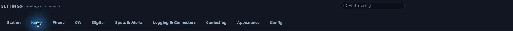

*The ten tabs and the setting search, in Nexus 1.10.3.*

---

## Station

Your operator identity, license privileges, and default frequency.

### Operator & Radio

- **Callsign** — "Your station callsign (required)." Everything keys off this.
- **Grid** — "Maidenhead locator. All 6 characters — 4 measures every distance
  and bearing from the middle of a ~100-mile square." Drives satellite passes,
  propagation anchoring, and distance math.
- **Operator name** — "Used by the CW `{NAME}` macro and logging."
- **Operator at the key** — for multi-operator only: the callsign of whoever is
  actually running the station, when that is not the station call. It is stamped
  on every contact you log (ADIF `OPERATOR`), so a shared activation can be split
  per operator afterwards — POTA and Field Day both want each operator to submit
  their own. Blank means single-op and nothing is stamped. Change it when you swap
  seats. It is the same setting as **Operator at the key** under
  [Who's who at this event](#whos-who-at-this-event); editing either one moves
  both.
- **State** — "Your US state/province — the CW `{MYSTATE}` macro (ragchew QTH)."
- **License Class** — Technician / General / Amateur Extra (US), or **Open** for
  non-US operators. "Sets your transmit privileges + the licensed-segment band
  dropdown. Open = no limits (outside the US)." This is a software transmit guard
  in every Nexus TX path, checked against the Part 97 sub-band table — Nexus
  refuses to key the rig outside your segment.
- **Band & Frequency** — "Pick a band-plan channel, or type a dial frequency in
  MHz."

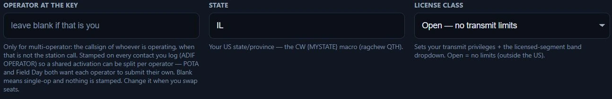

*The right-hand half of Operator & Radio in Nexus 1.10.3 — callsign, grid and
operator name sit to the left of these. The values shown are one station's, not
recommendations.*

---

## Radio

Everything about the rig itself: the roster, CAT, PTT, satellite Doppler, the
rotator, and sound-card routing.

### Setup health

A strip above the roster answering "is the station actually working?" — three
live indicators, so setup stops running on faith:

- **Rig** — responding / not answering / untested (a live **Test CAT** result
  wins over the passive CAT state).
- **RX audio** — the live level in dB, or the audio error.
- **TX** — on / off, and while a tune carrier is keying, the forward power.

**Prove TX** keys a ~2-second tune carrier to verify the CAT → PTT → RF path. It
asks for confirmation first, every time, and reminds you to have an antenna or
dummy load connected. The button sits at the right-hand end of the strip.

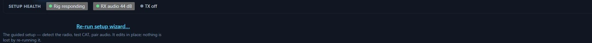

*Setup health on a working station in Nexus 1.10.3. Prove TX is at the far right
of the same strip, off-frame here.*

### Radios

Run more than one rig. Always shown — with one radio it is just a card and an
**+ Add radio** button.

- **Per-radio cards** — rename in place; **Active** marks your operating radio;
  **Edit** loads that radio's CAT + audio into the form below *without* changing
  the radio you're operating on (no swap, no dropped carrier) and shows an
  **Editing** badge; **Make active** swaps rigs (dropping any carrier first);
  **Remove** deletes a non-active radio. The card's meta line shows model,
  port/address, audio device, and rigctld port.
- **Covers bands** — band chips per radio for auto band-routing. None = covers
  all. Appears once you have two radios.
- **+ Add radio** — the discovery affordance. "Run two rigs at once — e.g. an HF
  radio plus a VHF/UHF radio on a different antenna?"

*A three-radio roster in Nexus 1.10.3. The outlined card is the **active** radio;
the form further down the tab edits whichever card you last pressed **Edit** on,
which need not be the same one.*

With two or more radios, three more controls appear:

- **Routing rules** — band coverage sends a whole band to one radio; a rule adds
  the **mode**, for when two radios share a band (2 m FT8 to the digital rig,
  2 m FM and APRS to the FM rig). Each rule is band chips + a mode class
  (Weak-signal digital, FM & APRS, SSB phone, CW, RTTY) → a radio. Rules are
  checked top to bottom and the **first match wins**; ↑ / ↓ reorder, ✕ removes.
  **Satellite** rides the same dropdown but is a *context*, not a sixth mode: it
  is matched only by transponder picks, at a tier above the mode rules, so a
  terrestrial tune never matches it.
- **Everything else** — the default radio for anything no rule and no band
  coverage matched, or "Stay on the current radio".
- **Test a band + mode** — pick a band and mode, click **Where would this go?**
  and the answer comes from the same resolver the radio loop uses. It does not
  QSY anything.
- **Run both radios at the same time** — launch Nexus and it asks which radio
  this window drives; open a second window for the other. Both share one logbook.
  Leave off if you only ever use one radio at a time — you can still switch
  between them from the top bar.

#### How a QSY picks a radio

Every retune asks the same question — *which radio owns this band and this mode?*
— and answers it in a fixed order. The first tier that answers wins; nothing
below it is consulted.

1. **Satellite-designated rules**, but only for a tune that started from a
   transponder pick. A rule whose mode box reads **Satellite** is invisible to
   every terrestrial retune, and it is checked *above* the mode rules — so it
   beats your FM & APRS rule for a packet bird no matter where the two sit in
   the list. Order inside this tier is still first-match.
2. **Routing rules**, top to bottom, first match wins. An empty band selector
   means *any band*; **Any mode** means any mode class. A rule aimed at a radio
   you have switched **off** is skipped at the moment of the decision — an
   unplugged rig never becomes the handoff target, and the rule comes back when
   you switch the radio on. A rule aimed at a radio you **remove** is deleted
   along with it, so no rule is ever left pointing at nothing.
3. **Band coverage** — the **Covers bands** chips on each card. A radio that
   lists the band explicitly beats one that covers everything, which beats one
   that lists the band nowhere. Nexus only moves you when another radio scores
   *strictly better* than the one you are on, so a tie leaves you where you are
   and a fine-tune inside a shared band never bounces between rigs.
4. **Everything else** — the fallback radio, or "Stay on the current radio".

Two things this order implies, and both surprise people. A rule **outranks band
coverage**, which is the whole reason rules exist: it is how 2 m FT8 leaves an HF
rig that also does 2 m. And a matched rule pointing at the radio you are already
on means *stay put* — it does not fall through to a broader tier that would then
walk you off.

The top bar's **Peg** switch turns the whole thing off: while it is on, band
changes never move the active radio.

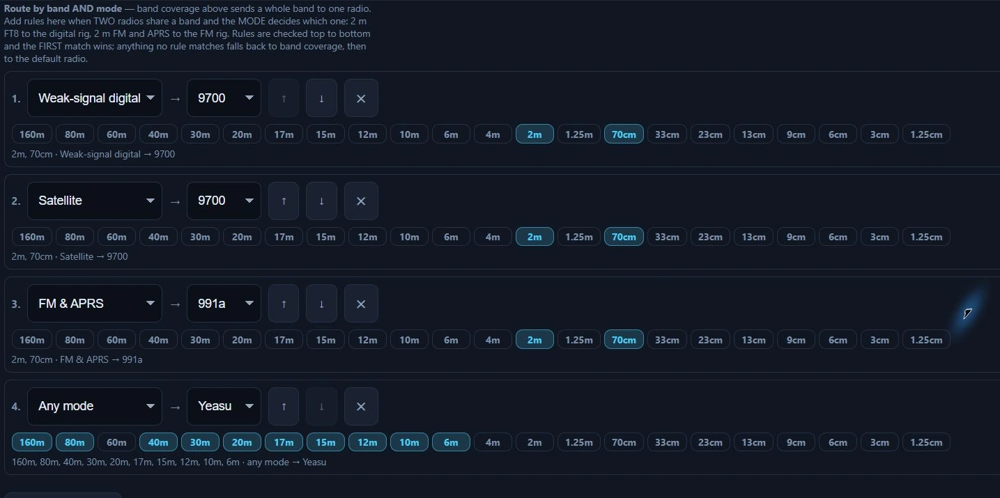

*One station's routing table in Nexus 1.10.3 — an example, not a recommendation.
The **Everything else** selector and the **Where would this go?** button sit to
the right of these rules and below them.*

**A worked example.** Take the roster above — an FTDX10 covering 160–6 m and
active, an IC-9700 covering 2 m and 70 cm, an FT-991A covering 6 m and 2 m — with
those four rules and **Everything else** left on *Stay on the current radio*.

| You tune to | Band, mode class | What happens |
|---|---|---|
| 14.074 FT8 | 20 m, weak-signal digital | Rules 1–3 name only 2 m and 70 cm, so none matches. Rule 4 matches on 20 m and names the FTDX10 — which is already active, so nothing moves. |
| 144.174 FT8 | 2 m, weak-signal digital | Rule 1 matches. The IC-9700 becomes the active radio, with its own CAT port and its own sound card. |
| 144.390 APRS | 2 m, FM & APRS | Rule 1 misses on mode class. Rule 2 is a Satellite rule, so a terrestrial tune cannot see it. Rule 3 matches: the FT-991A takes it. |
| a 2 m/70 cm bird | 2 m, FM & APRS | The satellite tier runs first, so rule 2 wins and the IC-9700 takes it — even though rule 3 would also have matched. |
| 50.313 FT8 | 6 m, weak-signal digital | Rules 1–3 miss on band. Rule 4 matches and keeps 6 m on the FTDX10, although the FT-991A also lists 6 m: a rule outranks coverage. |

Delete all four rules and the same station still works, on band coverage alone:
2 m and 70 cm would go to whichever of the two VHF rigs the tie-break picked, and
that is exactly the ambiguity a rule exists to settle.

**Test a band + mode** answers the same question without touching the rig — it
calls the resolver the radio loop calls, so it is the configuration's own answer,
not a second implementation of it.

**Audio follows the active radio, not the routing table.** Each card carries its
own input and output device, and the live RX audio, the waterfall and the
decoders all follow whichever radio is active at that moment. That is why an APRS
decoder armed by hand can report **No 2 m radio** on a station that clearly has
one: arming **Monitor** tunes nothing, so no routing decision has been made and
the decoder is still listening to the HF rig. Use APRS's **Tune to 144.390**
instead — that is a retune, it runs the FM & APRS rule, and the decoder follows
the rig that ends up active.

### Profiles

- **Saved profiles** — **Load** applies a profile merged onto your current
  settings; **Delete** removes it. "Switch a whole rig / antenna / CAT / band
  setup in one move." Your callsign, license class, radio roster and sync history
  never come from a profile, and anything the profile predates keeps its current
  value.
- **Save current as** — snapshots the current settings under a name.

### Rig & CAT

Every control here is **per radio**: it belongs to whichever card you pressed
**Edit** on, not to the station.

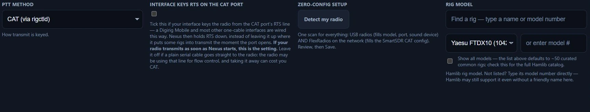

*The first four Rig & CAT controls in Nexus 1.10.3. Connection, Serial Port and
Baud continue across to the right.*

- **PTT Method** — "How transmit is keyed": CAT (via rigctld), Serial RTS, Serial
  DTR, or VOX (no keying). PTT and CAT are independent axes — VOX PTT with full
  CAT control is a valid setup.
- **PTT Serial Port** — appears on RTS/DTR. The COM port your keying line is on,
  for an SO2R controller (u2R/MK2R) that routes PTT separately from CAT. Blank =
  keying shares the CAT port, which is how a single-cable interface like a
  Digirig Mobile is wired. Per radio.
- **Interface keys RTS on the CAT port** — tick it when your interface keys the
  radio from the CAT port's own RTS line, which is how a Digirig Mobile and most
  other one-cable interfaces are wired. Nexus then holds RTS down instead of
  leaving it up, where on some rigs it starts a transmission the moment the port
  opens. **If your radio transmits as soon as Nexus starts, this is the setting.**
  Leave it off when a plain serial cable runs straight to the rig: that radio may
  be using the line for flow control, and taking it away can cost you CAT.
- **Zero-config setup ▸ Detect my radio** — "One scan for everything: USB radios
  (fills model, port, sound device) AND FlexRadios on the network (fills the
  SmartSDR CAT config). Review, then Save." Each hit gets a **Use this** button.
  The list is honest about what it found: a recognised interface cable says so
  and tells you to pick the rig yourself; a generic USB bridge chip says the port
  is right but the model isn't known; a missing Windows driver links the driver.
  Dual-UART Icoms show two rows and the CI-V one is tagged.
- **Rig Model** — "Hamlib rig model." A curated ~50-rig list by default; tick
  **Show all models** for the full Hamlib catalog, or type a model number
  directly ("Hamlib may still support it even without a friendly name here").
- **Connection** — "Serial for a USB/COM rig (most, incl. Xiegu); Network for a
  FlexRadio via SmartSDR or a remote rigctld over TCP."
- **Network Address** (Network only) — host:port. For a Flex, the WSJT-X-proven
  path is the SmartSDR CAT app on **this** PC: its default TCP port 5002 is
  directed at slice A, so `127.0.0.1:5002` with the FLEX-6xxx model works out of
  the box and audio rides DAX. Multi-slice ports are B=60001, C=60002, D=60003 —
  Nexus drives one slice. (Direct-to-radio `:4992` needs Hamlib's experimental
  native model and failed on real hardware.) A one-click **⚡ Pair DAX audio**
  button appears when SmartSDR's DAX devices are detected and neither audio side
  is already a DAX device — it bootstraps, it does not override a working
  hand-picked config.
- **Serial Port** (Serial only) — "COM / tty device for rig control — or
  Auto-test to find it." **Refresh** re-scans; **Auto-test** probes each port
  read-only (never transmitting) and selects the one that drives your rig. You
  can type a port that never enumerated. Rig-specific warnings appear inline:
  Xiegu CAT is on the SERIAL-B port; the Icom CI-V port is the CP210x one marked
  *Enhanced*.
- **Baud** (Serial only) — "match your rig's CAT setting (most modern rigs:
  38,400 or 115,200). Native Icom CI-V scope needs 115,200 here *and* on the rig."
- **Split operation** — None / Rig / Fake It. "Keeps your transmitted audio
  between 1500–2000 Hz by shifting the TX dial in 500 Hz steps, so audio
  harmonics fall outside the transmit filter — cleaner signal. Rig = uses VFO B
  split. Fake It = retunes the VFO around each over (works on any CAT rig). None
  = stock WSJT-X default."
- **Wheel tuning sensitivity** — how far the dial moves per mouse-wheel notch.
  Lower it if a free-spin mouse tunes too far per flick. Applies to the frequency
  readout and the Phone/CW scope wheel.

**Advanced** (a collapsed group) holds the rest:

- **rigctld TCP Port** — "Port Nexus launches rigctld on" (default 4532).
- **Data modes use plain SSB** — **leave this off unless you know you need it.**
  Nexus normally puts the radio in its DATA submode (DATA-U / USB-D / PKTUSB) for
  FT8, FT4, RTTY-AFSK and SSTV, because on most rigs that is the only mode where
  the USB codec reaches the transmitter. On a rig whose codec feeds only the data
  port, plain SSB takes audio from the mic and the radio transmits **no RF at
  all**. Only correct when your transmit audio goes in the microphone path (some
  RIGblaster models). Per radio. True FSK RTTY is unaffected.
- **Native Icom CI-V (early access)** — appears on a serial IC-7300/7610/9700/
  705/905. Nexus drives CI-V directly instead of launching rigctld, unlocking the
  rig's real spectrum scope ("CI-V RF") and instant dial tracking. Needs 115200
  baud set on **both** the radio and Nexus, plus "CI-V USB Port = Unlink from
  [REMOTE]" on the rig; below that the rig refuses to stream the scope (CAT still
  works, the panadapter just stays off).
- **Flex native panadapter (early access)** and **Flex native DAX audio (early
  access)** — appear on a network Flex. Stream the real SmartSDR panadapter
  (VITA-49 FFT) into the cockpit scope, and take RX audio straight off the
  network instead of the "DAX Audio RX" sound device, **which is invisible under
  Remote Desktop**. Both are **unverified on hardware**, so both are opt-in; if
  the scope stays blank or decodes stop, turn them back off.
- **CI-V bus diagnostic log** — appears once native CI-V is on. Records every
  byte to and from the radio to a file in your Downloads, for hardware-only
  issues like the IC-9700 PTT flicker. Turn on, reproduce, turn off, send the
  file. It keeps running while you're on other screens.
- **Flex radio IP (native panadapter)** — the FlexRadio's own LAN IP (SmartSDR
  API, port 4992). "This is the *radio's* address, not the SmartSDR-CAT port."

**Test CAT** saves, launches the bundled `rigctld` (Hamlib ships with Nexus on
Windows — no separate install), and reads the rig's frequency to confirm the
link.

### Audio

With two or more radios, a banner names which radio these devices belong to:
*"Audio devices below are for &lt;name&gt;. Each radio has its OWN input/output — click
'Edit' on another radio (in Radios above) to set its audio. The live RX audio +
waterfall follow whichever radio is active."*

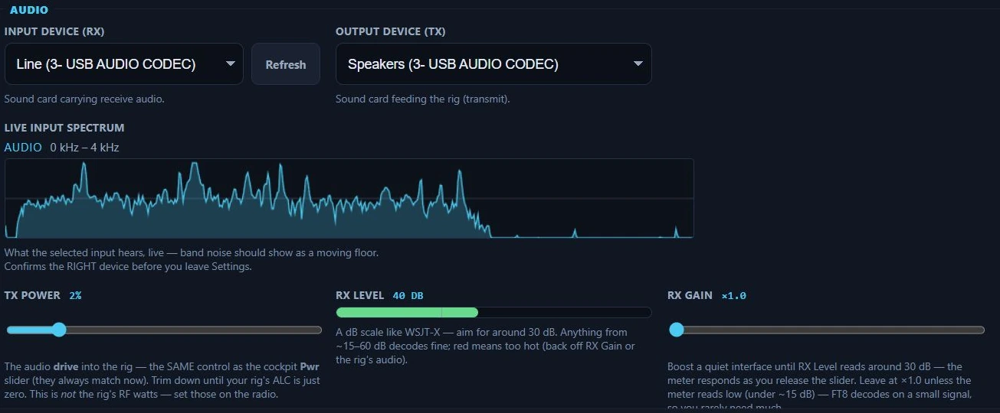

*Audio for one radio in Nexus 1.10.3. Device names are whatever your computer
calls its sound cards; the RX Level meter reading 40 dB is one station's, not a
target to copy.*

- **Input Device (RX)** — "Sound card carrying receive audio." **Refresh**
  re-scans.
- **Output Device (TX)** — "Sound card feeding the rig (transmit)."
- **Live input spectrum** — what the selected input hears, live. "Band noise
  should show as a moving floor. Confirms the RIGHT device before you leave
  Settings." Flat means no audio on that input.
- **Tx Power** — the audio **drive** into the rig, the same control as the
  cockpit **Pwr** slider (they always match). "Trim down until your rig's ALC is
  just zero. This is *not* the rig's RF watts — set those on the radio."
- **RX Level** — a live dB meter like WSJT-X. "Aim for around 30 dB. Anything
  from ~15–60 dB decodes fine; red means too hot." An audio error shows here.
- **RX Gain** — "Boost a quiet interface until RX Level reads around 30 dB — the
  meter responds as you release the slider. Leave at ×1.0 unless the meter reads
  low (under ~15 dB) — FT8 decodes on a small signal, so you rarely need much."

### Receive audio on this computer

This plays the audio your radio is RECEIVING out of a device on this computer — headphones
or speakers — so you can hear the band, or check levels and RFI, without listening on the
rig itself.

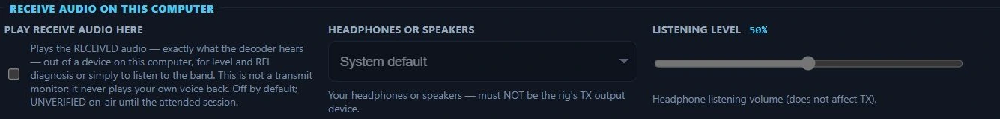

*Receive audio in Nexus 1.10.3, off by default.*

**It is not a transmit monitor.** In amateur usage "monitor" usually means hearing your own
transmitted audio, which is what MONI on the radio does. This never plays your voice back;
these controls used to be called "monitor" and the word was doing real harm, so it is gone
from the labels. (The search still knows it — look for "monitor" and you will land here.)

- **Play receive audio here** — off by default, and UNVERIFIED on-air until the attended
  session. It guards against the rig's TX device by name; if your devices go by multiple
  names, pick your headphones explicitly rather than System default.
- **Headphones or speakers** — and "must NOT be the rig's TX output
  device": playing the received band into the transmitter would put it back on the air.
- **Listening level** — playback volume, with no effect on transmit.

### Satellite Doppler

Corrects both legs of a pass — the downlink you listen on and the uplink you
transmit on. Nexus tunes only while auto-track is following a pass and you have
picked a transponder in the Satellites section.

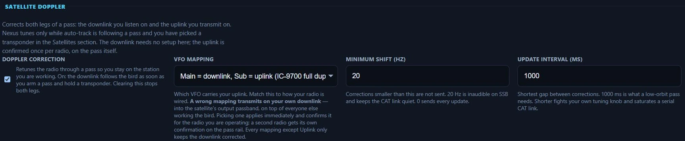

*Satellite Doppler in Nexus 1.10.3, set up for a full-duplex IC-9700. Pass alert
sounds sit to the right, off-frame. The VFO mapping has to match your own wiring
— copying this one is how you transmit on your own downlink.*

- **Doppler correction** — on by default. "Retunes the radio through a pass so
  you stay on the station you are working." Clearing it stops both legs.
- **VFO mapping** — which VFO carries your uplink; match it to how your radio is
  wired. **A wrong mapping transmits on your own downlink** — into the
  satellite's output passband, on top of everyone else working the bird. Picking
  one applies immediately and confirms it for the radio you are *operating*; a
  second radio gets its own confirmation on the pass rail. The control is
  disabled while you are editing a non-active radio, and says why.
- **Minimum shift (Hz)** — corrections smaller than this aren't sent. "20 Hz is
  inaudible on SSB and keeps the CAT link quiet. 0 sends every update."
- **Update interval (ms)** — shortest gap between corrections. "1000 ms is what a
  low-orbit pass needs. Shorter fights your own tuning knob and saturates a
  serial CAT link."
- **Pass alert sounds** — a rising tone at AOS and a falling one at LOS,
  alongside the popup. On by default; clearing it silences only the tones, never
  the popups.

### Orbital elements

Keplerian elements (TLEs) for the amateur satellites — pass times, pointing and
Doppler all come from them. Refreshed every 6 h from hamradiotools.io: the bird
list from the SatNOGS database (CC BY-SA 4.0), the elements from CelesTrak and
SatNOGS.

- **Update now** — fetch immediately.
- **Import from file** — a Celestrak TLE, AMSAT keps, or a new launch's SupGP
  set; the offline-shack escape hatch. Imports persist across refreshes and the
  newest epoch per satellite wins.

The status line always shows the bird count, the band coverage, the fetch date
and the source. A failed refresh adds a plain-language "Last refresh" line.

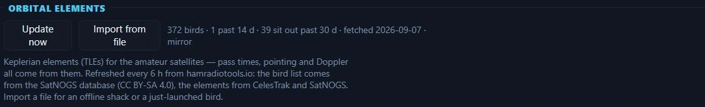

*Orbital elements in Nexus 1.10.3. The status line is the thing to read — it says
how fresh the elements actually are.*

### Rotator

The rotator itself, and its pointing manners. The manners apply to satellite
auto-track.

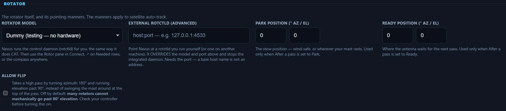

*The first four Rotator controls in Nexus 1.10.3, on a station with no rotator
hardware attached. After a pass, Tolerance and Calibration trim continue to the
right.*

- **Rotator model** — pick yours and "Nexus runs the control daemon (rotctld)
  for you, the same way it does CAT." Then use the Rotor pane in
  [Connect](connect.md), the ↗ on [Needed](needed-dx.md) rows, or the compass
  anywhere. **Dummy (testing — no hardware)** lets you try the whole path with no
  rotator attached; **Other Hamlib model #…** takes any model number `rotctl -l`
  knows. Entries say **(az)** or **(az/el)** where the backend declares it, so
  you can tell an azimuth-only model from a full az/el one before you buy into it.
  One board worth naming: **DF9GR's Easy-Rotor-Control V4** speaks three protocols,
  chosen in its own Service Tool. Configured the way its manual recommends
  (GS-232B, 9600) it belongs on **Yaesu GS-232B**; only in DCU-1 mode does it
  belong on the **DF9GR ERC** entry, which runs at 4800.
- **Rotator port & baud** — the serial port the controller is on, and its line
  rate. **The baud is per MODEL**, and picking your model fills in the right one:
  SPID Rot2Prog runs at 600, Rot1Prog at 1200, and the Idiom Press Rotor-EZ,
  Hy-Gain DCU-1 and Green Heron RT-21 at 4800 — only the GS-232 family, the M2
  RC2800 and the Prosistels are the 9600 that used to be handed to everyone. At
  the wrong rate a rotator never answers and reads exactly like broken hardware,
  so the hint under the field names your model's rate and says plainly when the
  saved value cannot work.
- **External rotctld (advanced)** — a `host:port` for a rotctld you run yourself,
  or one on another machine. It OVERRIDES the model and port above and stops the
  integrated daemon. It needs the port: a bare host name is not an address.
- **Park position (° az / el)** — "The stow position — wind-safe, or wherever
  your mast rests. Used only when After a pass is set to Park."
- **Ready position (° az / el)** — "Where the antenna waits for the next pass."
- **After a pass** — Stop / Park / Ready. "Stop is the default and moves nothing:
  the antenna stays pointed where the bird set." Park and Ready drive the rotator
  on their own at LOS, so set those positions first.
- **Tolerance (° az / el)** — a new target closer than this isn't commanded.
  "Without a deadband the rotator hunts and the relays chatter for the whole
  pass. 2° is about a G-5500's own resolution."
- **Calibration trim (° az / el)** — added to every command. "Use it when the
  controller reads one heading and the boom points at another."
- **Allow flip** — takes a high pass by turning azimuth 180° and running
  elevation past 90°. Off by default: **many rotators cannot mechanically go past
  90° elevation.** Check your controller first.

### Amplifier

Reads a linear's own status — power out, SWR, temperature, supply volts and amps,
and any alarm it is raising — and shows it in the **Amplifier** pane in Connect.
Nothing on this settings page changes how the radio transmits.

**Reading is most of it, but Nexus does command the amplifier — three things,
and only these three.** Standby ↔ Operate, one band up, one band down. Nothing
else is representable: there is no tune, no reset, and **no way to switch the
amplifier off**. That last one is not merely unused — SPE's `SWITCH OFF`
keycode sits immediately next to `TUNE` in the vendor's keystroke table, so the
command set is written as a closed three-value list with no arithmetic path to
either byte, and Hamlib's own SPE backend maps its "standby" onto the off code
and powers amplifiers down when asked for standby. That is the failure Nexus is
built not to have.

**Where the three controls are.** Not here. They are a compact strip in every
cockpit header once an amplifier is configured — Standby/Operate, band ◀ ▶ and
power out — described under
[Connect ▸ The Amplifier pane](connect.md#the-amplifier-pane). The only control
on *this* page that moves the amplifier is **Follow the radio's band** below,
and it is the only one that acts without being asked.

**Both write paths are refused while you are transmitting**, in the poll thread
that holds the readings rather than in the button — changing band on a keyed
amplifier can take a PA out. And **standby is not a stop**: dropping the
amplifier out mid-over ends nothing, because the exciter keeps keying and the
drive passes straight through. No amplifier control counts as a way to stop a
transmission.

**Which family does what on the wire**, because it decides how the controls
behave:

| | SPE Expert 1.3K-FA / 1.5K-FA / 2K-FA | Elecraft KPA500 / KPA1500 |
|---|---|---|
| Readings | power out, SWR (at the antenna and before the tuner), temperature, volts, amps, alarms | the same set |
| Operate ↔ Standby | a front-panel **keystroke** that *toggles* — there is no "go to operate". The button reads the amplifier's own status, never what was last sent, so a lost frame corrects itself on the next poll | names the state it wants (`^OS`), so a resent command is harmless |
| Band | steps **one band at a time**; the protocol has no "set band" | names the band (`^BN`), clamped to the published ladder |
| Temperature units | shown as a bare number — the protocol does not say whether the amplifier is reporting °C or °F, and it reports whatever its own display is set to | labelled, because Elecraft documents it as Celsius |

⚠️ **The line at the top of this settings block in 1.10.3 is out of date.** It
reads "Nexus never commands the amplifier: it only reads it", which was true
before the cockpit strip shipped and is contradicted by the **Follow the
radio's band** switch directly beneath it. Read it as "nothing on this page
commands the amplifier except Follow the radio's band".

- **Amplifier** — the family: SPE Expert 1.3K-FA / 1.5K-FA / 2K-FA, or Elecraft
  KPA500 / KPA1500. None is the default and the state of most stations; with None
  picked nothing is opened, nothing is polled and no amplifier surface appears
  anywhere. All three SPE models share one protocol; the 1.5K-FA reports itself as
  `15K` and is confirmed working, even though SPE's programming guide for this
  protocol names only the other two.
- **Amplifier port** — the serial port the amplifier is on, and it must be **its
  own**. A serial port can only be open once, so an amplifier pointed at the CAT
  port takes the port away from the radio and the *radio* is what stops working —
  Nexus warns in the status lane if you do it.
  There is no baud setting, deliberately. The SPE adapts itself to whatever speed
  it is spoken to, and the KPA remembers its own rate, so Nexus finds it by asking
  at each of the four rates Elecraft documents.

- **Follow the radio's band** — step the amplifier to whatever band you tune to,
  without being asked. **Off unless you turn it on**, and appears only once a model
  and port are set. It never moves the amplifier while you are transmitting, and it
  steps one band at a time, reading where the amplifier actually is after each step
  rather than assuming it arrived — so a step the amplifier ignored, or one you undid
  at its front panel, is simply seen and re-issued. On a band your amplifier does not
  have it does nothing at all rather than picking the nearest.
  ⚠️ **If your amplifier already follows the radio through its own band-data cable —
  which is how most SPE installations are wired — leave this off.** The hardware is
  doing the same job, and two things steering one band is worse than either alone.

Per radio, like the rotator: an SO2R station with an amplifier on each radio
configures each one on its own radio, and the pane follows the radio you are on.

*The Amplifier group in Nexus 1.10.3.* ⚠️ *The grey note at the top of that group
is out of date in this build: as its own **Follow the radio's band** control says
two columns to the right, Nexus does send band steps and a standby/operate
toggle. Read the section above, not the note.*

> ⚠️ **The SPE side is confirmed on hardware; the Elecraft side is not.** An
> EXPERT 1.5K-FA was linked on 2026-08-29 — it identifies itself as `15K`, and its
> readings and controls were checked against the amplifier's own front panel. The
> KPA500/KPA1500 path is written from Elecraft's published references and has never
> had an amplifier on the other end of the port, reading half included. One thing is
> still deliberately left off the screen rather than guessed: any °C/°F letter
> on an SPE temperature, because the SPE protocol does not say which scale the
> number is in — the amplifier reports whatever its own display is set to, so the
> pane shows `41°` with no letter. The Elecraft temperature *is* documented as
> Celsius and is labelled.

### Transmit limits & sharing

What the rig is allowed to do, and who else may drive it. These used to sit at
the bottom of Rig & CAT.

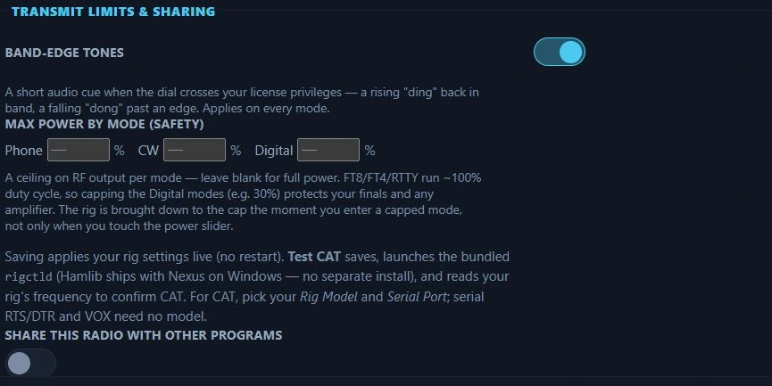

*Transmit limits in Nexus 1.10.3, at their defaults — the power boxes blank means
full power on every mode.*

- **Band-edge tones** — "A short audio cue when the dial crosses your license
  privileges — a rising 'ding' back in band, a falling 'dong' past an edge."
  Applies on every mode, not just digital. On by default.
- **Max power by mode (safety)** — a percentage ceiling on RF output for Phone,
  CW and Digital; blank = full power. FT8/FT4/RTTY run ~100% duty cycle, so
  capping Digital (e.g. 30%) protects your finals and any amplifier. The rig is
  brought down to the cap the moment you enter a capped mode, not only when you
  touch the power slider.
- **Share this radio with other programs** — the CAT broker: "Run a
  rigctld-compatible server so WSJT-X / N1MM / loggers share this radio THROUGH
  Nexus." Takes effect right away, no restart, and works even when Nexus is
  sharing an external rigctld. When on, it prints the address other programs
  connect to, and:
  - **Other programs may key transmit** — "Let the connected app key transmit
    when Nexus is idle. Off = other apps control the rig but never key it (Nexus
    owns TX)." Default off.
  - **Sharing port** — the one control of this group that stays on **Rig & CAT**,
    beside the other port settings, and appears only once sharing is on. Hamlib
    NET rigctl default 4532; change it only if something else on this computer
    already owns the port.

---

## Phone

Voice operating: the phone mode itself, repeater shift and tone, and the
microphone used to record voice-keyer messages. Anything that changes the on-air
signal lives here, not with the radio.

### Phone (SSB / FM)

**Mode**

- **Phone mode** — SSB (USB/LSB by band) or FM. "FM drives the rig to FM + the
  shift/tone below."
- **Repeater shift** (FM only) — simplex / plus / minus. "Offset is the band
  standard (2 m 600 k, 70 cm 5 M…)."
- **CTCSS (PL) tone** (FM only) — the repeater access tone, off or a standard EIA
  tone.

**Microphone**

- **Voice mic (recording)** — "Mic used when RECORDING a voice-keyer message.
  Default records from the audio input device — but on a digital setup that's the
  rig's RX audio, so you'd record the band, not your voice. Pick your actual mic
  here." If it can't open, recording falls back to the input device — never
  silent.

Mic gain and voice-keyer message recording are in the Phone cockpit, not here.

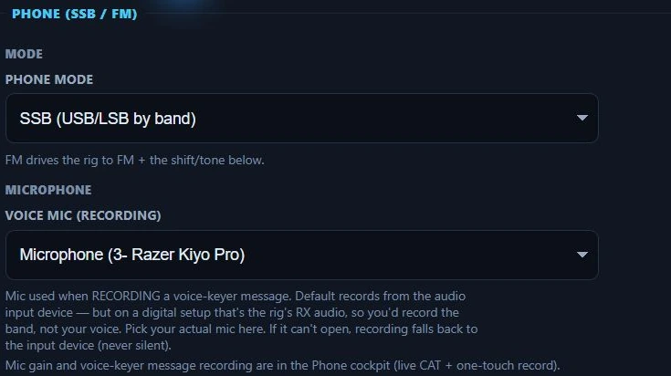

*Phone settings in Nexus 1.10.3. On SSB the repeater shift and CTCSS controls are
hidden — they appear when Phone mode is set to FM.*

---

## CW

How CW is sent: the keyer backend and its ports, sidetone pitch, and the F-key
macro profiles. Anything that changes what goes out on the key lives here, not
with the radio.

### CW

**Keyer**

- **Keyer backend** — four ways to send, also switchable live from the CW
  cockpit. **CAT** uses the rig's internal keyer (Hamlib `send_morse`), but older
  rigs (e.g. IC-756PRO III) don't support it. **Serial keyline** toggles DTR/RTS
  into the rig's KEY jack — the clean N1MM/fldigi method, needs only a keying
  cable. **WinKeyer** drives a K1EL. **Soundcard** keys an audio tone through SSB
  — a workaround; set drive so ALC reads zero.
- **Sidetone pitch (Hz)** — 300–1200 Hz. Sets the soundcard keyer tone and the CW
  scope zero-beat marker.
- **WinKeyer port** — "For the WinKeyer CW keyer (select it above). 1200 baud."
- **Keyline serial port** (serial keyline only) — the USB-to-serial into your
  keying interface (Buxcomm, US Navigator, a homebrew DTR cable) that plugs into
  the rig's KEY jack. "Must be a SEPARATE port from CAT. Set the rig to CW and
  its key-jack to straight-key / bug."
- **Keying line** (serial keyline only) — DTR (the CW convention) or RTS. "DTR is
  standard (RTS = PTT); flip to RTS if your interface is wired the other way."
- **CW ID after 73** — keys your callsign in CW once the final 73 has fully left
  the air (stock WSJT-X option, default off). It uses the normal CW keying path —
  PTT + tone — after the FT8 over, never on top of it.

**Macros (F-key profiles)**

- **CW cockpit F-keys** — named macro profiles (**New** / **Rename** /
  **Delete**, at least one always kept), switchable here or in one click from the
  CW cockpit bar. The grid edits the active profile: a label and a template per
  key. **Customize** starts from the built-in F1–F8 set; **Reset to defaults**
  returns to it.
  Tokens: `{MYCALL}` `{NAME}` `{MYGRID}` `{MYSTATE}` `{RST}`, `!` = the worked
  call, and `{HISNAME}` `{HISSTATE}` = the worked station's QRZ name and state.
  Each key **keeps its role** (F1 CQ, F2 answer, F3 report, F4 sign off, F5 my
  call, F6 his call, F7 ask repeat, F8 query), so the Guided copilot's next-step
  highlight still rolls F1→F2→F3→F4 through customized text.

*The CW tab in Nexus 1.10.3, on a station running a hardware WinKeyer. Which
ports and which backend are yours to pick — the four backends are described
above.*

---

## Digital

One fieldset per digital mode, plus the working frequencies they call on.
Anything that changes the on-air signal or the decode frame lives here, not with
the radio.

### Digital (FT8/FT4)

**Transmit & Sequencing**

- **Transmit period — Tx 1st (even)** — "On = transmit in the even/1st T/R slots;
  off = odd/2nd. The two stations in a QSO must pick **opposite** periods." Also
  on the top bar.
- **Tx Watchdog (min)** — "Auto-halt TX after this many minutes (0 = off)."
- **Disable TX after sending 73** — "After your final 73 goes out, Enable TX
  drops — working the next station is a deliberate arm (WSJT-X default). A CQ run
  is unaffected: it returns to CQ."
- **Double-click arms TX** — "Double-clicking a station enables TX so the answer
  goes straight out." Off = you arm TX yourself each time.
- **Tune timeout (s)** — "Auto-release the tune carrier after this many seconds —
  never leave a key-down unattended" (default 12).
- **Tune power (%)** — the power a tune-up keys at. Leave it empty and Nexus
  never touches your power setting, which is the default behaviour. It can only
  turn the rig **down**, never up: it keys at whichever is lower, this figure or
  the power you are already running, so 50 % here while you run 25 % still tunes
  at 25 %. On a 100 W rig, 10 % is about 10 W — enough for an antenna tuner, kind
  to a loop.

*Four of the Digital tab's five groups in Nexus 1.10.3. Each group continues to
the right — Tune timeout and Tune power finish the first row, Best caller the
second. Every value shown is one station's.*

**Auto-CQ & Caller Selection**

- **Stop CQ after N calls** — "Blank = WSJT-X behavior: CQ repeats until you stop
  it (the TX watchdog is the backstop). Set a number to auto-stop an unanswered
  CQ run." The Tempo chat CQ run always stops (default 10 unanswered); this
  number overrides that budget too.
- **Wait before calling CQ again** — seconds off the air after an unanswered run,
  before the next one starts. Default 180 (three minutes). 0 = do not resume: the
  run simply stops. You are still **listening** through the pause — a station
  that calls you is worked as normal, and answering anyone resets the count, so a
  busy run never pauses at all.
- **Blocked callsigns** — stations your auto-responder must never answer when
  they reply to your CQ. They are passed over for the next caller and shown
  dimmed (or hidden) in the roster and Band Activity. The base call is matched,
  so `PD2BS` also blocks `PD2BS/P`. Alt-double-click any decode or roster row to
  add one without coming here. Saved as you leave the field, not on **Save**.
- **Tempo chat: send cycles per message** — "A chat message transmits at most
  this many cycles, then shows 'no ack' (tap the bubble to re-send). Blank = 3
  (TempoDeep uses 5). Never affects FT8/FT4."
- **Tempo chat: a reply counts as received** — when the station you messaged
  sends a complete message back, stop re-sending and mark yours "confirmed"
  (works even when the other side isn't Nexus). A real ACK still upgrades it to
  "Delivered ✓".
- **Auto-CQ: drop a silent caller after N overs** — abandon a station that
  answered then went quiet and return to CQ. "Blank = 3; 0 = never abandon (wait
  for you, like stock WSJT-X)."
- **Best caller (auto-CQ pick)** — when several stations answer, which to work
  first: First to answer (default), Strongest signal, Farthest away, or Prefer CQ
  callers, with an optional minimum SNR.

**Logging Behavior**

- **Auto-log QSOs** — "Automatically log completed contacts to the ADIF logbook."
- **Prompt before logging** — a WSJT-X-style confirm-and-edit popup instead of
  logging silently. "No effect unless Auto-log is on."
- **Roger with RRR (not RR73)** — "Acknowledge the final report with a bare RRR
  (partner still owes a 73) instead of the combined RR73. Off = RR73 (modern FT8
  practice)."
- **Clear DX call after logging** — wipe the DX Call / DX Grid fields once a
  contact is logged. Off by default.

**Decoder**

All Decoder settings drive the *native* decoder. On a WSJT-X UDP source
(Companion mode) decodes arrive already made and **none of them apply**.

- **Decode depth** — Fast / Normal / Deep. "Deep finds the most signals (WSJT-X
  default); Fast saves CPU on old hardware."
- **Decoder passband (Hz)** — F low / F high, default 200–2900 Hz. "Raise F high
  toward 4000 Hz to decode stations calling above ~2.9 kHz (common on crowded FT8
  bands); lower the range to focus on a narrow filter or dodge strong close-in
  QRM."
- **A-priori (AP) decoding — FT8** — retry marginal signals against hypotheses
  built from your call, the DX call and the QSO state, including the cross-cycle
  replay of last cycle's QSOs. On by default. FT8 only: FT4's AP is part of its
  Normal/Deep depth and has no separate switch.
- **AP: CQ hypothesis only** — limit AP to the "CQ" guess, no MyCall/DxCall
  hypotheses (FT8 and FT4). "WSJT-X switches to this by itself after 5 minutes
  without transmitting, as a guard against stale-context false decodes; here it
  is your explicit choice."
- **Single decode** — decode only within ±25 Hz of your green RX marker instead
  of the whole passband. Isolates one weak station and saves CPU. FT8 and FT4
  only: 50 Hz is narrower than a single JT65, Q65 or MSK144 signal, so those
  modes keep the full passband.
- **DXpedition mode** — Off or **Hound**. "Hound = DXpedition pile-up discipline
  (calls above 1000 Hz; your report auto-moves to the Fox's frequency)."

**Station Housekeeping**

- **Journey — track a weekly streak** — off by default. "A gentle 'weeks on the
  air' counter on the Journey board — never a daily streak, never a penalty for a
  break."
- **Beacon — announce presence (CQ)** — "Off = passive (hunt & pounce): Nexus
  listens and only transmits when you act. On = periodically calls CQ to announce
  you're on frequency."
- **IR-HARQ — combine retransmissions** — on by default. "A weak frame that fails
  is recovered by joint-combining its retransmissions (RV0+RV1+RV2), and
  unacknowledged QSO overs escalate redundancy. Off = RV0-only." (TempoFast/
  TempoDeep — see
  [the Tempo chat layer](operate-digital.md#the-tempo-chat-layer-tempofasttempodeep).)
- **Clock check (NTP)** — check the PC clock against an NTP server and show the
  offset in the top bar. "TempoFast/TempoDeep are slot-timed to UTC — keep it
  within ~0.5 s." Turn off for fully-offline operation (no network calls).
- **Station power (W)** — "Your transmit power in watts — unlocks the Journey
  miles-per-watt & QRP feats." It also feeds the P.533 link budget. Leave blank
  if unknown. This is what you actually run, for the record — it commands
  nothing; the rig's power lives on the cockpit **Pwr** slider.
- **Units** — Automatic (from your system), Metric (km, °C) or Imperial (mi, °F).
  Covers distances, temperature and wind speed. Automatic follows your operating
  system's region. It applies everywhere in the app the moment you change it.

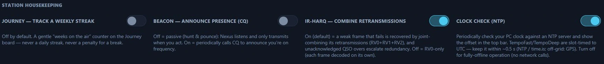

*Station housekeeping in Nexus 1.10.3, left half.*

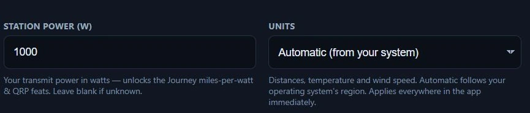

*The same row's right half in Nexus 1.10.3. 1000 W is one station's figure,
recorded so the Journey miles-per-watt maths is right — not a setting that
changes the rig.*

### JT65 — classic EME

- **Submode (tone spacing)** — A (HF standard, narrowest), B (2× spacing), or C
  (4× spacing, most Doppler-tolerant). "JT65 always uses a 60 s T/R period, so
  spacing is the only choice. A is what you want on HF; EME operators move up to
  B or C as Doppler spread on the higher bands smears the tones. Both stations
  must use the same submode."

JT65 transmits and receives. Its messages are the older 22-character format, not
the 37-character one FT8 and friends use — nothing downstream cares, decodes are
just shorter.

### MSK144 — meteor scatter

- **T/R period** — 5 s (fast turnaround, big showers), 10 s, 15 s (the 6 m
  standard), or 30 s (sparse pings, more to stack). Both stations must match.

MSK144 transmits for nearly the whole period, sending the same 72 ms frame
hundreds of times — that is how meteor scatter works, and a contact can take many
minutes of apparent silence. The audio frequency is fixed at a 1500 Hz centre and
the signal is 1 kHz wide, so **there is nowhere to tune it**. Shorthand (MSK40)
messages are off, matching WSJT-X's default.

### Beacons — WSPR & FST4W

A separate surface from the QSO modes: there is no exchange, only a schedule. Off
by default — beaconing keys the radio unattended, so it is always an explicit
choice.

- **Transmit %** — "Fraction of intervals to transmit on. 0 = listen only. A
  beacon that transmits every interval hears nothing, so a minority is the
  convention — 20–30% is typical." Below 40% Nexus also avoids back-to-back
  transmissions while still hitting the rate you asked for.
- **Transmit power (dBm)** — **required, and it has to be real.** "WSPR reports
  are published to a public propagation database that other operators draw
  conclusions from, so a wrong figure corrupts their data as well as yours. The
  beacon stays silent until this is set. 23 = 200 mW, 30 = 1 W, 37 = 5 W,
  43 = 20 W."
- **FST4W Round Robin slot** — "0 = use the transmit-% schedule. Otherwise your
  slot in a coordinated rotation: stations agreeing on the same slot count and
  each taking a different slot never transmit at the same time, because the
  assignment is fixed by UTC."
- **Round Robin slots** — how many stations are in the rotation. Ignored when the
  slot is 0.

Beacons transmit your callsign, grid and power, so Call CQ and S&P are inactive
on these tiers. Transmit still has to be armed as usual: **the schedule never
keys a radio whose transmit you have not enabled.**

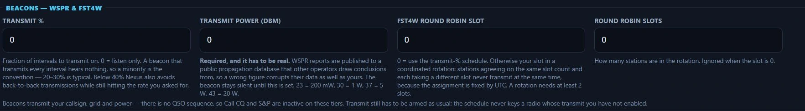

*Beacons in Nexus 1.10.3, at their defaults — Transmit % 0 is listen-only, and
Transmit power 0 keeps the beacon silent until you enter your real power.*

### FST4 (QSO) / FST4W (beacon)

- **T/R period** — 15 / 30 / 60 / 120 / 300 / 900 / 1800 s, shared by both tiers.
  "Longer periods hear weaker signals at fewer exchanges per hour. FST4W beacons
  run at 120/300/900/1800 s; FST4 QSO work is usually 15–60 s."

**FST4** is the QSO mode, **FST4W** the WSPR-like beacon mode — pick which on the
tier selector. Both transmit; the difference is that only FST4 has an exchange to
sequence, so FST4W keys on the schedule set under **Beacons** above. FST4W hashed
callsigns show as `<...>`: the lookup table upstream fills from a file this build
does not carry. (The fieldset's in-app note still says Nexus transmits neither;
that text is stale — both report `tx: true`.)

### Q65 — EME / VHF+ scatter

- **T/R period** — 15 s (troposcatter), 30 s (6 m meteor / ionoscatter), 60 s
  (EME, most common), 120 s (deep EME), 300 s (deepest, microwave EME). Changing
  it changes the decode frame length, so it takes effect on the next slot.
- **Submode (tone spacing)** — A through E. "Wider spacing survives more Doppler
  spread and frequency drift but costs sensitivity. Move up the letters as the
  path degrades — EME on the higher bands usually needs B or C."

Q65 transmits and receives, and **both stations must match**: a correspondent on
a different period or submode will not decode you.

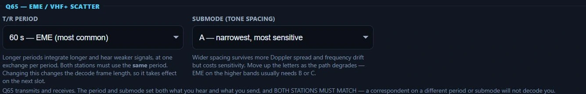

*Q65 in Nexus 1.10.3. Both boxes have to match the station you are working.*

### Quick-reply macros

Comma-separated chip lists for the quick text you fire from each surface:

- **Chat** — chips for Chat.
- **QSO** — chips for sequenced QSOs.
- **Band / CQ** — open broadcasts: the Call CQ launchpad and band feed.

### RTTY

**Receiving**

- **Start receiving when RTTY opens** — on by default: entering the screen arms
  the decoder, so a signal on the tuned tone pair prints without touching
  anything. Turn it off to arm by hand (the Arm RX button in the decoded-text
  pane) — for instance on a shared rig you monitor from. Either way this arms the
  **receiver** only; transmitting is never armed for you. Stopping the receiver
  yourself is remembered for the rest of the session, so re-entering the section
  does not restart it behind you.

**Keying**

- **Keying backend** — **AFSK** plays the two-tone waveform through the same TX
  audio path as FT8 (soundcard-clocked, jitter-free; set drive so ALC reads just
  zero). **True FSK** bit-bangs the rig's FSK input over a serial control line
  with the rig in RTTY mode, unlocking its narrow RTTY filters. "Software FSK
  timing is casual/Field-Day grade; AFSK is the timing-cleanest path."
- **FSK serial port** (True FSK only) — the port whose control line feeds the
  rig's FSK input. Empty = the CAT serial port.
- **FSK data line** (True FSK only) — DTR (the common wiring, leaving RTS free
  for PTT) or RTS. "PTT must ride its OWN path — CAT PTT or the separate PTT
  line, never this one; Nexus refuses a send if they collide."

**Signal**

- **Baud rate** — 45.45 (the HF standard) or 75. Drives the TX bit clock and the
  RX demodulator — true 45.45, never rounded to 45.
- **Shift (Hz)** — 170 (the HF standard), 425 or 850. The TX tone pair and the RX
  demodulator both.
- **Reverse (swap mark/space)** — "The convention is LSB with mark on the lower
  audio tone. Turn this on when deliberately running the opposite sideband (e.g.
  AFSK in USB/DATA-U) so the on-air sense stays correct." Applies to TX and the
  RX decoder.

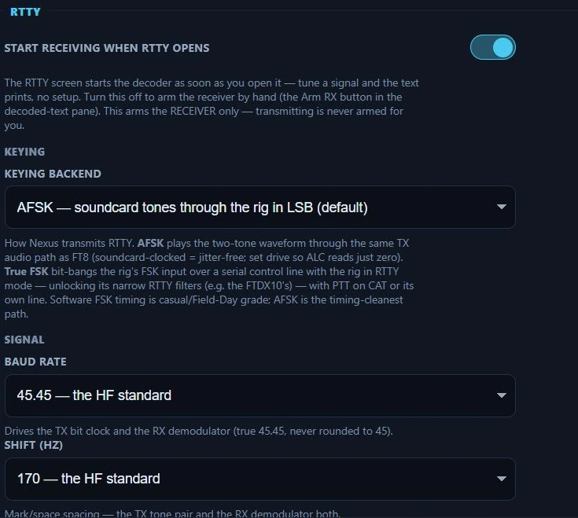

*RTTY in Nexus 1.10.3, on the AFSK default. Baud and shift drive both the
transmitter and the decoder, so they have to match the station you are copying.*

### PSK

PSK31 receive needs no setup: open the PSK screen, tune a watering hole
(14.070 is the classic), click a warble trace on the waterfall and the text
prints. The click nets the *decoder* — it never moves the rig — and a
slew-limited AFC (never more than ±25 Hz) rides small drift for you.

PSK31 and QPSK31 both **transmit as well as receive** in this build. Nothing about
sending lives on this tab, which is why there is only one control here: you type and send
from the [PSK cockpit](psk.md), and its dock carries the macros, the continuous-TX latch
and its own Stop. An over is capped at 500 characters — about two to three
minutes of air time, so a single message can never key past the default TX
watchdog on its own — and every send is refused up front, with a reason, if TX is
not armed, the dial is outside your licence privileges, another section owns the
rig, or a tune carrier is up.

(The PSK entry in the Features list still ends "(receive)". That wording is stale —
the mode transmits.)

- **Start receiving when PSK opens** — on by default: entering the screen arms
  the decoder, so a signal on the band prints without touching anything. Turn
  it off to arm by hand (the Arm RX button in the decoded-text pane) — for
  instance on a shared rig you monitor from. Stopping the receiver yourself is
  remembered for the rest of the session either way. **This arms the receiver
  only** — transmit is never armed for you.

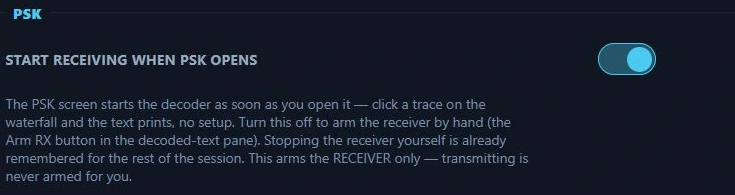

*The whole of the PSK tab in Nexus 1.10.3 — one receive control. Transmitting is
done from the PSK cockpit, not from here.*

### JS8

JS8 is the JS8Call-compatible keyboard mode; the [JS8 chapter](js8.md) is the tour. What
lives here is what JS8Call keeps in its own settings and Nexus cannot infer.

**Speed & receiving**

- **Transmit speed** — Slow (30 s periods), Normal (15 s), Fast (10 s) or Turbo (6 s).
  The period the TX clock follows; Normal is what most of the band runs. The speed chips
  in the JS8 header change this same setting.
- **Decode these speeds** — all four on by default, exactly as JS8Call's multi-decode:
  a Slow station and a Turbo station on the same band both print, each activity row
  marked with its speed letter (E/A/B/C). Untick a speed to save CPU on a small machine.

**Automatic transmissions**

Every one of these is the *second* of two acts. The first is the session TX latch in the
JS8 header, which is never remembered across launches — so a switch left on here keys
nothing until you enable TX in the cockpit, every session.

- **Heartbeat interval (minutes)** — 0 sends a heartbeat only when you press **HB**.
  Otherwise, while the HB chip is on, one goes out every this-many minutes on a random
  free slot between 500 and 1000 Hz. The HB chip itself is session-only.
- **Answer heartbeats** — off by default, as in JS8Call. On, a heard heartbeat gets your
  signal report (`HEARTBEAT SNR`), one frame per station, and a message you hold for
  that station is offered to it.
- **Auto-reply to queries** — on by default, as in JS8Call: `SNR?`, `GRID?`, `INFO?`,
  `STATUS?`, `HEARING?` and `QUERY MSGS` addressed to you are answered after a
  one-period countdown you can cancel in the cockpit. `@ALLCALL` queries are answered at
  most once per station every 15 minutes.
- **Relay for other stations** — on by default, as in JS8Call: a message routed through
  your callsign is passed along, and `MSG TO:` messages are held in your inbox until the
  addressee asks for them. This is third-party traffic; whether it is permitted where
  you operate is your call.
- **Idle watchdog (minutes)** — after this long with nothing typed, heartbeats,
  auto-replies and relaying all switch off and the cockpit says so (the JS8Call rule, so
  an unattended station goes quiet). 60 by default; 0 turns it off; anything below 5
  counts as 5. TX enable is left as it was — this is separate from the six-minute
  transmit watchdog in [Digital (FT8/FT4)](#digital-ft8ft4), which JS8 also obeys for
  everything but heartbeats.

**Station text**

- **INFO** — what an `INFO?` query gets back: rig, antenna, power, a QTH. Upper-case
  letters, digits and basic punctuation pack tightest.
- **STATUS** — what a `STATUS?` query gets back. Blank sends the JS8Call form: `IDLE`,
  the idle minutes, and the app name.
- **Groups** — the `@GROUP` names you belong to, comma-separated; a message to one of
  them counts as addressed to you. `@ALLCALL` is everyone and is always on.

### SSTV

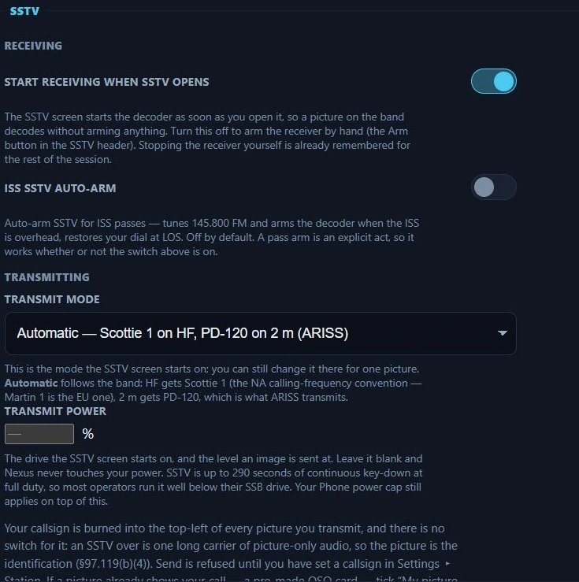

*SSTV in Nexus 1.10.3. A blank transmit power means Nexus leaves your power alone
— an SSTV over is up to 290 seconds of continuous key-down, so most operators run
it well below their SSB drive.*

**Receiving**

- **Start receiving when SSTV opens** — on by default. The SSTV screen starts the
  decoder as soon as you open it, so a picture on the band decodes without your
  arming anything. Turn it off to arm by hand (the Arm button in the SSTV header)
  — worth doing if you keep SSTV open as a monitor on a shared rig. Stopping the
  receiver yourself is already remembered for the rest of the session.
- **ISS SSTV auto-arm** — off by default. Tunes 145.800 FM and arms the decoder
  when the ISS is overhead, and restores your dial at LOS. A pass arm is an
  explicit act, so this works whether or not the switch above is on.

**Transmitting**

- **Transmit mode** — the mode the SSTV screen starts on; you can still change it
  there for one picture. **Automatic** follows the band: HF gets Scottie 1 (the
  NA calling-frequency convention — Martin 1 is the EU one), 2 m gets PD-120,
  which is what ARISS transmits. Pick one of the 15 modes to always start there.
- **Transmit power** — the drive the SSTV screen starts on, and the level an
  image is sent at. Leave it blank and Nexus never touches your power. SSTV is up
  to 290 seconds of continuous key-down at full duty, so most operators run it
  well below their SSB drive. Your Phone power cap still applies on top of this.

Your callsign is burned into the top-left of every picture you transmit and there
is no switch for it: an SSTV over is one long carrier of picture-only audio, so
the picture is the identification (§97.119(b)(4)). Send is refused until you have
set a callsign in [Station](#station). If a picture already shows your call — a
pre-made QSO card — tick "My picture already shows my callsign" in the SSTV
screen; that one is per-picture on purpose and resets with every new image.

### APRS

**Over the air**

These are the RF side, and none of them needs the internet feed below — most
stations run APRS on the radio alone.

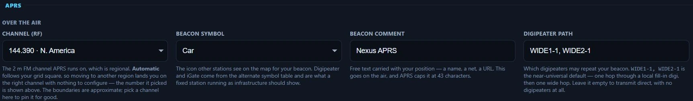

*The RF side of APRS in Nexus 1.10.3. Beacon SSID continues to the right. The
channel is regional — Automatic picks it from your grid.*

- **Channel (RF)** — the 2 m FM channel APRS runs on, which is regional.
  **Automatic** follows your grid square, so moving to another region lands you
  on the right channel with nothing to configure, and the number it picked is
  shown in the menu itself. The boundaries between regions are approximate; pick
  a channel to pin it for good. Picking one from the APRS screen's header pins it
  too — the two surfaces write the same setting.
- **Beacon symbol** — the icon other stations see on the map for your beacon.
  Car, House, Person, Bicycle, Jeep, Motorcycle, Truck and Dot come from the
  primary symbol table; **Digipeater** and **iGate** come from the alternate one
  and are what a fixed station running as infrastructure should show.
- **Beacon comment** — free text carried with your position: a name, a net, a
  URL. This goes on the air, and APRS caps it at 43 characters.
- **Digipeater path** — which digipeaters may repeat your beacon.
  `WIDE1-1, WIDE2-1` is the near-universal default: one hop through a local
  fill-in digi, then one wide hop. Leave it empty to transmit direct, with no
  digipeaters at all.
- **Beacon SSID** — the suffix on your callsign in every APRS frame you send,
  which is how other operators tell your mobile from your home station (-9
  mobile, -10 iGate, -7 handheld, -13 weather). **From my callsign** uses
  whatever your callsign already spells out, so if you have set it to
  `KD9TAW-9` on the Station tab, that is what goes out.

**APRS-IS (internet feed)**

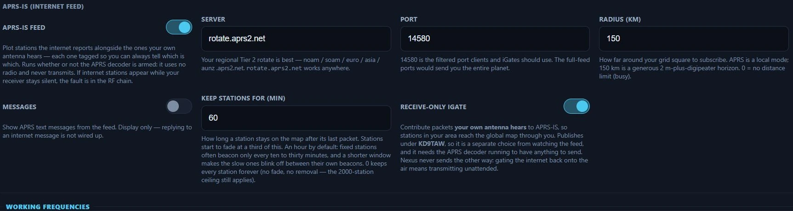

*The internet feed in Nexus 1.10.3. Watched calls, Weather stations and
Objects & items continue to the right. This side uses no radio and never
transmits — the iGate below it is the one control that puts RF you heard onto
the internet.*

- **APRS-IS feed** — "Plot stations the internet reports alongside the ones your
  own antenna hears — each one tagged so you can always tell which is which. Runs
  whether or not the APRS decoder is armed: it uses no radio and never
  transmits." If internet stations appear while your receiver stays silent, the
  fault is in the RF chain.
- **Server** — "Your regional Tier 2 rotate is best — noam / soam / euro / asia /
  aunz .aprs2.net. `rotate.aprs2.net` works anywhere."
- **Port** — "14580 is the filtered port clients and iGates should use. The
  full-feed ports would send you the entire planet."
- **Radius (km)** — how far around your grid to subscribe. "APRS is a local mode;
  150 km is a generous 2 m-plus-digipeater horizon. 0 = no distance limit
  (busy)."
- **Watched calls** — comma separated. "These come through from anywhere on
  earth, however far outside your radius they are — the club tracker on a road
  trip, a friend chasing a summit."
- **Weather stations** — include weather reports in the feed.
- **Objects & items** — repeaters, NWS alerts and event markers other stations
  have placed on the map.
- **Messages** — show APRS text messages from the feed. **Display only —
  replying to an internet message is not wired up.**
- **Keep stations for (min)** — how long a station stays on the map after its
  last packet; they start to fade at a third of this. An hour by default, because
  fixed stations often beacon only every ten to thirty minutes and a shorter
  window makes the slow ones blink off between their own beacons. 0 keeps every
  station forever (the 2000-station ceiling still applies).
- **Receive-only iGate** — contribute packets **your own antenna hears** to
  APRS-IS, so stations in your area reach the global map through you. It
  publishes under your callsign, so it is a separate choice from watching the
  feed, and it needs the APRS decoder running to have anything to send. **Nexus
  never sends the other way**: gating the internet back onto the air means
  transmitting unattended.

### Working Frequencies

The dial frequency used when a band/mode is selected. These are **overrides** of
the stock WSJT-X working-frequency table — "leave the list empty to use stock
everywhere. An override replaces the stock row for its band + mode."

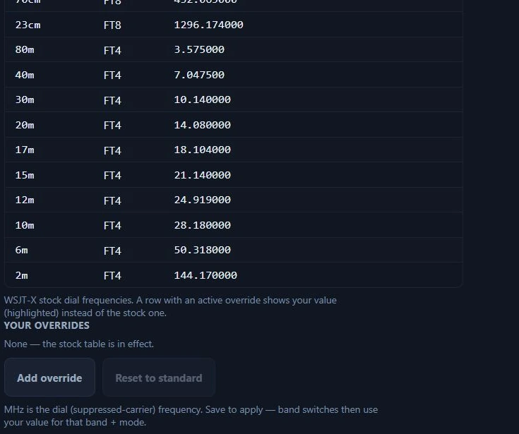

*Working Frequencies in Nexus 1.10.3 with no overrides set, which is how it ships.*

- **Standard table (read-only)** — the stock WSJT-X dial frequencies. A row with
  an active override shows your value, highlighted.
- **Your overrides** — rows of band + mode + dial MHz. **Add override** adds a
  row, **Reset to standard** clears them all, **✕** removes one. "MHz is the dial
  (suppressed-carrier) frequency." A duplicate band+mode is flagged inline and
  the last row wins. Save to apply — band switches then use your value.

---

## Spots & Alerts

What Nexus tells you about, and how loudly. Kept quiet by default so the app
doesn't cry wolf.

### Pounce — new-one alert

Interrupts you the **instant** a needed station appears on the cluster or RBN,
rather than waiting for the spot board to refresh. A loud tone plays whether or
not Nexus is the window you are looking at, and a banner offers one-click Work.
Each station alerts once per band and mode.

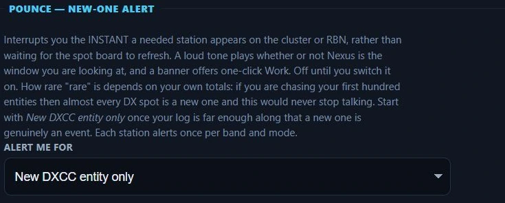

*Pounce in Nexus 1.10.3. How rare "rare" should be depends on your own totals —
start narrow.*

- **Alert me for** — Off (default) / New DXCC entity only / New entity or CQ zone
  / New entity, zone, or US state.

How rare "rare" is depends on your own totals: if you are chasing your first
hundred entities then almost every DX spot is a new one and this would never stop
talking. Start with *New DXCC entity only* once your log is far enough along that
a new one is genuinely an event.

### Alerts

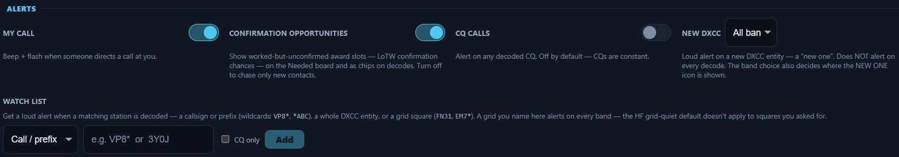

*Alerts in Nexus 1.10.3. New grid and Rare grid continue to the right.*

- **My call** — "Beep + flash when someone directs a call at you."
- **CQ calls** — "Alert on any decoded CQ. Off by default — CQs are constant."
- **New DXCC** — Off / HF only / VHF+ (6 m and up) / All bands. "Loud alert on a
  new DXCC entity — a 'new one'. **Does NOT alert on every decode.** The band
  choice also decides where the NEW ONE icon is shown."
- **New grid** — same band scopes. "Quiet toast on a grid you haven't worked.
  Default VHF+ only — grid awards (VUCC/FFMA) start at 6 m; on HF nearly every
  decode is an unworked grid. The band choice also decides where the GRID icon is
  shown, on the roster and the decode rows."
- **Rare grid 💎** — same band scopes. "The loud 💎 alert for rare/water-only
  grids (rovers, maritime, DXpeditions) — separate from plain grids so silencing
  HF chatter keeps the gems. Covers their GRID icon too."

Each band choice governs both halves of a need: whether it makes a sound and
whether it paints an icon. Set **New grid** to VHF+ and an HF FT8 roster stops
showing GRID chips — the icons follow the setting, not just the alerts.
- **Watch list** — the calls you want flagged wherever they turn up.

---

## Logging & Connectors

Where QSOs go and what feeds come in. Credentials live in the **OS keychain**,
never on disk; a saved password or key isn't shown again after you click **Set**,
and **Forget** removes it.

### Connections

A status grid of every connector, and a **Test** button on QRZ Logbook that
round-trips the API without logging anything. Below it, a session **Connection
log**: "every save, sync, push, and failure lands here."

*Connector health in Nexus 1.10.3. The dots are one station's; read the shape,
not the values — amber against LoTW here means a stored credential nothing has
been pushed through yet, which is not a fault.*

The dot reports the **last time Nexus actually talked to the service**, not
whether a password is on file. That distinction is the point: a revoked ClubLog
app-password or a rotated QRZ Logbook key leaves the secret sitting in your
keychain, so a "credential stored" dot stays green while nothing is getting out.
What you see instead:

- **working** (green) — an upload got through; the row says when.
- **failing** (red) — the last attempt bounced, with the service's own reason.
- **paused** (red) — ClubLog's auth kill-switch has tripped and every upload is
  being skipped until you fix the credentials.
- **stored — not verified yet** (amber) — a credential is saved but nothing has
  been sent through it yet. Not a fault, and deliberately not green.
- **auto-upload off** / **no credential** / **lookup only** (grey) — nothing is
  expected of this row.

LoTW, eQSL, QRZ Logbook and ClubLog read their history from the per-QSO stamps in
your log file, so it **survives a restart** — right after upgrading you will see
real history rather than a blank panel. HRDLog.net and Cloudlog leave no per-QSO
stamp, so they read "not verified yet" after each restart until the next contact
goes out. The QRZ callbook and RepeaterBook only ever look things up, so they
carry no upload history at all.

### Worked-before (B4) & dupes

What "worked before" means, everywhere it appears. The B4 chip on the roster and decode feed
comes in two strengths: hollow — you have worked this callsign somewhere, on any band — and
solid — you have worked them **on the band you are on now**. The log strip's **Dupe** badge uses
the on-band scope.

**Match mode too** (off by default, matching WSJT-X): when off, working a station on 40m marks
them B4-on-band for 40m in every mode, and a 40m contact in any mode reads as a dupe on 40m.
Turn it on and 40m FT8 and 40m phone become separate contacts — the solid chip and the Dupe
badge then require the mode to match as well. The hollow any-band chip is unaffected either
way. Most awards count band slots, not band-and-mode slots, which is why off is the default.

### Integrations & Feeds

**Local APIs & Loggers**

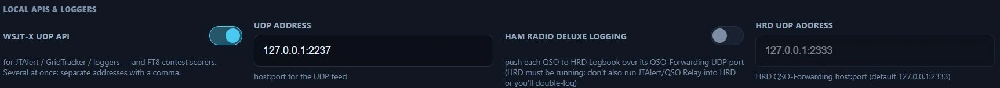

*The loopback feeds in Nexus 1.10.3, at their defaults. Companion UDP address and
the decode-log switches continue to the right.*

- **WSJT-X UDP API** + **UDP Address** — "for JTAlert / GridTracker / loggers"
  (default `127.0.0.1:2237`).
- **Ham Radio Deluxe logging** + **HRD UDP Address** — push each QSO to HRD
  Logbook over its QSO-Forwarding UDP port (default `127.0.0.1:2333`). HRD must
  be running, and don't also run JTAlert/QSO Relay into HRD or you'll double-log.
- **Companion UDP address** — "Where Nexus listens for WSJT-X/JTDX in Companion
  source mode."
- **Write ALL.TXT decode log** — WSJT-X-format decode log for GridTracker /
  loggers to tail. "Written only while this is on, and it first appears after the
  next decode." The saved path is shown, with **Reveal in folder**.
- **Save a WAV per logged QSO** — "Auto-records the last ~60 s of RX audio to the
  recordings folder on log."
- **Save received audio (.wav per period)** — None / periods with decodes / all
  periods. WAVs land in `recordings/periods` (12 kHz mono, ~360 KB each). "'All'
  writes ~2 GB/day of continuous monitoring — use for decoder debugging, not
  always-on."

**Spot Sources**

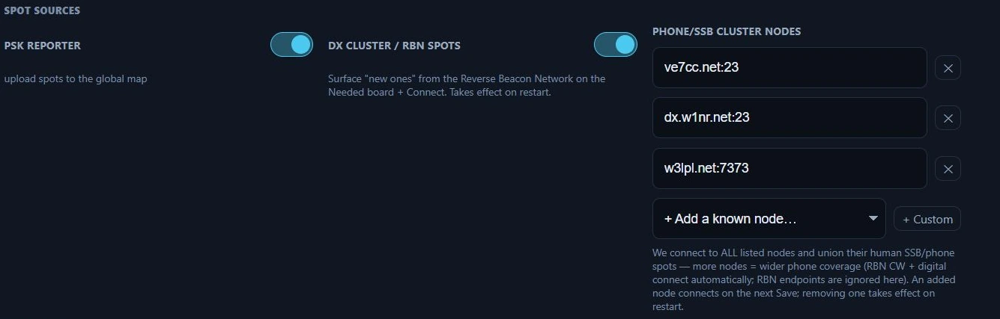

*Spot sources in Nexus 1.10.3. Which nodes you list is a matter of coverage, not
correctness — Nexus connects to all of them and merges what they report.*

- **PSK Reporter** — "upload spots to the global map."
- **DX Cluster / RBN spots** — "Surface 'new ones' from the Reverse Beacon
  Network on the Needed board + Connect." Takes effect on restart.
- **Phone/SSB cluster nodes** — human DX-cluster nodes for SSB/phone spots, since
  RBN only carries CW and digital. "We connect to ALL listed nodes and union
  their human SSB/phone spots — more nodes = wider phone coverage." Add from the
  **+ Add a known node…** presets (VE7CC-1 recommended; WA9PIE-2 on port 8000 if
  23 is blocked; W1NR phone-rich; W3LPL the skimmer-heavy firehose) or
  **+ Custom**. An added node connects on the next Save; removing one takes
  effect on restart.

**Propagation**

- **Near-region opening watch** — "Watch VHF/10 m activity near your QTH (not
  just your own contacts) so openings flag 'open around you' before you've worked
  anyone." Takes effect on restart.
- **Prediction engine** — Modelled (fast heuristic) or ITU-R P.533 (full
  physics). "P.533 is the real circuit-reliability method (validated against the
  ITU reference; ~0.1 s per prediction, uses your station power). **Live spots
  always win over any model.**" See [Connect](connect.md).
- **Antenna gain (dBi) — TX / RX** (under *Antenna gain (advanced)*) — "Used by
  the P.533 link budget only. 0 = a simple wire/vertical (isotropic); a
  3-element yagi ≈ 6–8. Honest v1: a plain dB shift — no pattern or
  takeoff-angle modelling, and the fast heuristic ignores it."

### DXKeeper (DXLab Suite)

Pushes each logged QSO into DXKeeper over its TCP Network Service. Enable it in
DXKeeper under *Configuration ▸ Defaults ▸ Network Service* first.

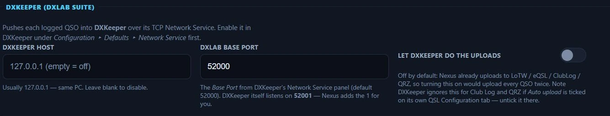

*DXKeeper in Nexus 1.10.3, disabled — a blank host is off.*

- **DXKeeper host** — "Usually 127.0.0.1 — same PC. Leave blank to disable."
- **DXLab Base Port** — the *Base Port* from DXKeeper's Network Service panel
  (default 52000). DXKeeper itself listens on base + 1 and **Nexus adds the 1 for
  you**, so the number you read off DXKeeper is the number that works.
- **Let DXKeeper do the uploads** — "Off by default: Nexus already uploads to
  LoTW / eQSL / ClubLog / QRZ, so turning this on would upload every QSO twice."
  DXKeeper ignores it for Club Log and QRZ if *Auto upload* is ticked on its own
  QSL Configuration tab — untick it there.

### N3FJP Integration (club master log)

"Each FD contact lands in the club's **N3FJP Field Day Contest Log** the moment
you log it — so the whole club's score updates in real time." Run N3FJP on the
master computer and point Nexus at its IP and port.

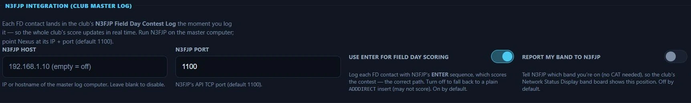

*N3FJP in Nexus 1.10.3, disabled — a blank host is off. Forward every QSO and the
Test N3FJP button continue to the right.*

- **N3FJP host** — IP or hostname of the master log computer. Blank = off.
- **N3FJP port** — N3FJP's API TCP port (default 1100).
- **Use ENTER for Field Day scoring** — on by default. Logs each FD contact with
  N3FJP's ENTER sequence, "which scores the contest — the correct path." Off
  falls back to a plain `ADDDIRECT` insert, which may not score.
- **Report my band to N3FJP** — "Tell N3FJP which band you're on (no CAT needed),
  so the club's Network Status Display band board shows this position." Off by
  default.
- **Forward every QSO** — also push **every** logged QSO, not just Field Day, to
  N3FJP ACLog. "N3FJP dedupes, so it's safe to run alongside the Field-Day push."
- **Connection test** — **Test N3FJP** saves, then tests the TCP link. "Run this
  at the club site before the event starts."

### N1MM+ Integration

- **N1MM contact broadcast address** — host:port, UDP. "Name the port — consumers
  stack on one host, and 12060 is often already taken by another logger." Blank
  = off. An address alone sends nothing outside a Field Day event.
- **Broadcast every QSO** — send the contact packet for **every** logged QSO, not
  just Field Day: point OpenHamClock or GridTracker at the address and each
  contact plots as you log it. "One packet per QSO: this never doubles up with
  the Field Day broadcast." Off by default; turning it on with a blank address
  fills in `127.0.0.1:12060` visibly, rather than as a hidden default.

### LoTW users list

- **Fetch now** — downloads ARRL's weekly activity list; the status line shows
  the call count and date. This powers the teal **L** marks on decode and roster
  rows.
- **Count as a LoTW user if uploaded within (days)** — the recency window
  (default 365).

"ARRL's activity list updates weekly — refetching more often just returns
'unchanged'. Manual fetch by design (WSJT-X convention)."

### Callsign → state database

- **Update now** — "A callsign→state index (from the FCC license file) so a New
  State lights up on cluster / CW / SSB spots that carry no grid." Downloads on
  first launch, then auto-refreshes weekly from hamradiotools.io; a live decode
  grid refines it for rovers.

### Country file (DXCC)

- **Update country file** — "The AD1C cty.dat country file maps callsigns to
  DXCC entities — the country on decode rows, the Needed board and the log."
  A copy ships built in, so entity resolution always works offline; Nexus
  checks weekly for a newer AD1C release and downloads it automatically. The
  resolver is fixed for a running session, so a downloaded update **applies at
  the next launch** — the status line shows the active release date and notes
  when a newer download is waiting.

### Confirmations

One group per service, in the order the panel shows them. Every password, key and
token here goes into the operating system's keychain, never to disk in the clear,
and none of them is ever shown back to you — the boxes read their placeholder
whether or not something is stored. **Set** saves one, **Forget** removes it.

**LoTW**

- **LoTW username** — "Often your callsign, but not always — use your LoTW
  account login."
- **LoTW password** — your LoTW **website** password, not your TQSL certificate
  password.
- **LoTW confirmations** — **Download confirmations** "pulls new confirmations
  into your log and marks which of your uploads LoTW now holds on file (so they
  read 'waiting on the other op,' not 'never uploaded')." This only goes **one
  way, down**; to send your contacts *to* LoTW use **Upload to LoTW (N)** in the
  Logbook. The first pull covers your whole history and can be slow; later ones
  are incremental.
- **LoTW Station Location** — for **uploading**. Signing is done by your
  installed **TQSL** against this named Station Location — set it up in TQSL
  first; the name must match exactly. **No certificate or password is stored by
  Nexus.**
- **Sign from ADIF location (travelers)** — turn on if you set TQSL to *"use the
  location in the ADIF file"* rather than creating named Station Locations. Nexus
  then stamps your call and grid into the upload and omits `-l`. **The whole
  batch is signed from your current grid**, so if you operate from more than one
  location, upload *before* you move.
- **TQSL path (optional)** — "Only if TQSL is installed somewhere non-standard;
  otherwise leave blank to auto-detect."
- **Upload to LoTW automatically** — every few hours, hand your un-uploaded
  contacts to TQSL in one batch: the same thing the Logbook's **Upload to LoTW**
  button does, on a timer. Not a per-QSO push like the auto-upload switches on
  the other services — one batch, one TQSL run, one result for all of it. Needs
  TQSL installed and a **Station Location** set. If a batch is refused it
  **stops and waits for you** rather than retrying; saving any LoTW setting
  starts it again. **Unavailable while "Sign from ADIF location" is on** — that
  mode signs the whole batch from wherever you are *now*, which is only ever
  right when you pick the moment yourself.

**eQSL**

- **eQSL username** / **eQSL password** — your eQSL.cc login, often your
  callsign.
- **eQSL confirmations** — **Sync eQSL now** downloads confirmations into your
  log. "These count as confirmations but **not** for DXCC/WAS (ARRL doesn't
  accept eQSL) — a separate tier."
- **Auto-upload QSOs to eQSL** — upload each logged QSO as you log it.

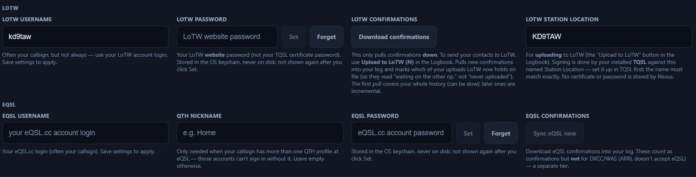

*LoTW and eQSL in Nexus 1.10.3. The empty eQSL boxes are what an unconfigured
service looks like.*

**QRZ**

- **QRZ username** / **QRZ password** — "this is what powers callbook lookups"
  (name, QTH, grid). Separate from the Logbook API key below, which only uploads
  QSOs. "Grid & state need a QRZ XML subscription; free accounts return only
  name/address/country."
- **QRZ Logbook API key** — a **separate** key from your QRZ logbook's settings
  page, used to upload logged QSOs.
- **Auto-upload QSOs to QRZ** — push each logged QSO to your QRZ logbook.
- **Pull confirmations automatically** — "As people confirm on QRZ, the
  confirmations flow in on their own — no need to press Sync. After the first run
  only what CHANGED is fetched." The last pull time is shown. QRZ confirmations
  **never count toward DXCC or WAS**, which need LoTW or a card.
- **Two-way sync** — **Sync from QRZ now** pulls your QRZ logbook **down**,
  adding QSOs you logged elsewhere (e.g. a phone app in the field) and marking
  QRZ-confirmed contacts. Safe to run repeatedly (deduped).

**HamQTH**

- **HamQTH username** / **HamQTH password** — "A **free** callbook used as a
  fallback when QRZ isn't configured or has no match — a HamQTH account returns
  name, grid & US state at no charge."

**ClubLog**

- **ClubLog email** — your ClubLog login email, not a callsign.
- **ClubLog callsign** — "The ClubLog logbook to upload into (empty = your
  callsign)."
- **ClubLog app-password** — "Use a ClubLog **Application Password** (Settings →
  App Passwords), not your main password."
- **ClubLog API key (application-level)** — "This is the **application**
  credential, not yours — official installer builds bundle one, and you only need
  email + app-password above. Building from source? Request a free key at
  clublog.org/requestapikey.php and paste it here (open-source can't ship one —
  ClubLog auto-revokes published keys)."
- **Auto-upload QSOs to ClubLog** — push each logged QSO in real time.

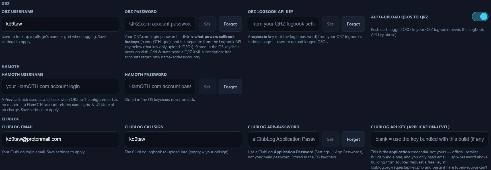

*QRZ, HamQTH and ClubLog in Nexus 1.10.3. QRZ takes two separate credentials —
the login that powers callbook lookups, and a Logbook API key that only uploads.*

**HRDLog**

- **HRDLog.net upload code** — from your HRDLog.net account (Options → your
  code). Uploads log under your station callsign. "This is the online HRDLog.net
  service — separate from the HRD Logbook UDP push under Integrations & Feeds."
- **Auto-upload QSOs to HRDLog.net** — "HRDLog.net is a live-logging and awards
  site — it is **not** an ARRL confirmation source, so an upload here never earns
  DXCC/WAS credit."

**World Radio League**

WRL is a live-logging site. Nexus pushes contacts **up** to your WRL logbook as
you make them, one contact per QSO. Nothing comes back down — there is no
confirmation sync and no download — and like HRDLog it is **not** an ARRL
confirmation source, so an upload here never earns DXCC or WAS credit.

You need a WRL account and a logbook on it. The only thing to fill in here is
the key.

- **API key** — from **worldradioleague.com ▸ Integrations ▸ Developer API**. Paste
  it and press **Set**. Nexus checks it against the live service before saving,
  so a mistyped key fails here, with a plain message, rather than silently on
  your first contact. The same check resolves where your contacts will land: your
  account's default logbook if you have one, otherwise its only logbook. An
  account with several logbooks and no default is a real ambiguity and Nexus
  refuses to guess — set a default on the WRL site, then press **Set** again. The
  key is stored write-only in the OS keychain and is never shown again.
  **Forget** removes it.
- **Auto-upload each QSO** — pushes every logged contact as it lands. Saving a
  valid key switches this **on** for you; **Forget** switches it off, because
  there is nothing to push with.
- **Already have a log? ▸ Export ADIF for WRL** — writes your whole log to an
  ADIF file in your Downloads folder, for WRL's own ADIF import on their site.
  Use it once, when you start: auto-upload only covers contacts made from now on,
  and WRL's API caps uploads at 5,000 a day, so for a log of any size the file is
  much the faster path.

**When an upload fails.** The **World Radio League** row under
[Connections](#connections) carries the state and the time of the last successful
push, and every attempt — good or bad — lands in the Connection log underneath
it. What Nexus does next depends on what WRL said:

- **accepted** or **duplicate** — done. WRL saying it already has the contact
  counts as success: Nexus stops and marks the upload done rather than retrying
  something that has already landed.
- **key invalid** — the credential is wrong or has been revoked. This is **not**
  retried, because retrying cannot fix it. Set the key again.
- **busy** — a rate limit, or trouble at their end. The contact is fine, the
  moment was not, so it goes back on the queue and retries with widening gaps
  (4 s, 8 s, 16 s… up to five minutes) until it gets through or twenty attempts
  are up.
- **rejected** — WRL refused the contact itself. Not retried; the log line
  carries their reason.

Contacts waiting to go out survive with the switch off, up to the most recent
256, so turning auto-upload on later still sends this session's recent work.

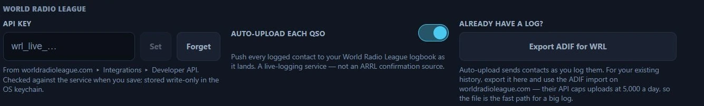

*The World Radio League connector in Nexus 1.10.3. The key box shows its
placeholder — a stored key is never displayed back.*

**RepeaterBook**

- **RepeaterBook API token** — optional. "Without a token the **Program** section
  uses the open hearham.com directory. Add a personal token (from your
  RepeaterBook account's **API Apps** page) to pull from RepeaterBook.com under
  your own account instead." Shared RepeaterBook access for every Nexus user is
  pending RepeaterBook's approval; if RepeaterBook is unreachable, Program falls
  back to hearham.com.

**Cloudlog / Wavelog**

Auto-forward each logged QSO to your self-hosted Cloudlog or Wavelog logbook over
HTTP.

- **Base URL** — your site root. "Leave blank to disable."
- **Station profile id** — "The station-location profile to log against (Cloudlog
  ▸ Station Locations)."
- **API key** — "Cloudlog ▸ Account ▸ API Keys — a key with read/write." A
  per-instance token for your own server.
- **Auto-forward QSOs** — push every logged QSO to the instance above as it's
  logged.

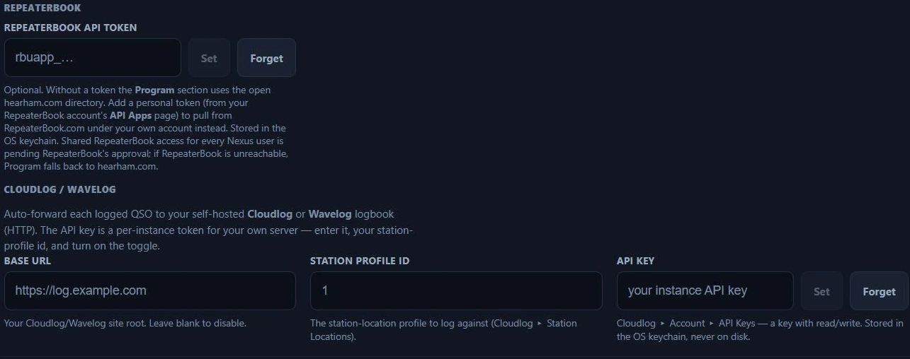

*RepeaterBook and Cloudlog / Wavelog in Nexus 1.10.3, both unconfigured. A blank
Cloudlog base URL is off.*

---

## Contesting

Always visible — capability, not configuration, gates the tabs.

### Contest Category

- **Unassisted entry** — "Turns off the AI CW decoder, DX cluster / RBN spots and
  the PSK Reporter needs feed together, and records the change with a timestamp.
  **Takes effect at once**" — its own command, not Save, because an operator
  flips it as an event starts. "Your own settings for each of those are left
  alone and come back when you switch this off."
- **Assistance record** — the timestamped journal: a row per flip and a row each
  time Nexus starts, with which sources were active. Kept in `assistance_journal.json` beside your settings, so
  it survives restarts. Newest first.

*Contest Category in Nexus 1.10.3. The badge states what you are entitled to
claim right now; the record underneath is the evidence, kept across restarts.*

### Field Day Setup

- **Field Day mode** — the master switch. "Turn on for Field Day weekend —
  reveals the Field Day workspace and the Class/Section exchange across all
  modes. Off the rest of the year." It stays on across restarts until you turn it
  off. The **same switch** also appears in
  [Appearance ▸ Features](#features) under Contesting — Field Day visibility is
  owned by this persisted setting, not by a feature flag, so the Features group
  hosts the master rather than a separate toggle.
- **Event** — ARRL Field Day or Winter Field Day. "Affects scoring labels and
  export headers."
- **FD Class** / **WFD Category** (the label follows the Event) — "Number of
  transmitters + class letter: A=club/group portable, B=1–2 person portable,
  C=mobile, D=home (mains power), E=home (emergency power), F=EOC. E.g. 3A."
  For WFD: "Transmitters + location: H=Home, I=Indoor, M=Mobile, O=Outdoor."
- **ARRL Section** — "Your ARRL / RAC section (e.g. WI, ENY, ONN). Start typing
  the code or a state name and pick from the list." Every entry is validated
  against the full ARRL/RAC list and an unknown one is flagged inline, so it
  never silently reaches the Cabrillo log.
- **Power multiplier** — ×5 (QRP/battery, ≤5 W on natural power), ×2 (≤100 W),
  ×1 (>100 W). "Multiplies your QSO points. Choose before the event."

Class and Section **start empty on purpose** and the station won't enter Field
Day until both are set — a banner says so while the mode is on and they're blank.
See [Contesting & POTA/SOTA](contesting-pota.md).

### Who's who at this event

A club site answers "who are you?" three different ways, and they are not the
same answer. This section puts all three in one place, in the order broad to
narrow.

- **Callsign on the air** — the call that goes out and onto every contact you
  log. At a club event that's the *club's* call, the same one at every position
  on site. It is the same setting as **Callsign** on the Station tab.
- **Position name** ("CW tent") — which tent, trailer or table this station is.
  It names you on the club band board so everyone can see which position is on
  which band, and it never goes on the air. Nexus refuses a save that turns on
  hosting or sets a join address while this is blank, and falls back to your
  callsign rather than an internal id if it somehow reaches the board empty.
- **Operator at the key** — whoever is running this position right now. Change
  it every time someone takes the seat; their contacts are stamped with it
  (ADIF `OPERATOR`) so the club can split the log by operator afterwards. Blank
  means the callsign above. It is the same setting as **Operator at the key** on
  the Station tab and the OPERATOR box on the Field Day dashboard.

Nothing here is a second copy: change one of them anywhere and it changes
everywhere.

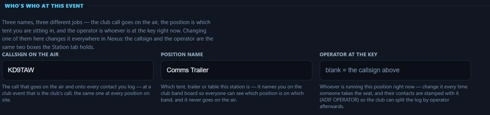

*Who's who in Nexus 1.10.3 — three fields answering three different questions.*

### Field Day Club Sync

Run the whole club on Nexus: one PC **hosts a club event** (this opens a TCP
port on the site LAN, and only while the toggle is on — the spectator scoreboard
below and [Connect on a TV](#connect-on-a-tv) are the other two things that
listen beyond the local computer); every other position joins it with **Find
club events** or by typing the host's `host:port` into **Join event at**. Each
position's contacts stream to the host as they're logged, and the host pushes
back the club score, a live band board, and the club-wide dupe list that
powers the while-typing dupe warning. **Event name** is what joining positions
see; the name this station shows under on the band board is **Position name**,
one section up. Contacts logged while the network is down are re-sent
automatically on reconnect, and if the host PC dies you can enable hosting on
any other position — everyone re-joins and nothing is lost. The host's Field
Day view gains **Club Cabrillo / Club ADIF** exports of the merged,
deduplicated log.
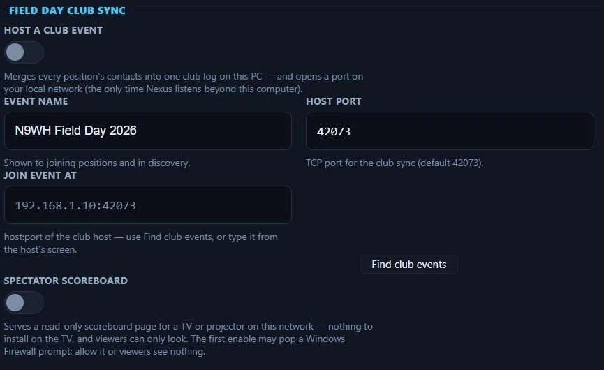

*Field Day Club Sync in Nexus 1.10.3, with hosting off. One position at the site
turns Host on; every other position joins it.*

Full walkthrough: [Contesting & POTA/SOTA](contesting-pota.md).

---

## Appearance

UI-only preferences (applied live, not via Save) and the section toggles.

### Workspace

- **Language** — the language Nexus writes in. Frequencies, signal reports,
  callsigns, grid squares, and band and mode names are never translated or
  reformatted: a dial reads the same in every language.
- **Theme** — Light or Dark. Light reads best outdoors in daylight. Either way,
  the top bar's **Field** chip boosts contrast and size on top of the theme you
  picked.
- **UI scale** — **Auto (fit)** scales the whole interface to the window so
  nothing is cut off, with **Max scale** cap chips so auto never overshoots on a
  big monitor. A cap this window can't reach is disabled and its tooltip says
  why ("a larger window or monitor unlocks it"). **Manual** picks a fixed
  percentage instead. The waterfall stays sharp either way.
- **Density** — Comfortable or Compact. "How tightly rows and controls pack.
  Compact fits more on screen."
- **Pane sizes** — **Reset pane sizes** restores the default pane widths. Pane
  layout itself is set in the cockpits: drag the dividers between panes to resize
  (double-click a divider to reset), and use the ⊞ menu to show or hide panes.

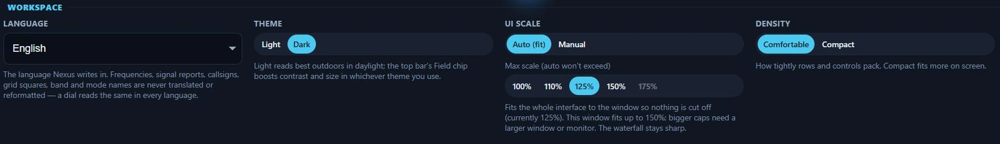

*Workspace in Nexus 1.10.3. Reset pane sizes sits to the right of Density.*

### Connect on a TV

Serves the [Connect](connect.md) view — the map with every layer, the panes,
live openings — as a plain web page to any browser on your own network. A shack
TV, a tablet on the bench, a phone in the garage. Nothing is installed on the
TV and nothing can be changed from it: the page is read-only, and the server
answers GET and HEAD only. The page also loads no script, font or image from the
internet, so it renders fully on a shack network with no route out — which is
where a wall display usually lives.

![The Connect on a TV settings block: a "Serve Connect on this network" switch turned on, with the hints "Serves the full Connect view — the map with every layer, the panes, live openings — read-only, to any browser on your network: a shack TV, a tablet, a phone. Nothing can be changed from it." and "While this is on, anyone on your network can see your callsign, grid square and the propagation picture — including the callsigns of stations heard and spotted. Your log, your needs board and the frequency you are on are never sent."](../img/manual/settings-connect-tv.webp)

*Connect on a TV in Settings ▸ Appearance, Nexus 1.10.3, switched on.*

⚠️ **This puts your station on the LAN, so read what it exposes.** The page
carries your callsign, your grid square and the propagation picture, including
the callsigns of stations you have heard and stations that have been spotted.
It deliberately does **not** carry your log, your needs board, or the frequency
you are on — what the station is doing right now is a different thing from what
the ionosphere is doing, and only the second belongs on a wall. **Off by
default.** Anyone who can reach the port can read the page; there is no
password.

**Put it on the TV:**

1. Turn on **Serve Connect on this network** and press **Save**.
2. Leave **Port** alone unless something else on the machine wants 7374. It is
   deliberately not the [Field Day scoreboard's](contesting-pota.md#field-day)
   port, so a club host can serve both at once.
3. Read the address off **Open this on the TV**. It fills in once the server is
   up — it says "Starting…" until then — and looks like
   `http://192.0.2.15:7374`, with your machine's own address on the network in
   place of that one. **Copy** puts it on the clipboard.
4. Type that address into the TV's browser, on the same network. That is the
   whole setup: nothing to install, no account, no pairing.
5. To take it down, turn the switch off and save. The port closes and the TV's
   page stops answering; refresh it there and you get a browser error rather
   than a stale display.

**If the TV cannot reach it**, work through these in order: the two devices are
on the same network and not on separated guest and main Wi-Fi; the machine's
firewall lets the port through — the first enable on Windows can pop a prompt,
and denying it leaves the page unreachable with no error on the Nexus side;
and the address is the one this row shows, not `localhost`, which on the TV
means the TV. If the row shows an error instead of an address, the port is in
use — change it and save.

**What the page does when Nexus is busy.** It is a snapshot of the same
propagation data the app has, fetched by the page as it refreshes. It loads no
script, font or image from anywhere outside your machine, because a shack TV is
often on a network with no route to the internet at all.

### Features

Turn sections on and off, and pick a goal profile.

*Features in Nexus 1.10.3. **Custom** is what the chip row shows once you have
changed any individual switch — it is not a seventh profile you pick, it is the
panel saying you are no longer on one. The core row has no switches because those
sections cannot be turned off.*

- **Profile** — a goal (getting started, DX/awards, contesting, POTA/SOTA,
  6m/VHF, or **Everything (expert)**, which turns the whole console on) sets
  sensible defaults. "Pick a goal to set sensible defaults — every feature stays
  toggleable below." Hand-toggling produces a seventh chip, **Custom**, and
  switching away from Custom asks first because it discards your hand-tuned set.
  A **Re-run setup…** link reopens the first-run wizard.
- **Core — always on** — the spine (Operate, Logbook, Settings, Now Bar, Chat,
  Connect, Needed) shows an "always on" badge instead of a toggle: a locked
  switch beside real ones just reads as broken.
- **Optional features**, grouped by category in this order: Operate, DX & Awards,
  Propagation, Contesting, POTA/SOTA, Logging, System. Each row is a toggle with
  a one-line "why you'd want it". Enabling a feature pulls in anything it depends
  on, and the hint names what else it will turn on.
- The **Contesting** group hosts the **Field Day mode** master switch (the same
  setting as [Contesting ▸ Field Day Setup](#field-day-setup)). Turning it on
  with no Class or Section set jumps you to the Contesting tab to fill them in.

### App updates

Turn on **Receive beta (pre-release) updates** to have the updater offer pre-release builds — newer features sooner, but less tested; leave it off to stay on stable releases only.

### Accessibility & eyes-free

Speech and sound cues for operating by ear. The keyboard and screen-reader labels
throughout Nexus are **always on** — these settings only control what comes out
of the speakers.

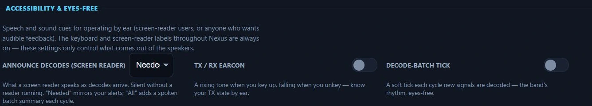

*Accessibility in Nexus 1.10.3. A screenshot cannot show what these do — each cue
is described below.*

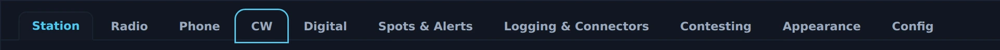

*Keyboard focus in Nexus 1.10.3. Tab and Shift-Tab move the ring, and the outlined tab is where
the keyboard is — separate from the coloured one, which is still the tab being shown. Every
interactive control in Nexus carries the same ring. The speech and earcon settings above cannot
be photographed, and were not exercised for this capture.*

- **Announce decodes (screen reader)** — Off / Needed only (calling you / new /
  watched) / All (adds a per-cycle CQ summary). Silent without a reader running.
- **TX / RX earcon** — "A rising tone when you key up, falling when you unkey —
  know your TX state by ear."
- **Decode-batch tick** — "A soft tick each cycle new signals are decoded — the
  band's rhythm, eyes-free."

---

## Config

Your whole setup in one file, and the way back to a clean slate. These were
previously under *Radio → Transmit limits & sharing*, where they were effectively
undiscoverable: backing up a whole station has nothing to do with transmit
limits.

### Backup & reset

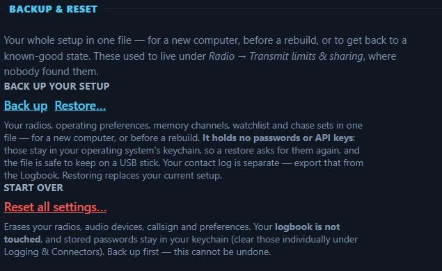

*Backup & reset in Nexus 1.10.3 — the whole of the Config tab.*

- **Back up** — writes your radios, operating preferences, memory channels,
  watchlist and chase sets to a single `.json`. For a new computer, or before a
  rebuild. **It holds no passwords or API keys** — those stay in your operating
  system's keychain, so a restore asks for them again and the file is safe to
  keep on a USB stick, or to attach to a support thread. Your contact log is
  separate; export that from the Logbook.
- **Restore…** — replaces your current setup from a file written by *Back up*. It
  refuses anything that is not one of ours, by name and by schema: a partial
  restore of a mangled file is worse than a refusal, because you would believe
  you were configured when you were not.
- **Reset all settings…** — returns everything to factory defaults: radios, audio
  devices, callsign, preferences. **Your logbook is not touched** (it lives
  outside the settings), and **stored passwords stay in your keychain** — clear
  those individually under *Logging & Connectors*. Confirms first, and cannot be
  undone, so back up if you have not. Use this rather than deleting
  `settings.json` by hand: deleting the file while Nexus is running resets
  nothing, because the app holds your old configuration in memory and writes it
  straight back on the next save.

---

## Related guides

- [Operate — FT8/FT4 digital](operate-digital.md)
- [Connect — map + propagation](connect.md)
- [Logbook & QSL](logbook-qsl.md)
- [Contesting & POTA/SOTA](contesting-pota.md)
- Back to the [guide index](index.md)
