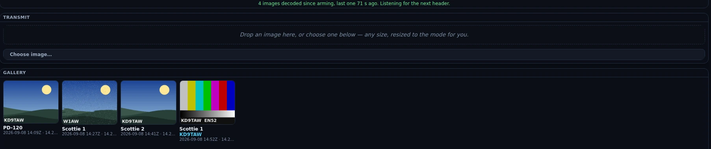
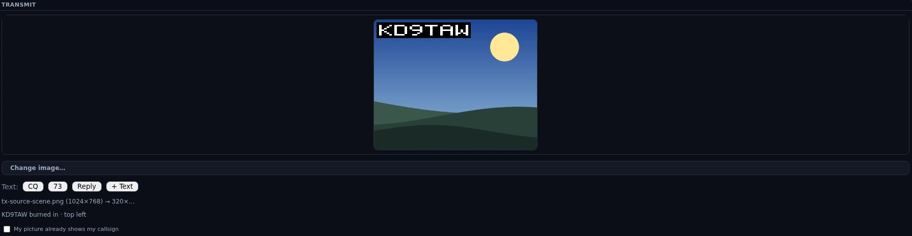
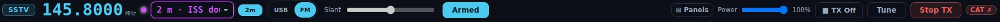

# SSTV

The SSTV section is a receive-first slow-scan station. Opening it starts the
receiver for you, and from then on any VIS header that arrives on the receive
audio decodes on its own: the picture appears where the waterfall was and is
saved to a local gallery with its mode, frequency and time. Transmit lives here
too — choose a picture, choose a mode, press **Send** — but it is always an
explicit act, and nothing on this screen keys the rig until you press that
button. The composer is not an image editor: it cover-crops your picture to the
mode's size, lets you drag the crop and lay text over it, and does nothing else —
no filters, no drawing, no adjustment. It does not log either: no QSO is written
from this section.

SSTV sits in the left rail's Digital group (FT · Tempo · RTTY · SSTV · APRS) and
is on by default — the wizard turns everything on. It is a mode rather than a
goal, so the five goal profiles in
[Settings ▸ Appearance ▸ Features](settings-reference.md#features) leave it out;
**Everything (expert)** keeps it on. If the rail has no SSTV button, switch it
back on there.

![The SSTV section armed and listening on 20 m: the header carries the SSTV badge, a 14.0740 MHz readout, the 20m (custom) band pick, the Slant trim, an Arm button reading Armed and a lit ▼ TX On latch. The waterfall still holds the space a picture will take — a busy band across 0–3 kHz — and the status line under it reads "Hearing audio, no SSTV header yet — a picture decodes automatically when one starts. Images on this band appear at 14.230 USB." Below, the Transmit pane's drop zone is empty and the Gallery pane runs nine received cards — Scottie 1, Scottie 2 and Robot 36, some clean MMSSTV art and some torn to noise, one carrying a decoded G8GRG callsign — over the pinned transmit bar with its Scottie 1 · ≈110s · 320×256 mode picker, Send and Stop.](../img/manual/sstv.webp)

## The tour

**The receiver arms itself when you open the section.** There is exactly one
reason to be on this screen with a receiver, so entering the view starts it —
you never have to know to arm anything. The header's **Arm** button reads
**Armed** while it is running and turns it off again; hovering it says what it
is doing: "Armed — any VIS header heard auto-decodes and auto-saves to the
gallery (RX only). Click to disarm." Stopping it that way is your decision and
is remembered for the rest of the session, so re-entering the section will not
restart it behind you; pressing **Arm** again clears that. The decoder is
RX-only — arming can never key the rig.

*The receive half in Nexus 1.10.3, parked on the 20 m SSTV calling channel. The
blue line on the last card is a decoded FSK callsign ID; the third card is torn
because the decoder lost sync part-way down, which is what a marginal picture
looks like. These are neutral test images, not off-air copy.*

The section stays alive when you navigate away: the receiver keeps listening and
pictures keep landing in the gallery while you are on the map or in the logbook.
Only the on-screen readout pauses while it is hidden, and it catches up on the
first poll when you come back. None of this survives a restart, though — a fresh
launch is not armed until you open the section (or an ISS pass arms it, below).

**The header.** Left to right: a mode badge that reads **SSTV** and fills in to
**SSTV · Scottie 1** when a header lands, or **SSTV · TX PD-120** while you are
transmitting; the big frequency readout, which you can type into and which tunes
off the ham bands as readily as on them; the SSTV band-plan picker; the **Slant**
trim, which is deliberately disabled — "Auto-corrected by the decoder; the manual
trim comes in a later build"; **Arm**; and the **▼ TX On / ■ TX Off** latch, which
is this section's transmit arm — the top bar's TX cluster is hidden here, so
without it a send would sit at the "TX is off" gate with nothing on screen to
open it. **⊞ Panels** is in the same row.

**The band picker** carries the standard SSTV calling frequencies, filtered to
the bands your license class can key phone on:

| Band | Dial | Mode | |
|---|---|---|---|
| 160 m | 1.890 | LSB | rare, and a winter-night band |
| 80 m | 3.845 / 3.730 | LSB | NA calling / EU (IARU R1) calling |
| 40 m | 7.171 / 7.165 | LSB | US calling / EU calling |
| 20 m | 14.230 | USB | **the** worldwide SSTV calling frequency |
| 20 m alt | 14.233, 14.236 | USB | the overflow channels when 14.230 is busy |
| 17 m | 18.160 | USB | |
| 15 m | 21.340 | USB | |
| 12 m | 24.975 | USB | |
| 10 m | 28.680 | USB | General and above — US Technicians have 10 m image only 28.300–28.500 |
| 6 m | 50.680 | USB | activity follows sporadic-E openings |
| 2 m | 145.800 | FM | the ISS downlink — ARISS events transmit PD-120 here |
| 2 m | 144.500 | FM | terrestrial VHF calling (regional conventions vary) |

**One region shows the band, then the picture.** Until a header arrives that
space is a live waterfall so you can see what is actually on the frequency; the
moment a VIS lands the picture takes the same space, and takes it back when the
image finishes. It is the full waterfall instrument — palette, zoom span
(Std 0–3 kHz / Full 0–4 kHz or a window around the marker), the G and Z contrast
knobs, pause-and-scroll-back, the 3-D stacked view — running at a 50 ms row
cadence rather than the FT surfaces' slower default, so a signal appearing on
frequency shows up immediately. It does not tune: clicking it moves nothing,
because there is no audio-offset to place in SSTV.

**The line under the waterfall says what the receiver is hearing.** It is a
status readout, not a fixed hint, and it exists because "I hear a signal but the
SSTV is not decoding" has four completely different causes that used to look
identical on screen. Where it helps, it names the SSTV frequency for the band you
are on — derived from the plan above, so an operator sitting on 14.236 is told
about 14.236:

| State | What it says, and what it means |
|---|---|
| Stopped | "The receiver is stopped — nothing is being decoded. Press Arm to start it." You disarmed it, so nothing is being fed to the decoder. |
| Started | "Receiver started — no audio has reached the decoder yet." The first seconds after arming, before the decode thread has reported anything. It is not a fault and does not blame your sound card. |
| No capture | "Listening, but no audio is reaching the decoder at all — the capture device is not delivering anything." Nothing has arrived for 10 s and the decoder has polled at least 20 times (~2 s), so this is a real dead input: check that [Settings ▸ Radio ▸ Audio](settings-reference.md#audio) input is the radio. Hearing the signal on the speaker does not mean the app is capturing it. |
| Silent | "Audio is arriving but it is silent." Samples are arriving with a peak under 0.002 of full scale — a routing or level problem (wrong input, or RX Gain far too low), not a dead band. |
| Listening | "Hearing audio, no SSTV header yet — a picture decodes automatically when one starts." The healthy idle state, and the one thing the old fixed hint could never say. |
| Unsupported mode | "Heard an SSTV header *n* min ago in a mode this build cannot decode (VIS 0x…)." A clean header arrived and was thrown away. Your signal and audio path are fine; that transmission is in a mode outside the fifteen below. It stays on screen for five minutes, then stops being news. |
| Decoded | "*n* images decoded since arming, last one *n* min ago. Listening for the next header." A completed picture is a durable fact about the whole chain, so this one latches. |

If the app itself stops answering the readout says so — "Cannot read the receiver
state — the app is not answering. The decoder may still be running." — rather
than drawing an idle receiver it has no evidence for. The counters behind all of
this are cumulative since you armed; arming again starts them over. Changes of
state are announced once for screen readers, and the line is not a live region:
the age in it reticks every second and would otherwise be read aloud each time.

**While a picture is coming in**, the caption under it names the mode and how
long the wait is — "decoding Scottie 1… the picture lands when the transmission
ends (≈1:50)" — and switches to a line count when lines land. If the decoder
measured your radio more than 10 Hz off the transmission's leader tone it adds
"· tuning +40 Hz", which is the one thing the spectrum would have told you and
the picture cannot.

**Transmit** (a ⊞ pane) is the image chooser: a drop zone that takes a dragged
file, a **Choose image…** button for the file dialog, and a preview canvas that
shows the picture already resized to the selected mode's exact pixels. **Drop a
photo at any size** — a 4032×3024 phone picture is fine. Nexus reads the file's
rotation tag first (so a portrait phone photo is not sent sideways), crops it to
the mode's shape from the middle, and scales it down in steps so fine detail
softens rather than breaking up into speckle. **Drag the preview** to choose which
part of the picture survives the crop; arrow keys nudge it a pixel at a time,
shift ten, Home re-centres, and double-click does the same. Only the over-long
axis moves — the cursor tells you which — and when the picture already matches the
mode it says so instead of offering a control that would do nothing.

**Text on the picture.** A **Text:** row under the preview lays lettering over the
image, MMSSTV-style. **CQ** and **73** drop in a line built from your own call
(`CQ CQ DE <your call>`); **Reply** builds `<their call> DE <your call> 599` from
the newest FSK ID in the gallery, and is disabled until a station with one has
been received; **+ Text** adds a free line. Each line gets a row of controls —
the text itself, **Crisp** (the ident's own pixel font, proven through the
decoder) or **Banner** (big display type with an outline), a size, eight colours,
and **Plate** or **Outline** for what keeps it readable at the far end. Drag a
line on the preview to place it, click to select, arrows nudge, Delete removes.
Text draws under the ID plate, never over it.

**Your callsign is burned into the top-left corner**, and that is not decoration —
see [Your callsign goes out in the picture](#your-callsign-goes-out-in-the-picture)
below. A line above the preview says where the identification is on this
picture — burned in, in your own text, or already in the artwork by your word.
What you see on the preview canvas is byte-for-byte what goes out, plate
included. Under it, the file name, its original size, the size it was resized to,
the mode and how long the rig will be keyed (`sunset.jpg (4032×3024) → 320×256 ·
Scottie 1 · 1:51 key-down`). Change the mode and it re-derives the crop at the new
shape, keeping your framing.

If a file cannot be sent the pane says so and keeps the picture you already had
loaded. **iPhone HEIC photos are the common one**: Nexus has no HEVC decoder, so
it names the format and your two fixes (Settings ▸ Camera ▸ Formats ▸ **Most
Compatible**, or Settings ▸ Photos ▸ Transfer to Mac or PC ▸ **Automatic**). JPEG,
PNG, WebP, BMP and GIF all work; a GIF sends its first frame. A picture smaller
than the mode is enlarged with a warning that stays on screen, not refused.

**Gallery** (a ⊞ pane) holds the received images, newest first, each a thumbnail
with its mode, the decoded FSK callsign ID if the sender appended one, and the
UTC time and dial frequency it finished on. Hovering a card shows the file's full
path. The pane is the one on this screen that grows: it takes the height left
over under the picture, keeping at least its head and a band of content, and once
the images out-run that it scrolls inside itself rather than pushing the Send bar
off the bottom. Thumbnails size to a column at least 140 px wide and keep their
own shape, so a 640×496 PD image and a 320×240 Robot image are the same width but
different heights and rows do not line up. Until the first image arrives the pane
holds a dashed placeholder: "Received images collect here — auto-saved with
callsign (FSK ID), mode, frequency, and time."

**The transmit bar** is pinned across the bottom and is not a panel. It carries
the mode picker — grouped Scottie / Martin / Robot / PD, each option labelled
with its airtime and pixel size (`Scottie 1 · ≈111s · 320×256`) — **Send**,
**Stop**, and, while an image is going out, a progress bar reading
"TX — Scottie 1 · 1:12 remaining". It sticks to the bottom of the scroll area, so
on a short window **Stop** is on screen at every scroll position.

**⊞ Panels** offers exactly two entries here, **Transmit** and **Gallery**, plus
**Undo last change** and **Reset layout**. The picture, the transmit bar and the
header are not panels: no layout you save can put Send, Stop or the TX latch out
of reach.

## Core workflows

### Receive your first picture

*The band picker's built-in calling frequencies in Nexus 1.10.3 — the same table
printed in the tour above. The list is filtered to the bands your license class
can key phone on, so yours may be shorter.*

1. Open **SSTV**. The receiver starts; the header's Arm button reads **Armed**.
2. Tune 14.230 USB — type it into the readout or take it from the band picker.
   Entering the section does not touch the rig, so you can also just spin the
   knob and watch the readout follow.
3. Read the line under the waterfall. "Hearing audio, no SSTV header yet" means
   the whole chain is working and you are waiting on the band.
4. When a transmission starts, the waterfall is replaced by the picture and the
   caption names the mode and the airtime. Expect a black frame for most of that
   time — see the limits below.
5. The finished picture saves itself: it appears in the Gallery, and a PNG lands
   in your Pictures folder under `Nexus SSTV`, beside a `gallery.json` of the
   metadata.

<!-- TODO: capture screenshot — the Gallery pane with four received images: mixed modes (a PD-120 and two Robot 36), one card carrying a decoded FSK callsign badge, each caption showing UTC and dial frequency -->

### Work out why nothing is decoding

The status line is the diagnosis, in order of what to do about it:

1. **"The receiver is stopped"** — press **Arm**.
2. **"no audio is reaching the decoder at all"** — the capture device is dead to
   the app. Point [Settings ▸ Radio ▸ Audio](settings-reference.md#audio) at the radio.
   What you hear on the speaker says nothing about what Nexus is capturing, and
   neither does the waterfall: it rides a separate tap.
3. **"Audio is arriving but it is silent"** — right device, no level. Check the
   rig's audio output and RX Gain.
4. **"a mode this build cannot decode (VIS 0x…)"** — nothing is wrong with your
   station. That station is transmitting outside the fifteen modes below.
5. **"Hearing audio, no SSTV header yet"** — nothing is wrong at all. Check you
   are on the frequency the line names for your band.

### Send an image

1. Arm transmit with the header's **■ TX Off** latch (it turns into **▼ TX On**).
2. Drag a picture onto the Transmit pane, or use **Choose image…**. Any size
   works — JPEG, PNG, WebP, BMP or GIF — and it is rotated upright, cropped and
   resized to the mode for you. Drag the preview to reframe it.
   (**Not** HEIC: see the note in the tour above.)
3. Pick a mode in the bottom bar. Until you choose one, Nexus follows the band:
   Scottie 1 on HF (the North American calling-frequency convention) and PD-120
   above 30 MHz (what ARISS uses).
4. Add text if you want it — **CQ**, **73**, **Reply** or **+ Text** — and drag
   each line where you want it. Check the identification line above the preview
   before you send: if your text already carries your call it will say so and the
   corner plate is left off, and if the call is in the artwork itself, tick
   **My picture already shows my callsign**.
5. Press **Send**. Nexus switches the app to Phone so the image rides the phone
   segment — without moving your dial — then hands the encoded transmission to
   the gated transmit path. A refusal is a toast that names the reason: **no
   callsign set**, TX off, outside your license privileges, the transmitter
   already busy with the voice keyer or mic PTT, or a mode whose key-down would
   out-run your Tx Watchdog.
6. Watch the progress bar count down. **Stop** aborts the image, drops the queued
   job and unkeys; so does turning the TX latch off.

*The composer in Nexus 1.10.3, stopped one click short of **Send**. The line
under the buttons is the identification receipt — it names where the plate went
— and ticking the box below it skips the plate for this picture only.*

On 145.800 MHz — the ISS downlink — Send asks first: "Transmit only during a
sanctioned ARISS uplink event. Send anyway?"

### Catch an ISS pass

1. Turn on **ISS SSTV auto-arm** in
   [Settings ▸ Digital ▸ SSTV](settings-reference.md#sstv). It is
   off by default.
2. At AOS of a pass, Nexus saves your dial, tunes 145.800 FM and arms the
   receiver, telling you it has done so.
3. ARISS transmits PD-120, which decodes here like anything else.

   

   *The ISS downlink staged by hand in Nexus 1.10.3 — the channel pick sets the
   dial and FM together, and nothing in this frame transmits. Sending here is
   gated behind its own confirmation, quoted in the step above.*
4. At LOS it disarms and puts your dial back — but only if you are still parked
   on 145.800 FM, so a mid-pass QSY of your own is left alone. That automatic
   stop is not treated as your decision, so opening the section later still
   starts the receiver normally.

See [Satellites](satellites.md) for pass prediction and the rest of the ISS
picture.

## Your callsign goes out in the picture

Every picture you transmit carries your call, and **Send is refused if you have
not set a callsign** in [Settings ▸ Station](settings-reference.md) — with no
callsign the station has no identity to put anywhere, and that refusal has no
exception.

*Where* the call sits has three answers, and the line above the preview always
names the one in force:

| What the preview says | When | What goes out |
|---|---|---|
| **`<call>` burned in · top left** | the default | Nexus draws the plate into the picture for you |
| **`<call>` in your text · no plate burned in** | one of your text lines contains your callsign | your own lettering is the identification; the plate is left off so it does not cover your layout |
| **`<call>` — you've said it's already in the picture** | you tick **My picture already shows my callsign** under the preview | nothing is drawn; you have told Nexus the artwork carries the call |

The tick is for a pre-made QSO card that already shows your call, where a plate
would cover the artwork to repeat what it says. **It clears every time you load a
new image**, on purpose: it is a statement about one picture, and Nexus cannot
read your artwork to check the next one. Delete the text that carried your call
and the plate comes back on the same redraw.

**This is how the station is identified, and before this build there was no
identification at all.** An SSTV over is one continuous key-down of up to about
five minutes carrying nothing but picture: no callsign was drawn into the image, no
CW ident was sent after it, and the FSK ID that some stations append is something
Nexus *reads*, not something it has ever transmitted. §97.119(b)(4) allows the call
to go out in the image itself when the picture is the communication, which is what
the plate does — and because the longest over Nexus can key is PD-290 at about
4:50, back-to-back images keep you inside the ten-minute rule with room to spare.

The end-of-communication ident is still yours. If the QSO finishes on voice, or you
hit **Stop** part-way through an image, the last thing transmitted did not
necessarily carry your call.

Some detail about the plate, because "there is a callsign in the bitmap" is not
the same as "the other station can read it". The figures below are the plate's.
A **Crisp** text line uses the same pixel font, but its size, colour and place on
the picture are yours — and a callsign that lives in your own artwork was never
measured at all. Both of those paths hand the identification back to you:

- **It is sized as a fraction of the picture width**, so it scales with the mode:
  5 px strokes on the 320-wide modes, 12 px on PD-290. That is at or above the
  smear a receiving decoder's own demodulator introduces, which is what would
  otherwise turn thin lettering into mush.
- **It is white on solid black, not an outline.** Black-to-white is the entire
  tone range an SSTV mode carries, so the plate is the strongest thing in the
  frame and does not depend on the picture behind it. A thin outline would vanish
  at these sizes.
- **It is drawn after the crop**, in the transmitted picture's own coordinates, so
  no amount of dragging the crop box can move your callsign off the edge.
- **It is a fixed bitmap font, not system text**, so the letter shapes are the same
  on every machine and every build.
- **It is proved by decoding it back.** Nexus's own test suite encodes a picture
  carrying the plate, runs it through the real decoder, and reads the callsign back
  out of the resulting pixels — for all fifteen modes, on a clean signal and at
  20 dB and 10 dB signal-to-noise. What that cannot prove is how *another*
  program's decoder renders it; if you want certainty there, ask a station running
  MMSSTV or QSSTV to tell you what they see.

## Honest limits

- **The picture lands at the end, not line by line.** The decoder needs the whole
  image buffered before it can place any line, so a Scottie 1 preview is a black
  rectangle for about 110 seconds and then the picture appears nearly all at
  once. The caption says as much, with the airtime, because otherwise it reads as
  a hang.
- **You have to catch the header.** Decoding starts from a VIS header; tuning in
  mid-picture decodes nothing, and you wait for the next transmission. There is
  no partial-image recovery.
- **Fifteen modes, and nothing else** — Scottie 1 / 2 / DX, Martin 1 / 2,
  Robot 24 / 36 / 72, and PD-50 / 90 / 120 / 160 / 180 / 240 / 290, for both
  receive and transmit. A header in any other mode is counted, named by its VIS
  code on screen, and discarded.
- **Only PD-120, PD-180 and Robot 36 are validated against real off-air
  recordings** (ARISS captures). The Scottie and Martin families are validated by
  encoding and decoding synthetic images round-trip, because no reference
  recordings were available.
- **The live picture is a preview, not the decode.** What you watch on screen is
  a thumbnail no more than 160 px wide, upscaled in whole multiples so it stays
  crisp (and capped at 6×, leaving margin rather than blur). The full-resolution
  image exists only once it is saved.
- **The gallery is a gallery, not a viewer.** There is no click-to-enlarge, no
  rename, no export or share. To see an image full size, open the file from the
  folder — the card's tooltip gives you the path. Each card carries two actions:
  **✕** deletes the image, after a confirmation, and the file is gone for good;
  **✎** loads it back into the composer so you can put your own text on it and
  send it back. The in-app list keeps the 200 newest; images past that stay on
  disk but drop off the screen.
- **Images are PNG, and lossless.** A received picture is the only copy of what
  somebody sent you, so it is stored exactly as it was decoded — nothing is
  smoothed or thrown away to make the file smaller. Each one also carries its own
  mode, receive time and dial frequency inside the file, so a picture keeps saying
  what it is after you mail it to the sender or post it somewhere. Pictures
  received before v1.3.x are 24-bit BMP and stay exactly where they are; the
  Gallery still shows them.
- **The slant trim is disabled.** The decoder re-anchors the line rate itself;
  the manual trim control is on screen but inert, and its tooltip says so.
- **Nothing here logs.** No QSO, no callsign field, no dupe check. On receive, the
  only callsign SSTV recovers is the FSK ID some stations append after the picture,
  which is best-effort, at most ten characters, and simply absent when the burst is
  missing or garbled. Nexus does not transmit an FSK ID of its own — its
  identification rides in the picture, as described above, which is
  human-readable rather than machine-readable.
- **The resized picture is not kept.** The crop lives in the section while the app
  runs and is gone on restart; your original file is untouched and is the only copy
  Nexus keeps. Sent images do not go into the Gallery — that folder means "what I
  received".
- **Robot 24 and Robot 36 carry a colour cast on the very top row**, an artifact
  of how those modes alternate colour information between lines. It is faithful
  to the reference decoder and it is in the saved image too.
- **Transmit is sound card and PTT**, the same path FT8 uses: Nexus generates the
  audio and keys the rig. There is no rig-side SSTV generator, and a station whose
  audio is not routed to the transmitter sends nothing.
- **One image at a time, no queue**, and the transmitter is shared: a send is
  refused while the voice keyer or mic PTT owns it, and refused again if you try
  to start a second image.
- **Long modes can be refused before they start.** An image whose key-down would
  out-run your **Tx Watchdog** (default 6 minutes, with 15 seconds of head-room)
  is refused up front, naming the mode's airtime and the setting, rather than
  keyed and guillotined half-drawn. There is also a hard ceiling of 330 seconds
  of key-down regardless of the watchdog — above every legitimate mode, PD-290
  included.
- **The receiver is session state.** A restart leaves it stopped until you open
  the section again; the gallery, being on disk, comes back with the app.

## Related guides

- [Phone (SSB)](phone.md) — SSTV rides the phone segment and shares its
  transmitter
- [RTTY](rtty.md) — the other free-running mode in the Digital group
- [Satellites](satellites.md) — ISS passes, prediction and tracking
- [Operate — FT8/FT4 digital](operate-digital.md) — the same waterfall
  instrument, and the audio path SSTV transmits through
- [Settings reference](settings-reference.md)
