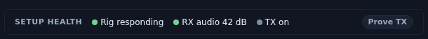
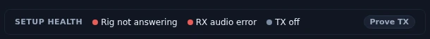

# Quick Start — your first FT8 QSO in 15 minutes

This is the short path from a downloaded installer to a logged contact. The install
step below is written for Windows; macOS, Linux and Raspberry Pi take the same path
from step 2, and [Install & Verify](install.md) covers them all. It assumes a radio with
a USB (or network) connection and a working antenna. Everything here is also covered
in more depth in the [user guide](guide/) — this page is the fast lane.

By the end you will have Nexus installed, your station and rig set up, a cockpit
full of live decodes, and one FT8 QSO in your log.

> **Nexus left beta at 1.0.0.** The FT8/FT4 core is built to WSJT-X's behavior
> and exercised on the air daily; it is the production part of the app. Where a
> number still comes from the bench rather than the air, these pages say so, and
> field reports are what close that gap.

---

## 1. Install and get past SmartScreen (about 3 minutes)

Download the file for your platform — `Nexus_<version>_x64-setup.exe` on Windows,
`Nexus_<version>_aarch64.dmg` on a Mac with Apple Silicon,
`Nexus_<version>_amd64.AppImage` or `Nexus_<version>_pc_amd64.deb` on Linux,
`Nexus_<version>_pi_arm64_bookworm.deb` / `..._trixie.deb` on a 64-bit Raspberry Pi —
from the
[SourceForge download page](https://sourceforge.net/projects/nexus-ham-radio/files/)
(the source lives there too).
It is a per-user install and needs no administrator rights. WebView2 (Windows) and Hamlib
(every platform) are bundled, so there is nothing else to install.
Full detail, including SHA-256
verification and where your data lives, is in [Install & Verify](install.md).

Run the installer. Because the Windows and Linux binaries are cross-compiled and
**unsigned**, Windows SmartScreen shows a blue *"Windows protected your PC"* dialog.
This is expected. Click **More info**, then **Run anyway**. The macOS DMG is signed
and notarized, so there is no Gatekeeper hoop — open it and drag **Nexus** to
**Applications** (run it from Applications, not from the disk image).

<!-- TODO: capture screenshot — Windows SmartScreen "Windows protected your PC" dialog with More info expanded, showing the Run anyway button -->

If you would rather verify the download first, the release page publishes a
`SHA-256` for each installer — see [Install & Verify](install.md#verify-the-download).

---

## 2. The first-run wizard (about 4 minutes)

On first launch Nexus opens a four-step wizard: **Station → Rig → Log → Finish**.
Every step is skippable — *I'll set it up myself* closes it wherever you are —
and everything it sets can be changed later in Settings.

On a clean install the wizard opens by itself, with empty fields. On a machine
that is already set up it does not reappear: reopen it with **Re-run setup
wizard…**, under Setup health in
[Settings ▸ Radio](guide/settings-reference.md#setup-health). Re-running it edits
in place — your callsign, radio and log come with you and nothing is lost — which
is why the fields in the captures below already hold a station.

### Step 1 — Your station

Enter your **callsign** and **grid square**. The grid is the anchor for
everything location-based: the propagation map, satellite passes, DXpedition
windows, and the range rings all compute from it. The field takes four or six
characters and turns red on anything that isn't a valid Maidenhead locator —
but give it **all six**, which is what the app asks for under the box: four
(`EN52`) only pins you to the middle of a ~100-mile square, and that centre is
where every distance and bearing is then measured from.

<!-- Figure width, deliberate: the four wizard captures are 648 px wide — the dialog's own native size, cropped, never upscaled — so they render about a third the width of this manual's 1920 px cockpit figures. That is 1:1 pixels; enlarging them would blur the only text a reader needs to match against their screen. Do not "fix" the mismatch by scaling these up. -->
![Step 1 of the first-run wizard, "Who's on the air?", with the four step chips — 1 Your station, 2 Your rig, 3 Your log, 4 Finish — across the top and the first one outlined as current. Under a line explaining that the grid square anchors satellite passes, propagation, the map and DXpedition windows, a Callsign box reads KD9TAW beside a Grid square box reading EN52, with a note under it asking for all six characters because four pins you to the middle of a ~100-mile square. "I'll set it up myself" and a blue "Next →" button sit at the bottom right.](img/manual/wizard-station.webp)

### Step 2 — Your rig

Plug in the radio, power it on, and click **Detect my radio**. One scan does two
things at once: it enumerates USB devices *and* looks for FlexRadios on your
network. What you see depends on the radio:

- **A named USB rig** (Icom IC-705 / IC-7300 class, and other radios that report
  their model in the USB descriptor) shows up as a row like *"IC-7300 on COM4"* —
  one click fills the Hamlib model, serial port, and paired audio device together.
- **A bridge-chip cable** (CH340, FTDI, CP210x, or Prolific reporting only "USB
  Serial") can't tell Nexus what radio is on the far end. The row fills the port
  and audio and names the chip, but leaves the **model blank** — pick your rig
  from the dropdown. If Windows is missing the chip's driver, Nexus shows the
  download link.
- **A FlexRadio on the LAN** shows up as *"FLEX-6400 on the network"*. One click
  configures the WSJT-X-proven path — CAT through the SmartSDR CAT app on this PC
  (`127.0.0.1:5002`, slice A) — and offers a **⚡ Pair DAX audio** button for the
  virtual audio devices.

Then click **Test CAT**. Nexus saves what you've entered, starts its bundled
`rigctld`, and reads back the dial frequency. A number like `14.074 MHz` means CAT
is working, and the **Setup health** strip at the foot of the step turns its Rig,
RX audio and TX indicators over to what it actually found. If it fails,
[Troubleshooting → CAT](troubleshooting.md#cat--rig-control) walks through the
usual causes.

![Step 2, "How does the radio connect?", with the 2 Your rig chip current. A "Detect my radio" button sits above seven detected serial rows — Silicon Labs CP210x bridges on COM6 and COM4, Dual CP2105 Standard and Enhanced COM ports on COM9, COM8, COM3 and COM5, and an FTDI USB Serial Port on COM7 — each naming its chip, the CP2105 rows adding "CI-V port — use this one" or "second port, not CI-V", and the Enhanced COM3 row outlined as selected. Below them the USB / Serial and Network connection cards, Audio in set to Line (3- USB AUDIO CODEC) and Audio out to Speakers on the same codec, a Test CAT button, and a SETUP HEALTH strip reading Rig responding, RX audio 42 dB and TX on with a Prove TX button. "← Back", "I'll set it up myself" and "Next →" close the step.](img/manual/wizard-rig.webp)

*A station that is actually working, in Nexus 1.10.3. The dB figure is this
station's own; anything from about 15 to 70 decodes, and 0 means no audio is
arriving at all.*

*The same strip with nothing connected. **Rig not answering** is CAT — wrong
port, wrong baud, or the cable; hover the light for the radio's own reply, then
fix it here and press **Test CAT** again. **RX audio error** is the input device
refusing to open, usually because another program holds it. Fix the rig first:
on a one-cable interface the audio device is part of the same radio.*

### Step 3 — Your log

**Import my ADIF log…** reads any standard ADIF (`.adi` / `.adif`) export —
WSJT-X, N1MM, Log4OM, HRD, QRZ, LoTW, ClubLog — and that history is what lights
up **worked-before (B4)** flags, the Needed board's new-DXCC / new-state /
new-grid calls, and your awards progress. Skip it and the app starts blind,
treating every station on the band as new.

The import is local: nothing leaves your computer, and duplicates are detected
and skipped. The step is optional and you can import at any time from the
[Logbook](guide/logbook-qsl.md) — but it is the single biggest thing that makes
the app useful on day one.

![Step 3, "Bring in your existing log", with the 3 Your log chip current. The paragraph explains that importing an ADIF log is what powers worked-before flags, the Needed board's new DXCC, states and grids, and awards progress, that without it the app starts blind, and that the step is optional because you can import later from the Logbook. A blue "Import my ADIF log…" button sits under it, above a line naming WSJT-X, N1MM, Log4OM, HRD, QRZ, LoTW and ClubLog as sources of any standard ADIF export and noting that nothing leaves your computer and duplicates are detected and skipped. "← Back", "I'll set it up myself" and "Next →" run along the bottom.](img/manual/wizard-log.webp)

### Step 4 — Finish

There is nothing to unlock: **every mode and every section starts on** —
FT8/FT4, Phone, CW, RTTY, SSTV, APRS, satellites, the maps, the lot. If you would
rather run a leaner app, sections come off one at a time afterwards in
[Settings ▸ Appearance ▸ Features](guide/settings-reference.md#features), which is
also where the goal profiles — getting started, DX/awards, contesting, POTA/SOTA,
6m/VHF, and **Everything (expert)**, which turns the whole console back on — set
a batch of sensible defaults in one pick. Toggle features by hand and the profile
reads **Custom**.

The one thing this step asks for is your **license class**: Technician, General,
Amateur Extra, or *Outside the US* for no limits. This becomes a real Part 97
transmit lockout — the app parks the dial in your licensed band segments and
refuses to key outside your privileges, including the 2026 60 m rules. It's a
safety net, not a substitute for knowing your license, and it is yours to
declare: the card outlined in the capture below is the state of that station, not
a recommendation.

**Show me Getting started** queues the four-things walkthrough to open as the
wizard closes. Click **Finish — everything on**, and Nexus drops you into the
digital cockpit.

![Step 4, "You get everything", with the 4 Finish chip current. The text says every mode and every section starts ON — FT8/FT4, Phone, CW, RTTY, SSTV, APRS, satellites, the maps, the lot — that Nexus is one program instead of six with nothing to unlock, and that a leaner app means trimming sections in Settings. "What's your license?" explains that the setting parks the dial in your licensed band segments and offers four cards — Technician (US, limited HF + full VHF/UHF), General (US, most HF privileges), Amateur Extra (US, full privileges) and Outside the US (no transmit limits) — with Outside the US outlined as this station's pick. Under "Want a walkthrough of what you just set up?" a "Show me Getting started" card reads "The four things, in order — opens when this closes", and the footer carries "← Back", "I'll set it up myself" and a blue "Finish — everything on" button.](img/manual/wizard-finish.webp)

---

## 3. A tour of the digital cockpit (about 2 minutes)

Out of the box the dial sits at **14.074 MHz** (FT8, 20 m), decode depth is
**Deep**, and the decoder listens across **200–2900 Hz**. Decoding runs every RX
slot automatically — there is no Monitor toggle to forget.

<!-- TODO: capture screenshot — the digital cockpit with waterfall, a full Band Activity list, the QSO strip, and the Classic/Roster toggle — callouts on each -->

The three things to know:

- **The waterfall** across the top shows signal energy over frequency, and carries
  two independent cursors. **Left-click** moves the green **RX** cursor,
  **right-click** (or **Shift**-click) moves the red **TX** cursor, and
  **Ctrl**-click moves both at once — the same legend the pane header prints. The
  [Operate chapter](guide/operate-digital.md#the-tour) shows it.
- **Band Activity** is the decode list — newest at the bottom, auto-scrolled to the
  latest period. Every row carries what stock WSJT-X never showed: the country
  name, a **B4** chip if you've worked them before, **New DXCC** / **new-grid**
  badges when a station is worth something to your log, and a teal **L** if they
  upload to LoTW. Rows calling CQ, and rows calling *you*, are flagged. Scroll up
  to review and auto-scroll pauses; scroll back down to resume.
- **The Classic ↔ Roster toggle** switches between the familiar stock layout (with
  the Tx1–Tx6 panel and editable DX Call/Grid) and a modern sortable call roster.
  Use whichever you like.

The TX controls — **TX On/Off · Tune · Stop TX · Hold Tx** — sit in the QSO strip
next to **Call CQ** and **S&P**. Nexus never transmits on its own; TX is always
something you switch on.

---

## 4. Answer a CQ (about 1 minute of watching)

1. Find a station calling **CQ** in Band Activity.
2. **Double-click** the row. Nexus arms the sequencer, sets your slot parity, and
   fires the first transmission at the next period. From there it runs the whole
   exchange for you — grid → report → R-report → RR73 → 73 — advancing on what the
   other station actually sends back. It locks onto that station, so a report from
   a bystander won't derail your QSO.
3. Watch the Tx panel to see which message goes out next. That's it — you're
   making the contact while you learn the rhythm by watching.

A **single click** just fills the DX Call/Grid fields without transmitting.
`Esc` halts TX instantly. `F4` clears the DX call, `F6` re-decodes the last period
for a second look.

<!-- TODO: capture screenshot — the cockpit mid-QSO — a station worked from Band Activity, the sequencer stepping through the exchange, the outgoing TX line highlighted -->

Two reassurances while you find your feet:

- **The license lockout has your back.** If the dial is outside your declared
  segment, the TX button shows a lock and the engine refuses to key — you can't
  accidentally transmit out of band.
- **The TX watchdog is watching too.** After 6 minutes of unattended transmit the
  engine halts itself, so a walk-away never leaves you keyed down.

---

## 5. Logging, and what the Needed board starts telling you

When the QSO completes it is logged automatically (auto-log is on by default),
and — once you configure them — pushed to QRZ and LoTW. Your logbook is a
standard ADIF file; importing an existing log credits your history immediately.

### Four different things, and only one of them is a contact

These get run together everywhere in this hobby, and running them together is
how an operator ends up believing their log says something it does not. They
happen at different moments, and each moves a different number:

1. **A decode** — you heard a station. Nexus prints it in the roster and, if
   PSK Reporter is on, sends it up as a **reception report**: "KD9TAW heard
   W1AW on 20 m at −14 dB". Reports go up every few minutes for **everything**
   you decode, whether or not you ever call. **A reception report is not a
   contact.** It changes nothing in your log — it is a note to the world that
   your receiver was working, and it is what puts you on other people's maps.
   The reverse direction is the same: a station's spot on PSK Reporter means
   somebody *heard* them, not that anybody worked them.
2. **A QSO** — you called, they came back, you exchanged reports and signed.
   That is a contact, and it is the only one of the four that writes a record
   in your logbook. This is what moves the **worked** counts on the Needed
   board, in [Stats](guide/stats.md) and in [Awards](guide/awards-journey.md).
3. **An upload** — Nexus sends that record to LoTW, QRZ, ClubLog, eQSL or WRL.
   You have now told a service what you did. Nothing is confirmed yet, and the
   contact counts toward no award. On its own an upload proves only that your
   half arrived.
4. **A confirmation** — the *other* operator uploaded a matching record, and
   the service paired the two. Only now does anything move in the **confirmed**
   column, and only LoTW and paper cards count toward ARRL awards — an eQSL or
   a QRZ match confirms the contact without earning credit. This one is not
   yours to hurry; it can take a day or a decade, and some contacts are never
   confirmed at all.

The short version: **decodes and reports are about your antenna, contacts are
about your log, uploads are about your side of the paperwork, and confirmations
are about theirs.** [Logbook & QSL](guide/logbook-qsl.md) covers uploads and
confirmations properly.

With a callsign and grid set, the **Needed board** begins ranking every station on
the air by what it's worth to *your* log — an all-time-new entity outranks a new
zone, which outranks a new band, and so on. What makes it trustworthy is the
**evidence line** on every row: *who* near you heard that station, how far away,
and how long ago. Those are other operators' reception reports — the same kind
of thing your own decodes send up — which is what makes them evidence that a
path is open rather than a claim that anybody worked it. One click there QSYs
the rig to the right band, mode, and frequency and opens the matching cockpit.

<!-- TODO: capture screenshot — the Needed board with several ranked rows, each showing its evidence line ("heard by K9LC (EN52, 26 km), 4 min ago") -->

---

## Where to go next

You're on the air. When you want to go deeper, each section has its own guide:

- [Operate: FT8 / FT4](manual/Operate-FT8-FT4.md) — the full click model, split, Hound, directed CQ, and every keyboard shortcut.
- [Needed board & hunting](manual/Needed-and-Hunting.md) — how the ranking and evidence rules work.
- [Connect: map & propagation](manual/Connect-Propagation.md) — the globe, opening detector, and band advisor.
- [Phone](manual/Phone.md) and [CW](manual/CW.md) — the voice and Morse cockpits.
- [POTA / SOTA](manual/POTA-SOTA.md) and [Field Day](manual/Field-Day.md) — hunting and event operating.
- [Logbook & awards](manual/Logbook-and-Awards.md) and [Integrations](manual/Integrations.md) — DXCC/WAS/WAZ math and the LoTW/QRZ/ClubLog/eQSL connectors.
- [Tempo chat (TempoFast / TempoDeep)](manual/Tempo-Chat.md) — the weak-signal chat tiers (on the air; published thresholds are bench figures, and on-air reports are wanted).

Stuck on something? Start with [Troubleshooting](troubleshooting.md).
